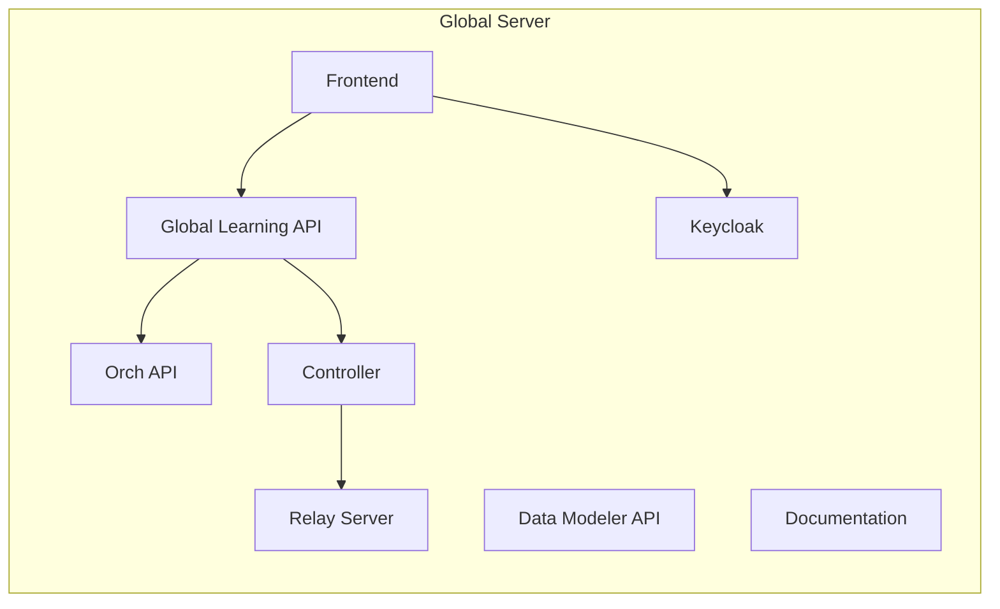
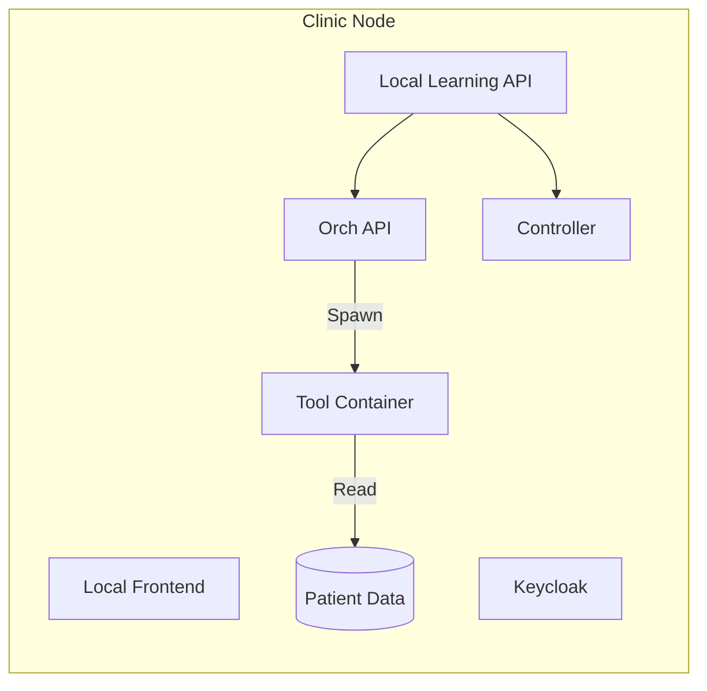
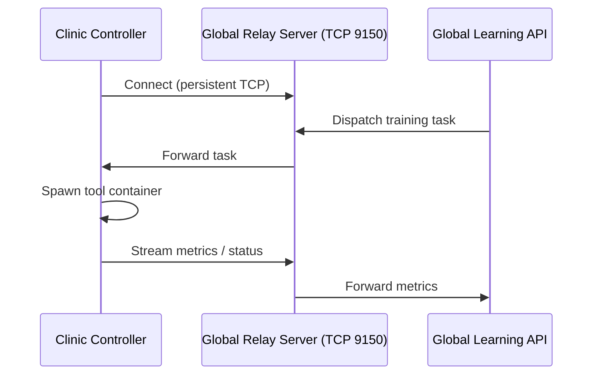

# Deployment Overview

The deployed %%DEPLOYED_PRODUCT_NAME%% network consists of two distinct deployment targets that work together: a single **global server** and any number of **clinic nodes**. Understanding the relationship between them is the first step before deploying anything.

---

## Components

### Global Server

The global server is the central backbone of the platform. It is deployed once and shared by all participating clinics. It hosts:

- **Frontend** — the web UI used by Data Scientist to manage schemas, datasets, projects, and federated runs
- **Global Learning API** — the REST and WebSocket API that coordinates federated runs, stores results, and serves the frontend
- **Data Modeler API** — the graph-based API for browsing and creating data schemas (backed by a Neo4j database)
- **Orchestration API (Orch)** — spawns and manages the federated learning tool containers during training runs
- **FLNet Controller** — the internal coordinator that routes messages between the global server and clinic nodes
- **Relay Server** — the TCP/HTTP bridge that clinic controllers connect to; exposes a direct TCP port (default `9150`) for persistent clinic connections
- **Keycloak** — the identity provider handling authentication for both the global frontend and the clinic frontends
- **Documentation** — this documentation site, served at `/documentation/`

The global server is always internet-accessible (or at least reachable from all clinic machines). It does **not** hold any patient data.

→ **[Deploy the Global Server](deploy-global.md)**

---

### Clinic Node (Local Deployment)

Each participating institution runs its own **clinic node**. A clinic node is a self-contained stack that:

- Holds the institution's local patient data (in CSV files, or connected via a database connector)
- Runs the **Local Learning API** — the per-clinic backend that registers with the global server and manages local runs
- Spawns federated learning **tool containers** on demand when the global server starts a training run
- Runs its own **Keycloak** instance for local user management
- Exposes a **local frontend** (the "Instance Manager") for data admins to manage connectors and monitor local activity

Patient data never leaves the clinic node. Only computed values (model weights, statistics, metrics) travel to the global server — and only during an active federated run.

→ **[Deploy a Clinic Node](deploy-client.md)**

---

### How They Connect

At startup, each clinic's **controller** opens a persistent TCP connection to the global server's **relay server** (port `9150` by default). This connection stays open and is used to:

- Receive training task assignments from the global server
- Send metric updates and status events back to the global server
- Route FLNet protocol messages between tool containers and the global controller

The clinic only needs **outbound** access to the global server's relay port. No inbound ports need to be opened on the clinic machine.

---

## Local Testing with Docker-in-Docker (DinD)

For development, testing, and hackathon environments where you want to simulate a clinic node on a single machine, FL-Net provides a **Docker-in-Docker (DinD)** packaging of the clinic stack.

The DinD approach bundles the entire clinic compose stack — including all Docker images — into a single self-contained Docker container. This means:

- **No internet required at runtime** — all images are pre-loaded at build time
- **One command to start** — a single `docker run` starts the full clinic stack
- **Isolated** — each DinD container has its own inner Docker daemon and network
- **Portable** — the built image can be distributed to clinics without internet access

The DinD image is the recommended approach for hackathons and local development. For production clinic deployments, use the standard compose-based approach instead. The DinD image connects to a locally running Platform, so you must deploy both the DinD Platform and the DinD Client.

→ **[Local Clinic Deployment with DinD](deploy-local-dind.md)**

---

## Deployment at a Glance

| | Global Server | Clinic Node (standard) | Clinic Node (DinD) |
|---|---|---|---|
| **Deployed** | Once, centrally | Once per institution | For dev/testing |
| **Holds patient data** | No | Yes | Yes |
| **Internet required** | Yes | Outbound only (port 9150) | At build time only |
| **Startup** | `docker compose up` | `docker compose up` | `docker run feddb-dind` |
| **Guide** | [Global Server](deploy-global.md) | [Deploy Client](deploy-client.md) | [DinD Deployment](deploy-local-dind.md) |
