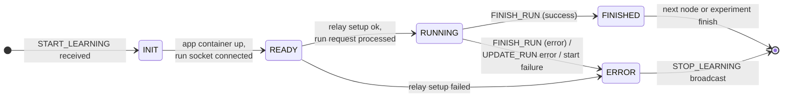
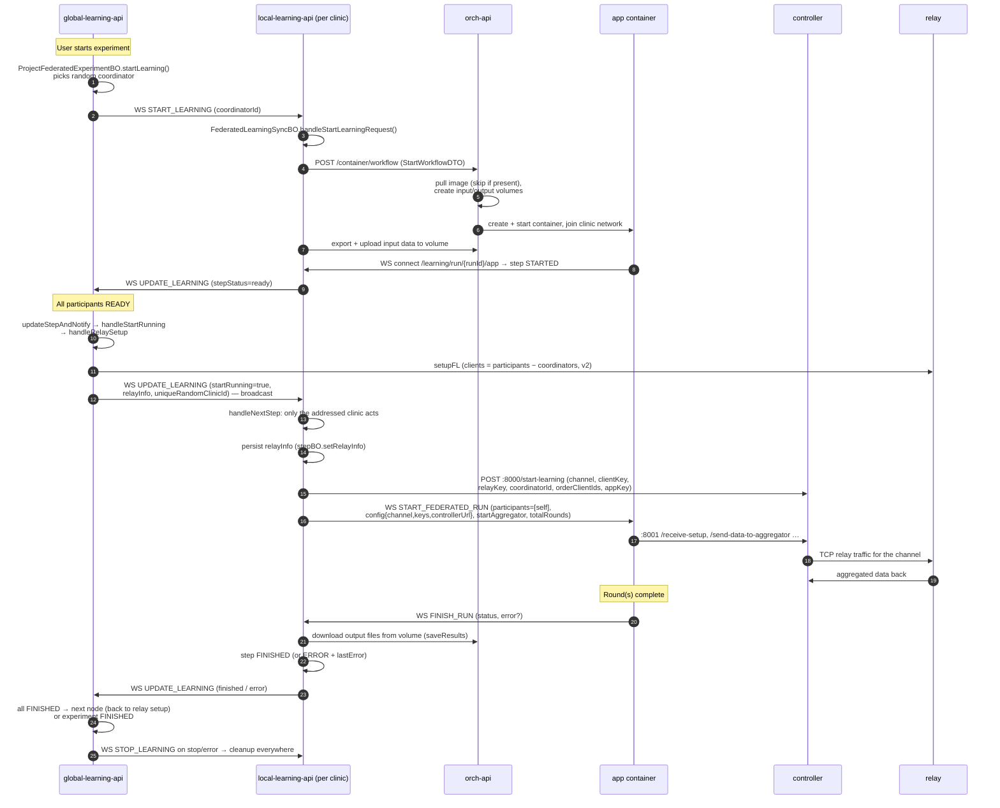

# Federated Learning Flow (Global → Local → App)

This page is the complete reference for the life cycle of a federated learning experiment: which
service calls what, which messages flow over which channel with which payload, how statuses
transition on both sides, where data is written, and where errors are detected and propagated.
Use it to debug a run that does not start, hangs, or stops with an error.

## Identifiers Glossary

A run involves several distinct identifiers that are easy to confuse:

| Identifier | Created by | Example | Used for |
|---|---|---|---|
| `globalUniqueExperimentId` | global, on experiment creation | `92bae936-9ed5-…` | Correlates the experiment across global ⇄ all clinics. Key of nearly every FLNet message. |
| `uniqueRandomClinicId` | local, per experiment (`approveLearning`) | `50a0fb21-87a1-…` | Pseudonymous identity of a clinic *within one experiment*. The global never learns which clinic is which. |
| websocket `connectionId` | Quarkus, per socket connection | `fedd937a-…` | Transport-level only. **Not** related to the clinic id — the global keeps `connectionId → Set<experimentId>` and nothing else. |
| `runId` / `stepId` | local DB (`FederatedLearningExperimentStepEntity.id`) | `7` | Identifies one workflow-node execution in one clinic. Path parameter of the app run socket. |
| relay `clientId` / `coordinatorId` | relay server, per channel | `7bea0c1a930376df` | Identity of a participant on the relay channel. Carried in `FederatedLearningRelayInfoDTO.id`. |
| `channel` | relay server | `239042527ef5…` (64 hex) | The relay room for one workflow-node round. |
| `clientKey` / `relayKey` | relay server | 512-hex strings | Credentials the controller needs to join the channel. **Longer than 255 chars** — stored as `TEXT`. |
| `appKey` (controller registration) | local, random UUID per registration | — | Sent to the controller in `/start-learning`. Distinct from the app's `APP_ID`. |
| `APP_ID` (`system_settings.app_id`) | app image `.env` | `28` | Identifies the *tool*, not the instance — **identical in every clinic**, which is why per-instance identification must not rely on it. |

## Services and Deployment Topology

| Service | Repo / Module | Inside clinic? | Role |
|---|---|---|---|
| **global-learning-api** | `learning-apis/global-learning-api` | no | Coordinates experiments: acceptance counting, coordinator selection, relay setup, step synchronization, stop/finish. |
| **local-learning-api** | `learning-apis/local-learning-api` | yes | Connects to the global over a websocket, drives the local workflow, starts app containers via orch-api, registers learnings on the controller, hosts the app run socket. |
| **orch-api** | `orch-api` | yes | Docker orchestrator: pulls images, creates volumes, starts/stops app containers, streams container logs to its DB. |
| **controller** (FeatureCloud) | `feature-cloud-controller` | yes | Relay gateway: REST `:8000` (learning registration, `flrunmanagerport`), AppCommunicatorV2 `:8001` (app data exchange). Holds the relay credentials after registration and speaks TCP to the relay. |
| **relay** | global deployment (`GLOBAL_RELAY_TCP_ADDRESS`, e.g. `…:9150`) | no | Message broker between the controllers of all clinics for one channel. |
| **app** (e.g. `us-130-fl`) | `apps/us-130-fl` + `pyfedappwrap` | yes (ephemeral) | The federated tool. One container per clinic per workflow node, started by orch-api. |

In the **clinic-dind** deployment (`meta/deployment/clinic-dind`) each clinic is one
docker-in-docker container running an inner compose stack on the network
`${COMPOSE_PROJECT_NAME}_local-learning-network`. orch-api attaches every app container it starts
to that same network, which is why the app can resolve the compose service names `controller` and
`local-learning-api` by DNS.

## Communication Channels

| # | Channel | Between | Protocol / endpoint | Code |
|---|---|---|---|---|
| 1 | FLNet client socket | local ⇄ global | Websocket | global: `FLNetClientWebsocket` (+ `FLNetClientWebsocketHandlerBO`, `FLNetClientBroadcastBO`); local: `bio.cosy.feddb.local.api.eam.WebsocketClient` + `ClientManager` |
| 2 | Orchestration | local → orch-api | REST, `POST /container/workflow`, `DELETE /container/workflow/{id}`, volume upload/download | client: `OrchWorkflowServiceClient` etc. (configKey `orch-docker-service`); server: `WorkflowServiceImpl`, `WorkflowNodeBO` |
| 3 | Learning registration | local → controller `:8000` | REST `POST /start-learning` | `LocalControllerLearningService` (configKey `controller-api`), payload `ControllerStartLearningRequestDTO` |
| 4 | App run socket | app ⇄ local | Websocket `/learning/run/{runId}/{type}` where `type ∈ {app, controller}` | `FederatedLearningExperimentWebsocketService extends WorkflowAppServer` |
| 5 | App data exchange | app → controller `:8001` | REST `/receive-setup`, `/send-data-to-aggregator`, `/send-data-to-clients`, `/receive-data-from-aggregator`, `/receive-data-from-clients` | pyfedappwrap `FLNetCommunicator` (`engine/service/controller/common.py`) |
| 6 | Relay traffic | controller ⇄ relay ⇄ controllers | TCP | controller config `relay.addressTCP` |

### FLNet message catalog (channel 1)

All messages are wrapped in `FedDBClientDataDTO<T>` with a `messageType` from
`FedDBClientTypeEnum` (`core-learning-api …/socket/FedDBClientTypeEnum.java`):

| Type | Direction | Payload | Purpose |
|---|---|---|---|
| `EXISTING_QUERY` | G → L (broadcast all) | `QueryDTO` | Fire a cohort-count query; the clinic answers with `QueryClientResponseDTO` (count). |
| `LEARNING_QUERY` | G → L (broadcast all) | `ProjectFederatedExperimentForLocalDTO` | Announce an experiment; clinic checks data access and answers `LearningQueryClientResponseDTO` (count, `modelCanBePublic`). |
| `DATA_STATISTICS` | G → L | `ProjectFederatedRequestDataStatisticsDTO` | Request data statistics / auto-access check. |
| `START_LEARNING` | G → L (experiment broadcast) | `StartLearningClientRequestDTO` (`globalUniqueExperimentId`, `coordinatorId`) | Phase 2 trigger: every accepted clinic starts its first workflow node. |
| `UPDATE_LEARNING` | **both** directions | G → L: `LearningClientSyncRequestDTO`; L → G: `LearningClientSyncResponseDTO` | G → L: run request (`startRunning=true`, relay info) or next-step request. L → G: step/project status report. Same type, different DTOs per direction. |
| `STOP_LEARNING` | G → L (experiment broadcast) | `LearningClientStopRequestDTO` | Stop and clean up the experiment in every clinic. Sent on user stop **and** on any error stop. |
| `CURRENT_LEARNINGS` | L → G (on connect) | list of experiment ids | Registers the connection in the global's `learningConnectionMap` (`connectionId → experimentIds`). Without it the clinic receives no experiment-scoped messages. |
| `RUN_METRICS` | G → L | `ProjectFederatedRequestRunMetricsDTO` | Ask clinics for local training metrics. |
| `ERROR` / `NO_RESPONSE` | L → G | — | Error reply / explicit "nothing to send". |

### App run socket catalog (channel 4)

Wrapped in `AppMessageWrapperDTO<T>` with `AppMessageTypeEnum`, dispatched in
`WorkflowAppServer.handleAppMessages`:

| Type | Direction | Payload | Effect on local |
|---|---|---|---|
| `START_FEDERATED_RUN` / `START_RUN` | L → app | `StartRunDTO` | Starts the (federated) run. `START_FEDERATED_RUN` is chosen when the node `supportsFederatedLearning` (`FederatedLearningExperimentBroadcastBO.startStep`). |
| `CLIENT_STARTED` | app → L | — | Ignored (no-op case). |
| `UPDATE_RUN` | app → L | `UpdateRunDTO` (`runId`, `status`, `progress`, `error`) | `updateRun`: sets step status/progress; `ERROR` status also sets `lastError`. |
| `FINISH_RUN` | app → L | `FinishRunDTO` (`runId`, `status`, `error`) | `finishRun`: ERROR ⇒ step `ERROR`+`lastError`; success ⇒ **save results from the orch volume first**, then step `FINISHED`; closes the socket. |
| `LOG_MESSAGE` / `LOG_METRIC` | app → L | `RunMessageLogDTO` / `RunMessageMetricDTO` | Persisted per step (`FederatedLearningExperimentStepMessageBO`), feeds the UI log/metric stream. |
| `SEND_MODEL` | app → L | — | Deprecated; logs a warning ("use HTTP endpoint instead"). Model/result files go through the HTTP upload path. |

## Status Models

Two status enums exist and are mapped into each other — keep them apart:

**`RunStatusTypes`** (step level, both sides):
`PENDING → INITIALIZED → STARTED → RUNNING → FINISHED | STOPPED | ERROR`.
Terminal: `FINISHED, STOPPED, ERROR` (`terminalStates()`); a step can only be (re)started from a
startable state (`canBeStartedStatus`). Status persistence guards against overwriting terminal
states (`updateStatusTransactional … where stepStatus not in terminal`), which produces the log
line *"Skipping duplicate status update … already terminal"*.

**`ProjectStatus`** (participant/experiment level on the global):
`INIT → READY → PREPARE → RUNNING → FINISHED | STOPPED | ERROR | SHUTDOWN`.

The local maps step → participant status via `ProjectStatus.fromRunStatusTypes`
(`PENDING/INITIALIZED/STARTED → READY`, `RUNNING → RUNNING`, …). The global aggregates all
participants with `ProjectFederatedExperimentHelper.getNextStatus(participants)`:

- any participant `ERROR` ⇒ `ERROR`
- **all** `READY` ⇒ `READY` (triggers relay setup + run start)
- **all** `FINISHED` ⇒ `FINISHED` (triggers next node or experiment finish)
- participants with `null` stepStatus are treated as `INIT` (with a warning)



## End-to-End Sequence



---

## Phase 0 — Prerequisites (queries, acceptance, connection)

Before an experiment can start:

1. Each clinic's `WebsocketClient` connects to the global (`flnet.global.socket…`) and announces
   its running experiments with **`CURRENT_LEARNINGS`**. The global stores
   `connectionId → Set<experimentId>` in `FLNetClientBroadcastBO.learningConnectionMap`. *A clinic
   that has not synced receives no experiment-scoped broadcasts* (log: *"No experiment found for
   connection …"*).
2. **`EXISTING_QUERY`** broadcasts collect cohort counts. `QueryBO.handleQuery` deduplicates by
   `globalUniqueId`: a re-fired query id returns the cached count on `dev`/`staging` profiles and
   `0` on any other profile (privacy default).
3. **`LEARNING_QUERY`** announces the experiment; each clinic that grants access responds with its
   count. The global counts acceptances (`updateExperimentCount`); when the configured clinic
   count is reached the experiment becomes `READY` (log: *"reached required clinic count. Setting
   status to READY"*).

On the local side, accepting a learning request creates the experiment
(`FederatedLearningExperimentBO.approveLearning`): a `FederatedLearningExperimentEntity` with a
fresh `uniqueRandomClinicId` and one `FederatedLearningExperimentStepEntity` per workflow node.

## Phase 1 — Experiment Start (Global)

**Entry:** `ProjectFederatedExperimentBO.startLearning(projectId, experimentId, keycloakId)`
(`global-learning-api …/project/experiment/federated/ProjectFederatedExperimentBO.java`).

1. Validates: experiment status `READY`, `participants.size() >= participantsMinAmount`, workflow
   present — otherwise `NotAllowedException`.
2. **Coordinator selection:** a random participant gets `setIsCoordinator(true)`. Non-coordinators
   keep `null` — safe because the entity getter is null-safe:

   ```java
   public boolean getIsCoordinator() {
       return Boolean.TRUE.equals(isCoordinator);
   }
   ```

3. `projectFederatedExperimentStepBO.createForWorkflow(entity)` creates the global-side step rows.
4. `ao.startLearningTransactional(experimentId, coordinator)` — a **bulk JPQL update** setting
   `experimentStatus=RUNNING, startedAt, coordinator`. Bulk updates bypass the persistence
   context; the code detaches/reloads the entity afterwards.
5. `FLNetClientBroadcastBO.startLearning(globalUniqueId, coordinatorClinicId)` broadcasts
   **`START_LEARNING`** to every connection associated with the experiment.

## Phase 2 — Local Start: container, data, ready (each clinic)

**Entry:** `WebsocketClient.onMessage` → `processMessage` → 
`FederatedLearningSyncBO.handleStartLearningRequest(StartLearningClientRequestDTO)`.

:::info Message processing model
`onMessage` processes the connection's messages **sequentially** on a worker pool
(`Multi.emitOn(...).transform(...)`). A long-running handler (this one starts containers and
uploads data) delays subsequent messages on the same connection — ordering is guaranteed, latency
is not.
:::

1. Resolve the experiment by `globalUniqueLearningExperimentId`; missing ⇒ error response
   *"Experiment not found"*. If `coordinatorId` equals this clinic's `uniqueRandomClinicId`, mark
   the project coordinated (`setProjectAsCoordinatedTransactional`).
2. `FederatedLearningExperimentBO.startLearning(experimentId, firstStep=true, relayInfo=null)`:

   **`prepareStartContext`** resolves what to run:
   - first node via `baseWorkflowEngine.firstNode(workflow)` (or `nextNode` after the previous
     step), marks the experiment running, finds the matching step entity by `nodeId`,
     checks `canBeStartedStatus(step.stepStatus)` — a non-startable step throws
     *"… is in status X which is not startable"* (this also guards duplicate starts).
   - sets the current node (`ao.setCurrentWorkflowNode`) and builds the `StartWorkflowDTO`
     (image, container name, env, volume names, node hyperparams).

   **`executeWorkflow`** (`core-learning-api …/orch/WorkflowOrchestrator.java`) calls orch-api
   `POST /container/workflow?changeUrl=true&path=learning/run&port=8080`. Error handling
   distinguishes HTTP errors (status + response body surfaced) from transport errors (connection
   refused/timeout) — both end as `IllegalStateException` with the real cause.

3. **orch-api** (`WorkflowNodeBO.startContainer`):
   - `ensureNotRunningAlready` — hard-cleans an existing container for the same workflow node.
   - `DockerPullService.loadApplicationImage` — registry selected by image name
     (`gitlab.cosy.bio` / `featurecloud` / default). **Skipped if the image exists locally** when
     `orch.docker.pull.skip-if-present=true` (the pre-bundled dind image makes this the common
     case). Pull failures are rethrown — a swallowed pull failure would resurface later as a
     confusing "no such image".
   - Volumes are created as `{hash}-fc-w{workflowId}-n{executionOrder}_volume_input|output`
     (e.g. `8ee0b12c9738482b-fc-w7-n0_volume_output`), the container as
     `{hash}-fc-w{workflowId}-n{executionOrder}`.
   - Container env injected by `WorkflowServiceImpl.startWorkflow`:

     | Env | Value |
     |---|---|
     | `WS_URL` / `HTTP_URL` | `ws://{host}:8080/learning/run/` — the app run socket / upload base. `{host}` is the caller's address or `container.host.override`. |
     | `DATA_DIR` / `OUTPUT_DIR` | volume mount paths `/mnt/input`, `/mnt/output` |
     | `ENABLE_LOCAL_RESULT_SAVING` / `ENABLE_REMOTE_RESULT_SAVING` | `true` / per request |
     | `SEND_CONSOLE_LOG`, `DEV_MODE` | `true`, `false` |
     | `FL_RUN__CONTROLLER_COMM_URL` | from `container.controller-comm-url` (default `http://controller:8001`) — the app's fallback controller endpoint |

   - The container joins the clinic network (`CONTAINER_NETWORK_NAMES`) and a log stream is opened
     (`ensureLogStream`) — this is why app stdout appears in orch-api's log as
     *"Database stream - container … log: …"*.
4. Back on local: the step is persisted `PENDING` (or `INITIALIZED` for old-FC apps) with the
   container id; for the first node the input data is exported
   (`PatientDataExportBO.exportDataForLearning`) and uploaded into the **input volume** via
   orch-api (`uploadFilesToVolume`, file name from the node's input config, e.g. `data.csv`).
5. The app engine boots (pyfedappwrap `FedDBEngine`), connects to
   `ws://local-learning-api:8080/learning/run/{runId}/app` with a service-account bearer token.
   `FederatedLearningExperimentWebsocketService.onOpen` → `setAppIsRunning` → step `STARTED`
   (`RUNNING` if the connection type is `controller`).
6. Every step status change runs `FederatedLearningExperimentStepBO.updateStatus`, which ends with
   `websocketSender.sendRunningUpdate(...)` → **`UPDATE_LEARNING`** to the global carrying
   `LearningClientSyncResponseDTO{projectStatus, stepStatus=ready, currentNodeId,
   uniqueRandomClinicId, globalUniqueExperimentId, error=null}`.

Example (from a real run):

```json
{"messageType":"UPDATE_LEARNING","message":{
  "type":"LEARNING_SYNC","error":null,
  "uniqueRandomClinicId":"50a0fb21-87a1-4c59-8010-ee0acba84f01",
  "projectStatus":"RUNNING","currentNodeId":"cd48df13-bca7-40c3-be9b-08383c8d3ccb",
  "stepStatus":"ready","globalUniqueExperimentId":"92bae936-9ed5-4f15-90e4-7636e23c2bdf"}}
```

## Phase 3 — Relay Setup and Run Request (Global)

**Entry:** `FLNetClientWebsocketHandlerBO.handle` (`UPDATE_LEARNING` from a clinic) →
`ProjectFederatedExperimentParticipantBO.updateStatus` →
`ProjectFederatedExperimentBO.updateStepAndNotify(participant)` (runs in a transaction with a
`PESSIMISTIC_WRITE` lock on the experiment).

`getNextStatus(participants)` aggregates; when it returns `READY`:

### `handleStartRunning(participants, experiment)`

1. `getNextStep(...)` resolves the node to start. For the **first** node it also calls
   `setCurrentStep`, which persists the current node via bulk update **and** sets it on the
   in-memory entity:

   ```java
   ao.setCurrentWorkflowNode(experimentId, step);   // bulk JPQL update (DB only)
   experiment.setCurrentWorkflowNode(step);          // keep the managed entity in sync
   ```

   :::warning Bulk updates bypass the persistence context
   `setCurrentWorkflowNode` and `startLearningTransactional` are JPQL bulk updates. Reading the
   same field from the in-memory entity right after returns the **stale** value unless it is set
   explicitly. Forgetting this caused a `currentWorkflowNode == null` NPE in relay setup.
   :::

2. **`ProjectFederatedExperimentStepBO.handleRelaySetup(experiment)`**:
   - Resolves the node's `FederatedAppVersionEntity` (node-level, falling back to the submodel's
     model). Missing ⇒ `IllegalStateException`. The app must be flagged
     `supportsFederatedLearning`, otherwise relay setup is refused.
   - **Slot math (v2):** the relay request asks for
     `clients = participants − coordinators` client slots, because v2 has a *separate*
     coordinator/aggregator slot and the coordinator clinic occupies it. Requesting one slot per
     participant would leave the aggregator waiting for a client that never connects.
     v1 (old FeatureCloud) has no separate slot — the first client is also the coordinator.
   - `globalRelayService.setupFL(startup)` returns
     `CreateFLLearningRelayServerResponseDTO{channel, relayKey, clientIds,
     clientId2ClientKey, coordinatorId, coordinatorKey}`. Channel and relayKey are persisted on
     the **global step row** (`project_federated_experiments_steps.channel_id/relay_key`, both
     `TEXT` — relay keys exceed `varchar(255)`).
   - One `FederatedLearningRelayInfoDTO` is mapped per participant:
     clients get `{id=clientId, key=clientKey, coordinator=false}`, the **coordinator clinic**
     gets `{id=coordinatorId, key=coordinatorKey, coordinator=true}`. All entries share
     `channel, relayKey, maxNumClients, orderClientIds, appVersion(v1|v2)`. The `coordinator`
     flag is set explicitly on every entry (nullable-`Boolean` discipline; the DTO getter is
     null-safe and serializes `true|false`, never `null`).
   - A relay-API failure inside the inner call is caught and returns an **empty list** — the outer
     code logs *"Relay setup returned no relay info …"* as a warning. An exception in the outer
     mapping is caught in `handleStartRunning` and logged **with stacktrace** before
     `stopLearning(ERROR)` — this catch used to be silent, which made error stops undebuggable.

3. Participant step statuses are bulk-updated to `RUNNING`, the global step to `STARTED`.
4. **`FLNetClientBroadcastBO.startStepLearning(...)`** sends one **`UPDATE_LEARNING`** run request
   *per participant*:

   ```json
   {"messageType":"UPDATE_LEARNING","message":{
     "type":"LEARNING_SYNC","nextStep":40,
     "currentNodeId":"cd48df13-…","startRunning":true,
     "globalUniqueLearningExperimentId":"e73d8d86-…",
     "uniqueRandomClinicId":"e5476802-…",
     "relayInfo":{
       "id":"7bea0c1a930376df","key":"3b8327b4…(512 hex)…",
       "channel":"239042527ef5…","relayKey":"804f7b53…(512 hex)…",
       "coordinator":false,"coordinatorId":"a9eed9cc8a12bef1",
       "maxNumClients":3,
       "orderClientIds":["7bea0c1a930376df","cf738bfbf2897153","a9d96f27359178b4"],
       "appVersion":"v2"}}}
   ```

   Each request is **broadcast to the whole experiment** with the target clinic in
   `uniqueRandomClinicId`; clinics ignore requests addressed to others.

   :::warning Why broadcast instead of targeted send?
   The websocket `connectionId` is unrelated to the clinic id and the global has no mapping
   between them. A former implementation filtered connections by
   `connection.id().equals(clinicId)` — which never matched, so **no clinic ever received the run
   request** and every experiment hung at READY. The payload-carried target id is the supported
   pattern.
   :::

## Phase 4 — Controller Registration and App Start (Local)

**Entry:** `FederatedLearningSyncBO.handleNextStep(LearningClientSyncRequestDTO)`
(annotated `@Retry(maxRetries = 8, delay = 75)` — note this retries a side-effectful method; the
duplicate-start guard below is what keeps that safe-ish).

For `startRunning=true`:

1. **Self-selection:** if `request.uniqueRandomClinicId` is set and differs from this clinic's id
   ⇒ ignore (debug log).
2. **Out-of-sync guard:** if the requested `currentNodeId` differs from the local current node ⇒
   warn + ignore. **Duplicate guard:** if the current step is already `RUNNING` or terminal ⇒
   *"Ignoring duplicate start request"*.
3. `FederatedLearningExperimentBO.handleStartLearning(experimentId, relayInfo)`:

   ```java
   experiment.getCurrentWorkflowNode().setRelayInfo(relayInfo); // for the calls below
   stepBO.setRelayInfo(stepId, relayInfo);                      // transactional persist (jsonb)
   ```

   The method runs **outside a transaction**, so the entity mutation alone would never reach the
   DB (`relay_info` is a `jsonb` column on the local step).

4. `BaseWorkflowExperimentBO.handleStartLearning(experiment)`:

   **(a) Controller registration** — `handleStartFederatedLearningFC(currentStep)` (called for
   old-FC **and** new federated apps): maps the relay info via
   `mapper.relayToController(step.getRelayInfo(), runId)` into

   `ControllerStartLearningRequestDTO{channel, clientId, clientKey, relayKey, runId,
   coordinatorId, maxNumClients, orderClientIds, appKey=randomUUID, appVersion}`

   and `POST`s it to the controller (`:8000/start-learning`). The controller stores the
   credentials and joins the relay channel. Missing relay info or a non-200 response sets the
   step to error and throws.

   **(b) App start** — `startStep(currentStep)`:
   - `getStartup(stepId)` builds the base `StartRunDTO`: `hyperParams` (from the node config),
     `inputFilePaths` (from the node's input interface, e.g. `{"data": "data.csv"}`),
     `supportFederatedLearning`, `isTrainable`.
   - `enrichWithFederatedRelay(run, step)` adds the federated topology:

     | `StartRunDTO` field | Value | Why |
     |---|---|---|
     | `participants` | **exactly one** — this clinic: `participantId = relayInfo.id`, `role = AGGREGATOR` if `relayInfo.coordinator` else `CLIENT`, plus the run's `hyperParams`/`inputFilePaths` | The app self-identifies by the *single-participant rule*: all clinics share `APP_ID`, so a multi-entry list is ambiguous and rejected by the runner ("Real federated runs require … only one participant"). |
     | `config.channel/clientId/clientKey/relayKey/coordinatorId/maxNumClients/orderClientIds/appVersion` | from `relayInfo` | Full relay topology for the app side. |
     | `config.controllerUrl` + `controllerCommUrl` | `fl.app.controller-url` (default `http://controller:8001`) | Per-run controller endpoint; the env var injected by orch-api is the fallback. |
     | `startAggregator` | `relayInfo.coordinator` | Only the coordinator clinic runs the aggregator. |
     | `totalRounds` | hyperparams `federated_rounds` / `total_rounds` | Round count for the aggregator. |

   - `FederatedLearningExperimentBroadcastBO.startStep(run)` wraps it as
     **`START_FEDERATED_RUN`** (`runType=FEDERATED_RUN`) and sends it to the connection whose
     path `runId` matches.

## Phase 5 — The App Round (pyfedappwrap)

Code: `pyfedappwrap/engine/worker/federated_worker_manager.py`,
`engine/tests/federated/runner.py` (despite the path, this **is** the production runner),
`engine/service/controller/common.py`, `engine/federated/models.py`.

`FederatedWorkerManager._run_federated(run_dto, run_type)` per message:

1. `_build_participants(run_dto.participants, total_rounds)` — maps to
   `FLNetLocalParticipantConfigDTO` (base/data/output dirs default under
   `/tmp/fedrun/{participantId}`; `federated_rounds` defaulted from `totalRounds`). Empty list ⇒
   `FINISH_FEDERATED_RUN(status=ERROR, error="No participants configured")`.
2. `_build_run_config(...)` → `FLNetLocalTestConfigDTO`:
   - `use_external_controller=True` for real runs; `simulate_participants_locally=True` **only**
     for `FEDERATED_TEST_RUN`.
   - **Controller URL resolution order:**
     1. run message `config.controllerCommUrl` / `config.controllerUrl`
     2. test runs: `system_settings.fl_test.dockerized_controller_comm_url`
     3. real runs: env **`FL_RUN__CONTROLLER_COMM_URL`** (`system_settings.fl_run.controller_comm_url`)
     4. none ⇒ `ValueError: External federated runs require a controller URL …`
   - **Topology overrides:** `aggregator_id_override ← config.coordinatorId`,
     `client_ids_override ← config.orderClientIds` (coordinator excluded). These exist because on
     a real run the payload contains only *this* instance's participant, so neither the
     aggregator id nor the full client list can be derived from `participants` —
     `config.aggregator_id` raises a descriptive `ValueError` instead of a bare `StopIteration`
     when both sources are missing.
3. `LocalFederatedRunner.run(apps_by_participant)`:
   - `_participants_to_execute()` — real runs execute **exactly one** participant, selected by
     (in order): `participant_id == system_settings.app_id`; the single participant; a unique
     `hyper_params.app_id` match; a unique `hyper_params.local=true` match. Anything else raises
     the *"identify this app instance"* error.
   - **CLIENT path:** `configure_app` wires the `FLNetCommunicator`
     (`controller_url`, `client_id = participantId`, `client_ids = resolve_client_ids()`,
     `aggregator_id`, `channel`), validates `hyper_params` against the app's pydantic config
     type, stages input files from `DATA_DIR`, then `app.start(config, input, mode)`. The app
     exchanges data via the controller endpoints (`/receive-setup`,
     `/send-data-to-aggregator`, `/receive-data-from-aggregator`, …) using
     `appKey = system_settings.app_id` in request payloads.
   - **AGGREGATOR path (coordinator clinic):** `_run_aggregator` loops `totalRounds` times:
     `await_data_from_clients(num_data_packages_per_communication_round=len(client_ids))` →
     `aggregate(packages)` → `broadcast(aggregated)`. Afterwards the aggregated result is saved
     to the output dir.
4. Status/progress flow back over the run socket as `UPDATE_FEDERATED_RUN` /
   `FEDERATED_PARTICIPANT_UPDATE` / log messages; completion as
   **`FINISH_FEDERATED_RUN`** with `status=FINISHED` or
   `status=ERROR, error="<type>: <message>"`.

:::note Result files
With `ENABLE_LOCAL_RESULT_SAVING=true` the app writes its outputs (predictions, coefficients,
report, …) to `OUTPUT_DIR=/mnt/output` — the **output volume**, which the local API harvests at
finish (Phase 6). With `ENABLE_REMOTE_RESULT_SAVING=true` results are additionally uploaded over
`HTTP_URL` (the upload endpoint persists them via `saveResults(stepId, file)`, and the
**coordinator** clinic forwards the model result to the global API).
:::

## Phase 6 — Finish, Result Harvest, Propagation

**Entry:** `WorkflowAppServer.handleAppMessages(FINISH_RUN)` →
`FederatedLearningExperimentWebsocketService.finishRun(runId, finishTest, runType)`.

```java
boolean isError = finishTest.getStatus() == RunStatusTypes.ERROR || finishTest.getError() != null;
if (isError) {
    step.setStepStatus(RunStatusTypes.ERROR);
    step.setLastError(error);                  // propagates: experiment error + global stop
} else {
    stepResultBO.saveResults(runId);           // harvest output volume BEFORE cleanup
    step.setStepStatus(RunStatusTypes.FINISHED);
}
stepBO.updateStatus(step);
connection.closeAndAwait(RUN_FINISHED);
```

Ordering matters: `stepBO.updateStatus` → `handleFinalState` → on the last step
`workflowOrchestratorBO.cleanup(experimentId)` **removes the containers and volumes**. The result
harvest (`saveResults` → `WorkflowOrchestratorBO.getFiles` downloads a zip of the output volume →
`createForStep` persists `FederatedLearningExperimentStepDataEntity` rows and links files to the
next node's inputs via `WorkflowConnection` edges) must therefore run **before** the status
update.

`FederatedLearningExperimentStepBO.updateStatus` then:

1. persists the status (`updateErrorTransactional` sets `stepStatus=ERROR` **and** `lastError`
   atomically, guarded against terminal states),
2. on `lastError != null`: `experimentAO.markExperimentError` +
   `federatedLearningRequestBO.stopLearning(globalRequestId)` — the global is told to stop,
3. on terminal status: `handleFinalState` — last step + FINISHED ⇒ mark experiment finished,
   notify global (`finishLearning`), clean containers/volumes; ERROR ⇒ cleanup; otherwise stop
   just this step's container (keep volumes for the next node),
4. always: `sendRunningUpdate` → **`UPDATE_LEARNING`** to the global.

**Global:** `updateStepAndNotify` aggregates again — all `FINISHED` ⇒ `handleNextStep`:
persist the step `FINISHED`; `nextNode == null` ⇒ experiment `FINISHED` (participants bulk-updated,
SSE event to the UI); otherwise participants → `INIT` for the next node and
**`nextStepLearning`** is broadcast — the cycle re-enters Phase 3 for the next node.

**`STOP_LEARNING`** (user stop or error stop) → `FederatedLearningSyncBO.stopLearning` in every
clinic → `BaseWorkflowExperimentBO.stopLearning` → steps stopped, containers and volumes removed.
Killing the app container closes the run socket; `onError("Connection was closed")` on a step
without a prior error is treated as a **successful finish**
(`setAppHasError`, see the TODO there — a crash that only manifests as a dropped connection is
currently recorded as FINISHED).

## Error Propagation Map

| Failure | Detected at | What the logs show | Propagation |
|---|---|---|---|
| orch-api unreachable / start timeout | `WorkflowOrchestrator.executeWorkflow` | local: `Failed to reach orch-api to start workflow …` + cause (e.g. `ProcessingException: timeout … for server orch-api:8080`) | step `ERROR` → experiment error → global stop |
| Image pull / container create fails | orch-api `WorkflowNodeBO` / `DockerAppService` | orch: `Failed to load Docker image …` / `Failed to start container … (image …, name …)`; the REST 500 body carries the cause | as above, with the orch response body in the step error |
| Relay setup fails | global `handleStartRunning` catch | global: `Relay setup failed for experiment N (current node X) - stopping learning with ERROR: …` + stacktrace | `stopLearning(ERROR)` → `STOP_LEARNING` broadcast to all clinics |
| Relay API down (inner call) | global `handleRelaySetup` inner catch | global: `Failed to setup relay …` then `Relay setup returned no relay info …` (warn) | run request goes out without relay data — round cannot start; watch for this warning |
| Controller registration fails | local `handleStartFederatedLearningFC` | local: `Failed to start learning for runId …` + controller response | step error + exception to the run-request handler → error response to global |
| App startup contract violation | app `_run_federated` | orch log stream: `No participants configured` / `Real federated runs require …` / `External federated runs require a controller URL` | `FINISH_FEDERATED_RUN(ERROR)` → step `ERROR` + `lastError` → global stop |
| App crashes mid-round | app thread outcome | orch log stream: `Federated run N crashed: …` + traceback | as above |
| App container killed externally | run socket `onError` | local: `Error in Learning-WebsocketClient: Connection was closed` | step `FINISHED` if no prior error (see pitfall), otherwise the prior error wins |
| Clinic reports error in `UPDATE_LEARNING` | global `updateStepAndNotify` | global: `Participant X reported status ERROR for experiment N - stopping learning` | `stopLearning(ERROR)` → broadcast |

## Configuration Reference

### local-learning-api (`application.properties`)

| Property | Default | Purpose |
|---|---|---|
| `quarkus.rest-client.orch-docker-service.url` | `http://localhost:8091` (compose: `http://orch-api:8080`) | orch-api endpoint. |
| `quarkus.rest-client.orch-docker-service.read-timeout` | `300000` | Workflow start may include a cold image pull — far above the 30 s rest-client default that used to kill first runs. |
| `quarkus.rest-client.controller-api.url` | `http://localhost:8092` (compose: `http://controller:8000`) | Controller registration endpoint. |
| `fl.app.controller-url` | `http://controller:8001` | Controller AppCommunicator URL placed into the run message (`config.controllerUrl/CommUrl`). |
| `flnet.global.socket…` | per env | Global websocket address. |

### orch-api (`application.properties`)

| Property | Default | Purpose |
|---|---|---|
| `orch.docker.pull.skip-if-present` | `true` | Skip pulling images already present (pre-bundled dind images make starts near-instant). `false` to force-refresh mutable tags. |
| `orch.docker.read-timeout` / `connect-timeout` | `300s` / `10s` | Docker-daemon response timeouts (cold pulls take minutes). |
| `container.controller-comm-url` | `http://controller:8001` | Injected into app containers as `FL_RUN__CONTROLLER_COMM_URL`. Unset to skip. |
| `container.host.override` | unset (compose: `host.docker.internal` in dev) | Host placed into `WS_URL`/`HTTP_URL` for the app. |
| `container.memory.limit/swap`, `container.cpu.shares`, `container.enable.oomkill-disable` | unset | App container resource limits. |
| `container.auto-stop` | `true` | Stop started containers on orch-api shutdown. |

### App container environment (pyfedappwrap `Settings`, env-configurable)

| Env | Maps to | Notes |
|---|---|---|
| `APP_ID` | `system_settings.app_id` | Tool identity — same in every clinic; never use for instance identification. |
| `FL_RUN__CONTROLLER_COMM_URL` | `system_settings.fl_run.controller_comm_url` | Fallback controller endpoint (nested env, delimiter `__`). |
| `WS_URL`, `HTTP_URL`, `DATA_DIR`, `OUTPUT_DIR`, `SEND_CONSOLE_LOG`, `DEV_MODE`, `ENABLE_*_RESULT_SAVING` | corresponding settings | Injected by orch-api (Phase 2 table). |

### Clinic dind build (`meta/deployment/clinic-dind`)

| Variable | Default | Purpose |
|---|---|---|
| `BUNDLE_APP_IMAGES` | us-130 app image | Space-separated app images baked into the dind (`images.tar`), so orch-api never pulls at run time. `""` disables. |
| `USE_LOCAL_IMAGES`, `*_LOCAL_IMAGE` | — | Use locally built service images instead of registry ones. |

One-command build + multi-clinic start:
`meta/deployment/build_and_start_us-130_clincs_local_images.sh [CLINIC_COUNT] [START_PORT]`.

## Debugging a Run

1. **Clinic logs (everything in one stream):** `docker logs clinic-dind-us130-001` — contains
   `local-learning-api-1`, `orch-api-1`, `controller-1` prefixes **and** the app's stdout
   relayed by orch-api as *"Database stream - container … log: …"*.
2. **Did the clinic get the message?** Look for `Received global message message: <TYPE>` in
   `WebsocketClient`. A missing `UPDATE_LEARNING` after all clinics are ready points at the
   global broadcast / connection map.
3. **Did the run request act?** `Processing next step request: …` (full payload incl. relay info)
   then either `Starting execution step …` or one of the ignore guards.
4. **Controller engaged?** `controller-1` must log relay/channel activity after registration. A
   controller log that ends at `Starting AppCommunicatorV2 on port 8001` means it never received
   `/start-learning` or never reached the relay.
5. **App contract errors** appear in the orch-api log stream with full Python tracebacks.
6. **Global side:** `Relay setup for experiment … -> N relay client slot(s)`,
   `Stopping FED experiment N (globalId …) with reason …` — every stop now logs its reason; an
   ERROR stop without a preceding logged cause is a bug.

## Known Pitfalls

- **One participant per clinic.** All clinics share `APP_ID`; the app self-identifies only via
  the single-participant rule. Never send a second (aggregator) participant to the coordinator
  clinic — the runner rejects it.
- **Coordinator contributes no client data.** The coordinator clinic runs the aggregator role —
  an *n*-clinic experiment trains on *n − 1* clients' data. Coordinator-as-both-roles would need a
  second app container per coordinator clinic (not implemented).
- **Relay slot math.** v2 client slots must exclude coordinators; otherwise the aggregator waits
  forever for a client that does not exist.
- **Nullable `Boolean` flags.** `isCoordinator` (participant entity) and `coordinator` (relay
  DTO) are nullable in the DB/wire format. Use the null-safe getters; direct unboxing has caused
  run-stopping NPEs twice.
- **Bulk JPQL updates bypass the persistence context** (`setCurrentWorkflowNode`,
  `startLearningTransactional`, the status updates). Re-sync or reload the in-memory entity when
  the same object is read later in the flow.
- **Transactionality of websocket handlers.** Handlers run on worker threads without an implicit
  transaction. Entity mutations without an explicit transactional write are silently lost — relay
  info persistence was such a case.
- **Two finish paths.** The FL app flow finishes via
  `FederatedLearningExperimentWebsocketService.finishRun` (which must harvest results itself,
  *before* the status update triggers volume cleanup). `BaseWorkflowExperimentBO.updateStatus`
  with `onPreFinishStep`/`onFinishStep` (incl. local auto-advance) is a separate path used by
  other run types — changes to finish behavior must consider both, and multi-node FL workflows
  must not trigger the local auto-advance race.
- **"Connection was closed" masks crashes.** A dropped run socket on a step without a recorded
  error is treated as success (`setAppHasError` TODO). Apps should always send an explicit
  `FINISH_RUN`; infrastructure-level kills can be misrecorded as FINISHED.
- **Hyperparameter key casing.** A hyperparameter named `C` has been observed to arrive as `c` at
  the app, where pydantic silently falls back to the default value. Verify key casing end to end
  when a tuned hyperparameter appears to have no effect.
- **`appKey` mismatch (open risk).** The local API registers the learning on the controller with
  a random UUID `appKey`, while the app authenticates its controller requests with
  `system_settings.app_id`. If the controller validates these against each other, `/receive-setup`
  fails — check this first if the app reports authorization-like errors against the controller.
- **`relay_key` / `channel_id` lengths.** Relay credentials are 512-hex strings; the step columns
  are `TEXT` on the global side. Schema regenerations must not fall back to `varchar(255)`.
- **Query dedup returns 0 in prod.** A re-fired `EXISTING_QUERY` with a known `globalUniqueId`
  returns the cached count only on `dev`/`staging`; production returns `0` by design.
