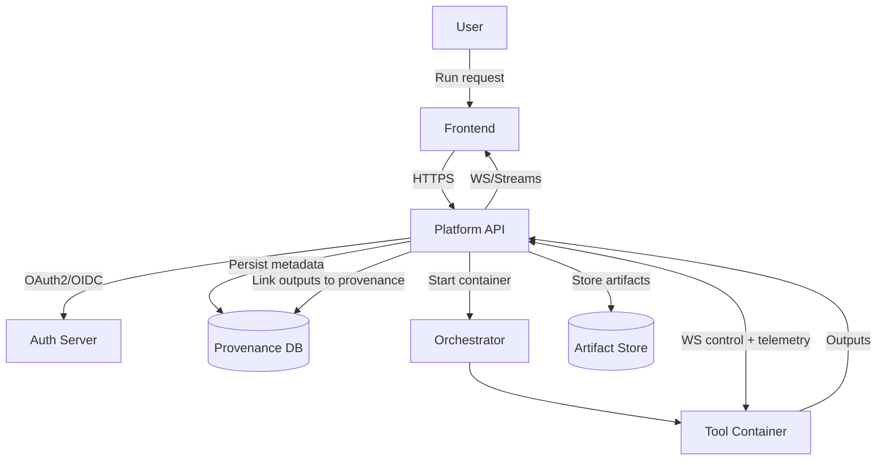
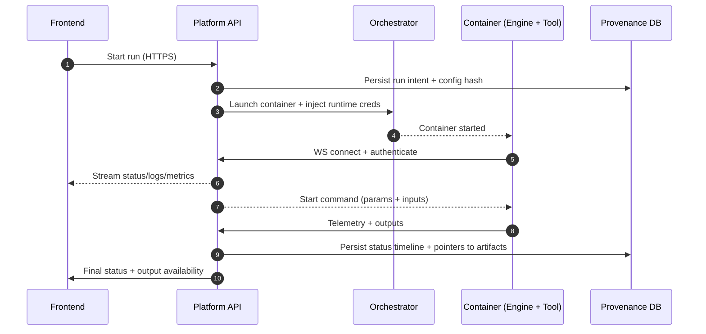

# Architecture at a Glance

%%DEPLOYED_PRODUCT_NAME%% separates **control plane responsibilities** (governance, orchestration, provenance) from **data plane execution** (tool runtime inside containers).

## Components

### Frontend (UI)
- Submits user requests (run, cancel, inspect results)
- Displays live telemetry (status, logs, metrics)
- Browses stored outputs and provenance

### Platform API (Control Plane Core)
- Authenticates/authorizes requests via **OAuth2/OIDC**
- Validates configuration and input schemas
- Persists run metadata and provenance
- Initiates container runs via the orchestrator
- Maintains the persistent WS channel to the tool runtime

### OAuth2/OIDC Server
- Issues access tokens (claims, scopes, roles)
- Enables centralized authn/authz and tenant separation (where applicable)

### Orchestrator / Orch-API
- Creates isolated container runs (e.g., Docker socket or cluster runtime)
- Injects runtime credentials and execution parameters
- Enforces operational limits (resource, timeouts) depending on deployment

### Tool Container (Runtime)
- Runs the %%DEPLOYED_PRODUCT_NAME%% engine + tool domain logic
- Implements lifecycle transitions and standardized messaging
- Produces declared outputs and pushes them back to the platform

### Provenance Storage
- Database: configuration, parameters, status timeline, errors, references
- Artifact store: output files, model artifacts, reports (depending on deployment)

## Control flow vs data flow

## Run lifecycle (where it “lives”)

The lifecycle is represented in **two places**:

- **Platform control plane:** authoritative status visible to users, persisted as provenance
- **Container runtime:** engine state machine driving tool execution and emitting telemetry

## Deployment modes

### Development mode
- Tool can connect non-containerized (faster iteration)
- Supports interactive configuration updates and test executions

### Production mode
- Execution is **strictly containerized**
- Ensures homogeneous, verifiable runtime and enforceable security constraints
