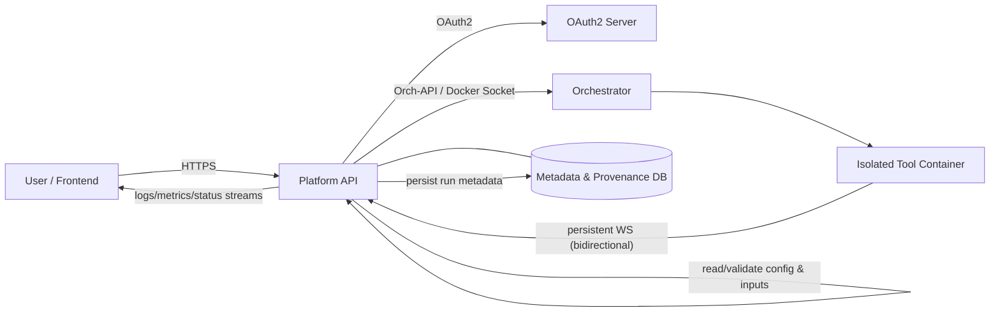
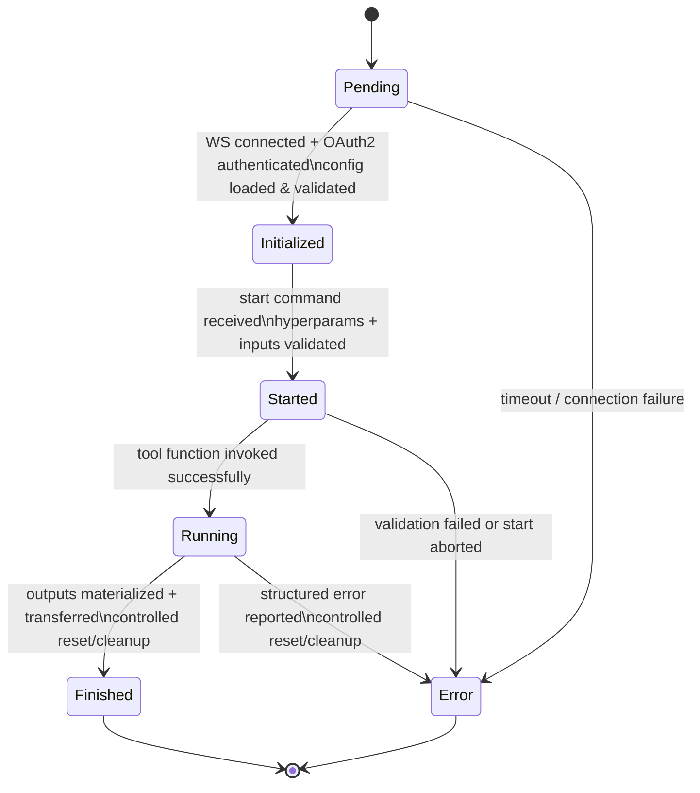
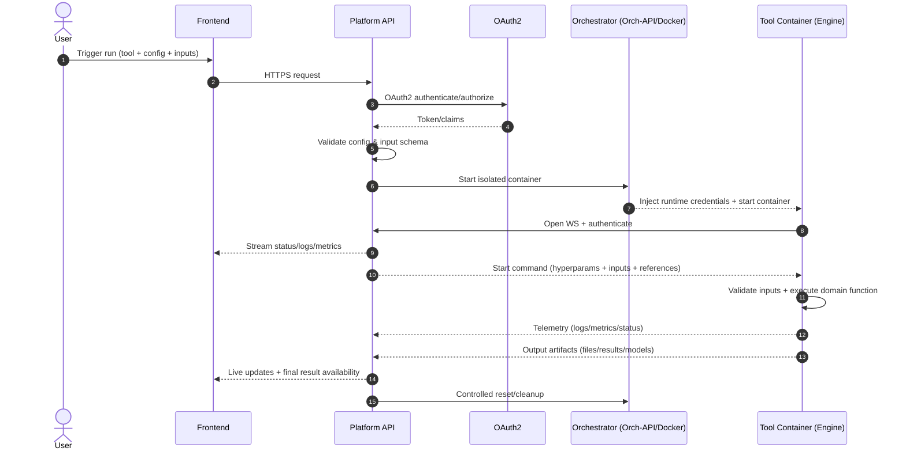

# Concepts

%%DEPLOYED_PRODUCT_NAME%% tools are **containerized scientific components** that run with a **standardized runtime interface**. This interface creates a strict boundary:

- **Tool code** implements *domain logic only* (e.g., preprocessing, training, evaluation).
- **%%DEPLOYED_PRODUCT_NAME%% platform** implements *orchestration + governance* (authentication, lifecycle control, telemetry, provenance, validation, cleanup).

This separation is the core design principle: **methodological freedom inside the tool, controlled execution outside the tool**.

---

## Execution & Interaction Model

A tool run is started from the user-facing platform, executed in an isolated container, and continuously observed and controlled via a **persistent WebSocket (WS) channel**.

- **Development mode**: a tool can connect without a container for interactive iteration (config updates, test runs, live outputs).
- **Production mode**: execution is **strictly containerized** to ensure a homogeneous, verifiable, security-controlled runtime.

### Control plane vs runtime boundary

**What the WS channel is used for:**
- **Development:** interactive config updates, test executions, runtime outputs.
- **Production:** execution control signals + runtime telemetry (logs, metrics, status transitions).

---

## Tool Lifecycle (Containerized)

Every containerized run follows an explicit lifecycle with stable phases.  
Each phase is observable via **status messages** and **telemetry** in the control plane and inside the container runtime.

### Lifecycle phases in detail

#### 1) Pending
On container start, the %%DEPLOYED_PRODUCT_NAME%% engine initializes automatically and the tool enters **Pending**.

- Establishes an **authenticated WS connection** to the platform API
- Uses **OAuth2 credentials provided at runtime** by the orchestration layer
- Enforces **platform-defined timeouts**
- Loads + validates configuration against the expected schema
- On failure: emits **structured error** visible to the user

#### 2) Initialized
In **Initialized**, the tool is operational and listens to WS messages.

Typical incoming message types:
- start training / prediction
- terminate requests
- (development) configuration updates

Until a start command arrives, the tool remains idle.

#### 3) Started
A start message contains all information needed for execution:

- Hyperparameters
- Input definitions (files, inline payloads, or controlled download references)

Input delivery options:
- **Already present in the container**
- **Uploaded by Orch-API**
- **Small payloads sent via WS**
- **Download link** retrieved from the platform in a controlled manner

All incoming data is validated. If validation fails, the run is aborted.  
If validation succeeds, the tool’s **domain function** is invoked.

> Tool code is strictly limited to the domain function(s).  
> Orchestration, status transitions, standardized error handling are handled by %%DEPLOYED_PRODUCT_NAME%%.

#### 4) Running
In **Running**, the tool continuously communicates with the platform:

- real-time **logs, metrics, and status** over WS
- live progress updates for users
- systematic telemetry for evaluation (performance, resource usage, stability) across tool versions

#### 5) Finished
After successful execution:

- declared outputs are **materialized** (files, artifacts, visualizations, model assets)
- outputs are **transferred back** to the platform
- engine performs a **controlled reset/cleanup**, leaving the container in a clean final state

%%DEPLOYED_PRODUCT_NAME%% treats “Finished” as a **semantically meaningful** state, not just “process ended”.

#### Error Handling & Recoverability
Errors are **first-class lifecycle states**, not out-of-band exceptions.

When an error occurs:
- transition to **Error**
- structured error reporting (message, stack trace, runtime context)
- controlled reset/cleanup
- failed runs remain **traceable** and, if inputs/config are preserved, **reproducible**

This is designed for robust production pipelines and scientific traceability (especially in clinical/regulatory settings).

---

## Message & Data Flow (Run-Level View)

The end-to-end flow from user request to results is deterministic and auditable.

---

## Tool Types

Lifecycle explains **how** tools run. Types explain **what** scientific role a tool fulfills in a pipeline.

%%DEPLOYED_PRODUCT_NAME%% assigns each tool an explicit, extensible **type**. Typing improves:
- interpretability
- reuse
- transparency
- reproducibility

### Preprocessing
Deterministic preparation steps (e.g., normalization, encoding, imputation).

- No persistent model artifacts
- Clarifies separation between “data preparation” and “analysis/modeling”

### Analysis
Trainable machine learning components.

Key properties:
- models can be trained, versioned, executed reproducibly
- the platform orchestrates training using explicit hyperparameter configurations
- for each unique hyperparameter combination, a **subvariant** is instantiated for traceability
- after training, the trained model (including weights) is persisted via standardized **save/load** interfaces
- model artifacts are stored in versions and can be selected, compared, and reproduced later
- when a model is chosen for a run, corresponding weights are loaded during initialization

### Evaluation
Computes metrics and evaluation variables without altering data or models.

- separation from analysis enables methodologically sound interpretation
- supports systematic comparisons between models and pipelines

### Self-learned
Algorithmic procedures without persistent model formation (e.g., clustering, heuristics).

- results derived directly from data + parameters
- prevents misleading treatment as trainable, versioned models

### Data Transformation
Structural operations (ETL-like): splitting, aggregation, reshaping, dataset transformations.

- focuses on structural adjustments, not statistical preprocessing
- explicit modeling increases transparency and reproducibility of data-changing steps

### Database Adopter
Pipeline entry-point tools that load data from external sources.

- typically no classic input interface
- defines data provenance
- central for traceability, versioning, and regulatory transparency

---

## Key Takeaways

- %%DEPLOYED_PRODUCT_NAME%% enforces a **standard runtime interface**: tools implement science; the platform implements orchestration and governance.
- Production execution is **container-only** for verifiable, controlled runtimes.
- Runs follow an explicit lifecycle: **Pending → Initialized → Started → Running → Finished/Error**.
- Real-time **telemetry + status** is always available via the WS channel.
- Tool **types** define scientific roles to keep pipelines interpretable, reusable, and reproducible.
