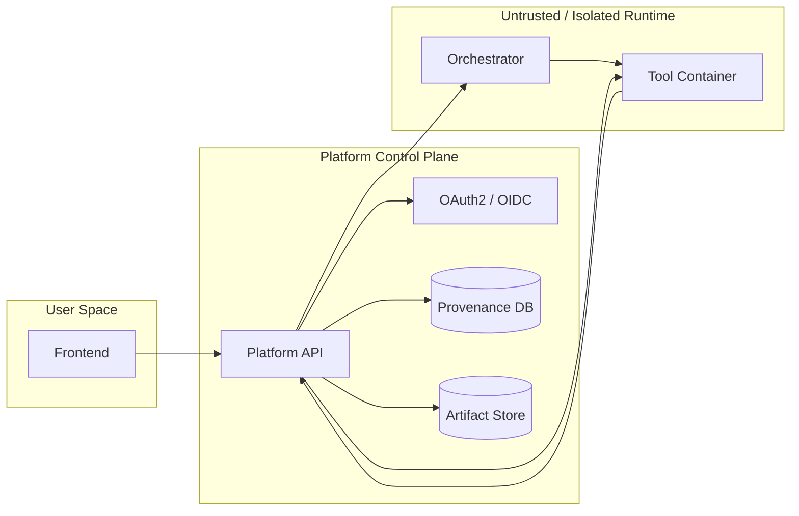

# Introduction

%%DEPLOYED_PRODUCT_NAME%% is a platform for executing **reproducible, governed scientific tools** in a controlled runtime environment.

At a high level, %%DEPLOYED_PRODUCT_NAME%% provides:

- **Standardized tool runtime interface** (tools implement domain logic, the platform implements orchestration)
- **Isolated execution** (production runs are strictly containerized)
- **End-to-end traceability** (configuration, inputs, outputs, and telemetry are captured as provenance)
- **Live observability** (status transitions, logs, and metrics streamed via WebSocket)
- **Security controls** (OAuth2/OIDC authentication, runtime credential injection, policy enforcement)

## Mental model

Think of %%DEPLOYED_PRODUCT_NAME%% as two cooperating layers:

- **Tool layer (inside the container):** scientific logic, deterministic transformations, model training/inference, evaluations
- **Platform layer (control plane):** authentication, validation, orchestration, lifecycle control, provenance storage, auditing

## What you should read next

- **Architecture at a glance** - components and data/control flows
- **Security & trust model** - where trust is placed and how risks are controlled
- **FAQ** - common operational questions (dev vs prod, inputs/outputs, failures)
