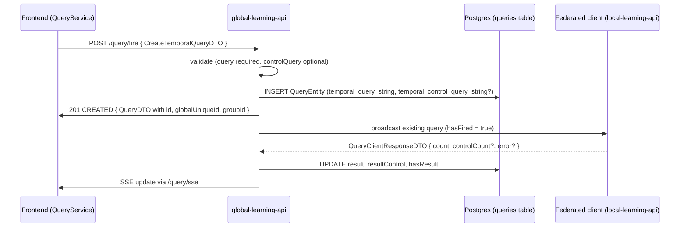

This page describes how the global-learning-api turns a `CreateTemporalQueryDTO` from the frontend into a persisted query and then broadcasts it to the federated local clients.

## Source files

| Role             | Path                                                                              |
| ---------------- | --------------------------------------------------------------------------------- |
| REST interface   | `learning-apis/global-learning-api/.../api/query/QueryService.java`              |
| REST impl        | `learning-apis/global-learning-api/.../api/query/QueryServiceImpl.java`          |
| Business logic   | `learning-apis/global-learning-api/.../api/query/QueryBO.java`                   |
| MapStruct mapper | `learning-apis/global-learning-api/.../api/query/QueryMapper.java`               |
| JPA entity       | `learning-apis/global-learning-api/.../api/query/QueryEntity.java`               |
| Panache repo     | `learning-apis/global-learning-api/.../api/query/QueryAO.java`                   |
| Response handler | `learning-apis/global-learning-api/.../api/query/response/QueryResponseBO.java`  |
| Federated wsc.   | `learning-apis/global-learning-api/.../api/feddbclient/FLNetClientBroadcastBO.java` |

The DTO classes themselves live in `core-learning-api` under `bio.cosy.feddb.core.api.query` and `bio.cosy.feddb.core.api.query.temporal`.

## Lifecycle



## Endpoints

The interface declares only temporal endpoints; the legacy simple-query DTOs and the PUT update path are gone.

```java
@POST                                  Response create(@Valid CreateTemporalQueryDTO dto);
@POST @Path("/fire")                   QueryDTO createAndRun(@Valid CreateTemporalQueryDTO dto);
@POST @Path("/{id}/fire")              QueryDTO fireQuery(@PathParam("id") Long id);
@POST @Path("/{id}/fire-data-statistics") QueryDTO fireDataStatistics(@PathParam("id") Long id);
@GET                                   List<QueryDTO> list();
@GET  @Path("/sse")                    Multi<QueryDTO> listSSE();
@GET  @Path("/{id}")                   QueryDetailDTO retrieve(@PathParam("id") Long id);
@DELETE @Path("/{id}")                 Response delete(@PathParam("id") Long id);
```

To edit a query, the frontend re-creates it under the same `groupId`. `list()` and `listSSE()` collapse versions per group and return only the latest, which is why the editing UX still looks like an update from the user's side.

## Persistence

`QueryEntity` stores the temporal payloads as JSON text:

| Column                          | Type | Notes                                                  |
| ------------------------------- | ---- | ------------------------------------------------------ |
| `temporal_query_string`         | TEXT | Required JSON for the case `QueryGroup`.               |
| `temporal_control_query_string` | TEXT | Optional JSON for the control `QueryGroup`.            |
| `result`                        | INT  | Patient count for the case cohort, set on response.    |
| `result_control`                | INT  | Patient count for the control cohort, set on response. Null when no control query. |
| `has_fired`, `has_result`       | BOOL | Status flags driven by `QueryBO`.                      |
| `group_id`, `global_unique_id`  | TEXT | Versioning identifiers.                                |

`QueryMapper.queryGroupToJsonString` / `jsonStringToQueryGroup` perform the (de)serialisation via Jackson. Two parallel mappings exist: one for the case payload, one for the control payload.

## Create path in `QueryBO`

```java
public QueryDTO createTemporal(CreateTemporalQueryDTO request, String keycloakId) {
    validateTemporalRequest(request);
    return persistTemporal(request, keycloakId, request.getGroupId());
}

public QueryDTO createAndRunTemporal(CreateTemporalQueryDTO request, String keycloakId, Set<String> roles) {
    validateTemporalRequest(request);
    QueryDTO dto = persistTemporal(request, keycloakId, request.getGroupId());
    return fireQuery(dto, roles);
}
```

`validateTemporalRequest` throws `BadRequestException` when `query` is missing; `controlQuery` is genuinely optional and the rest of the pipeline treats `null` the same as "no control cohort". `persistTemporal` allocates a new `globalUniqueId` (UUID), keeps the `groupId` (or allocates one), and persists via `QueryMapper.createDtoToEntity`.

## Broadcast and counts

`fireQuery(QueryDTO, Set<String> roles)` sets `hasFired = true`, persists via `update`, then calls `FLNetClientBroadcastBO.fireExistingQuery(query)`. The federated clients receive the full `QueryDTO` and run it locally (see [Local learning API · query translation & privacy](../local-learning-api/query-translation-and-privacy.md)).

Replies arrive on a websocket as a `QueryClientResponseDTO`:

```java
class QueryClientResponseDTO {
    FedDBClientResponseType type;
    String globalUniqueQueryId;
    Long count;          // case
    Long controlCount;   // null when no control query
    String error;
}
```

`QueryResponseBO.saveResponse` writes the result to `query_result` and then asks `QueryBO.setCount(globalUniqueId, count, controlCount)` to increment `result` and `result_control` atomically. The two counts are kept in lockstep so a frontend reading `QueryDTO` always sees both values from the same response.

`QueryAO.updateCountsByGlobalUniqueId` falls back to the single-count update when `controlCount` is null, so existing federated clients that don't speak the control field still work.

## Validation rules

- `query` must be non-null. Returns 400 otherwise.
- `controlQuery` is optional. When null, the response will have `resultControl = null`.
- The body is structurally validated by Bean Validation (`@Valid`). Field-level errors (missing operator, malformed `temporalRelations`) are surfaced by the **local** translator, not here — see [the local doc](../local-learning-api/query-translation-and-privacy.md).
- `groupId` may be passed by the client to express "this is a new version of an existing query". If omitted, a fresh UUID is assigned.

## Versioning

Every save creates a new `QueryEntity` row. `groupId` ties versions together; `findAllVersionsByGroupIdForUser` powers the "older versions" list returned by `GET /query/{id}` in `QueryDetailDTO.olderQueries`. Refiring an already-fired query also creates a fresh `createVersionFromEntity` row so reruns are first-class.

## Where to start when changing things

| Task                                              | Start here                                          |
| ------------------------------------------------- | --------------------------------------------------- |
| Add a new field to the temporal DTO               | `core-learning-api/.../api/query/temporal/*.java` + mapping in `QueryMapper` |
| Add a new endpoint                                | `QueryService.java` interface, then `QueryServiceImpl.java` + `QueryBO.java` |
| Change persistence (add a column)                 | `QueryEntity.java`; `drop-and-create` in tests/dev means Hibernate auto-applies |
| Change the federated wire format                  | `QueryClientResponseDTO` (core) **and** the local handler in lockstep |
| Add a new count semantic (e.g. "third cohort")    | `QueryDTO`, `QueryEntity`, `QueryAO.updateCountsByGlobalUniqueId`, `QueryResponseBO.saveResponse` |
