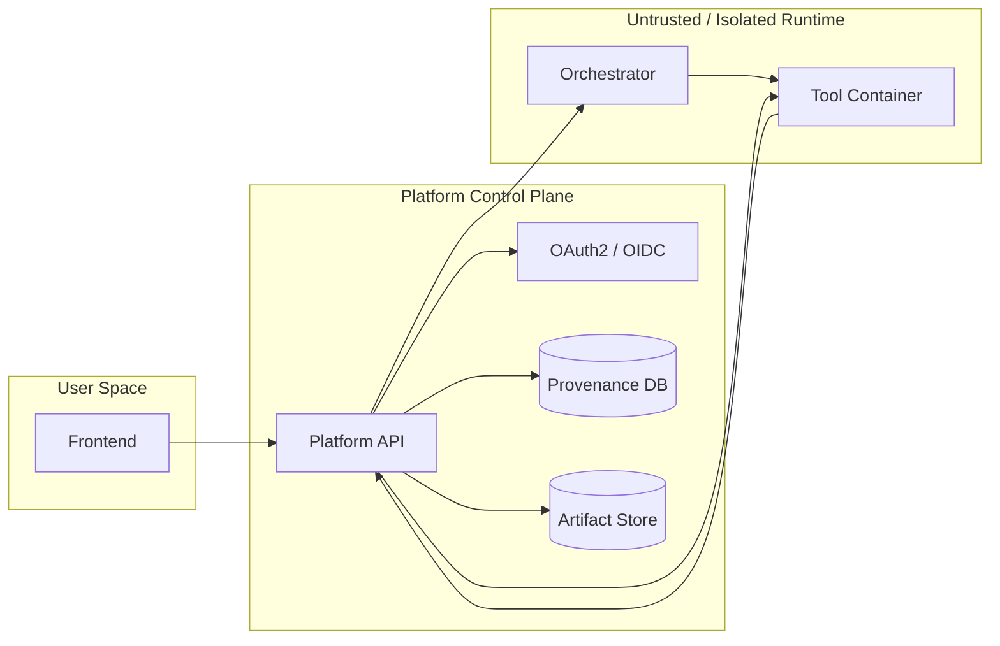

# Security & Trust Model

%%DEPLOYED_PRODUCT_NAME%% is designed around a **zero-trust-friendly** approach: tools are treated as potentially untrusted code and are executed in controlled environments with explicit boundaries.

## Trust boundaries

**Key idea:** the container runtime is isolated and must not be trusted by default.  
The platform enforces identity, policy, validation, and provenance.

## Authentication & authorization

- **User → API:** authenticated via OAuth2/OIDC access tokens.
- **Container → API:** authenticated via **runtime credentials injected by the orchestrator**.
- Authorization decisions are based on token claims/scopes/roles (deployment-dependent).

### Why inject runtime credentials?
It avoids baking secrets into images and supports:
- rotation
- least privilege
- short-lived credentials
- per-run isolation of privileges

## Input/output security model

### Input acquisition options
- Files staged inside container by orchestrator
- Files uploaded via Orch-API
- Inline small payloads via WS (for development/small configs)
- Controlled download references (platform-mediated)

**Platform responsibilities:**
- schema validation and size checks (where applicable)
- provenance capture (hashes/pointers)
- enforcing allowed sources (e.g., only platform URLs)

**Tool responsibilities:**
- treat inputs as untrusted data
- validate against expected schema (defense-in-depth)
- never assume filesystem contents beyond declared inputs

### Output handling
- Outputs must be **declared** and are transferred back to the platform.
- The platform persists artifacts and links them to run provenance.

## Network & isolation expectations (production)

Production runs are strictly containerized to enable:
- immutable images (digest-pinned deployments)
- runtime confinement (namespaces/cgroups/SEC profiles depending on infra)
- controlled egress (deployment policy: no-internet or allowlisted endpoints)

> Exact isolation primitives (seccomp/AppArmor/SELinux, rootless, etc.) depend on deployment, but the model assumes the runtime is constrained and auditable.

## Telemetry and information disclosure

Telemetry (logs, metrics, stack traces) is essential for traceability, but must be controlled:

- Logs/metrics are streamed to authorized users only
- Errors are structured and persisted as provenance
- Sensitive values should not be logged by tools (avoid secrets in stdout)

## Threat model (high-level)

%%DEPLOYED_PRODUCT_NAME%% is built to mitigate:

- **Unauthorized execution** (OAuth2/OIDC + policy checks)
- **Secret leakage** (runtime injection, avoid image-embedded secrets)
- **Non-reproducible runs** (provenance: config + inputs + artifacts + telemetry)
- **Unbounded execution** (timeouts, cancellation, orchestration controls)
- **Supply-chain risk** (containerization enables scanning, digest pinning, and audit gates)

## Developer guidelines (security-relevant)

- Keep tool logic inside the domain function(s); avoid custom networking unless required
- Avoid writing to unexpected paths; use declared output locations
- Do not log secrets, tokens, or raw patient identifiers
- Prefer deterministic behavior and explicit random seeds (where applicable)
