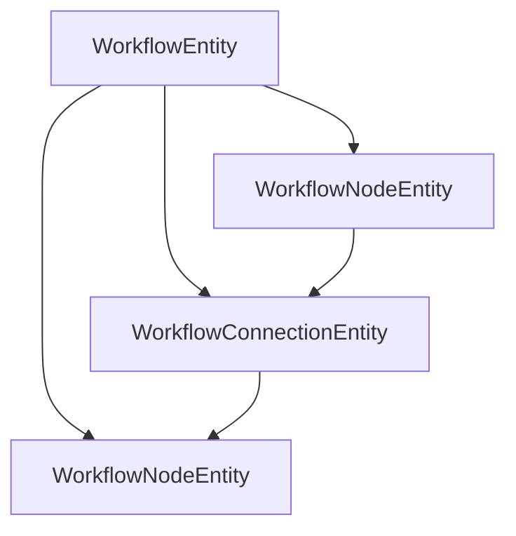
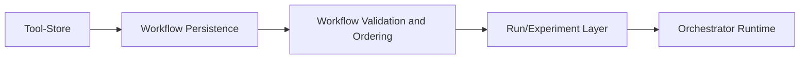
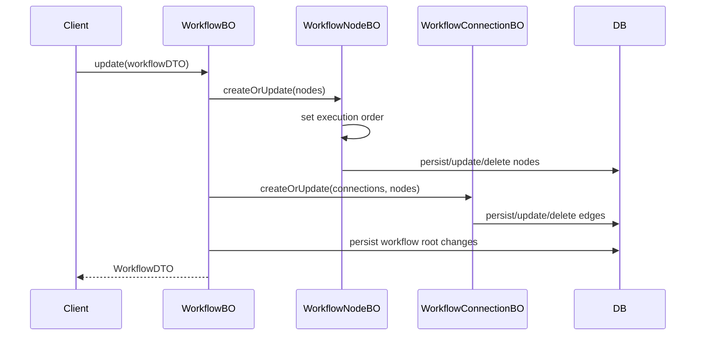
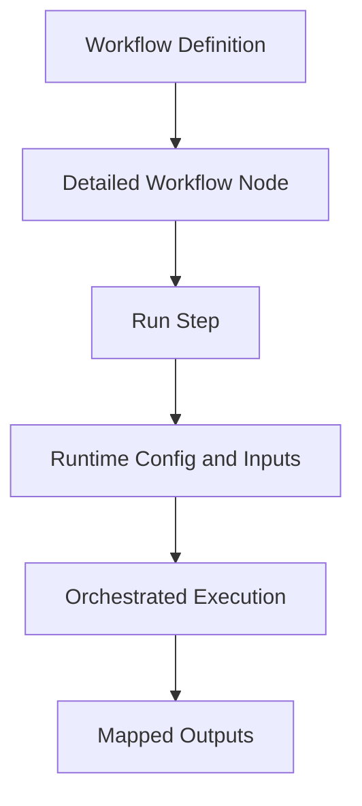

# Workflow System

## What Are Workflows?

In %%DEPLOYED_PRODUCT_NAME%% , a workflow is a platform-managed execution DAG. It is not just a user-authored list of steps. Each node references a Tool-Store-backed tool version and binds that tool to:

- declared input interfaces
- declared output interfaces
- a hyperparameter schema
- platform-known metadata such as image and version references

This means workflow composition is contract-driven. A workflow edge is only meaningful if the output contract of one node can be connected to the input contract of another node. The platform therefore reasons over typed tool interfaces, not only over visual ordering.

%%DEPLOYED_PRODUCT_NAME%%  uses workflows as governed execution objects inside the platform. The platform controls:

- which tools may participate in workflows
- which tool versions are admitted for execution
- how node metadata is resolved
- where execution happens
- how results and lineage are linked back to workflow nodes

This differs from classic scientific workflow systems that mostly assume tools already exist outside the platform and are then referenced as containers or scripts. In %%DEPLOYED_PRODUCT_NAME%% , the trust anchor is shifted into the platform itself: tools are admitted through a controlled Tool-Store and build pipeline before they become available for workflow composition.

## Why This Matters

The workflow system serves three backend goals:

1. It provides a stable persisted graph model for analysis definitions.
2. It constrains composition through known tool contracts and versioned metadata.
3. It creates an execution-ready model that can be handed to orchestrated runtime components.

This is especially relevant in regulated or sensitive environments because reproducibility and traceability depend not only on workflow syntax, but also on who admitted the tools, which version was used, and where execution happened.

## Core Model

At the backend level, a workflow is persisted as a root entity with nodes and connections.

### WorkflowEntity

`WorkflowEntity` is the aggregate root for a workflow definition.

It contains:

- `publishStatus`
- `name`
- `description`
- `inputs` as workflow-level input configuration
- `nodes`
- `connections`

Important backend property:

- a workflow is owned through the authenticated entity model inherited from `BaseAuthEntity`

### WorkflowNodeEntity

A `WorkflowNodeEntity` represents one executable step in the graph.

Key fields include:

- `workflow`
- `federatedAppId`
- `federatedAppVersionId`
- `modelSubId`
- `imageName`
- `oldFCVersion`
- incoming and outgoing connections

The important design point is that a node does not only point to a logical tool. It points to an admitted versioned artifact or model-backed execution unit that the platform can resolve and execute.

### WorkflowConnectionEntity

A `WorkflowConnectionEntity` represents a typed edge between two nodes.

It contains:

- `inputNode`
- `outputNode`
- `inputFileName`
- `outputFileName`
- `inputConfigName`
- `outputConfigName`

These fields show that a connection is not merely “node A before node B”. It binds named output and input contracts. This is what makes the graph typed rather than purely positional.

## Conceptual Architecture

The layers are:

- Tool admission: determines what tool versions are available for use.
- Workflow persistence: stores the graph structure.
- Validation and ordering: derives executable structure from node and edge contracts.
- Run layer: materializes workflow nodes into run steps.
- Orchestrator runtime: executes node workloads in controlled infrastructure.

## Backend Responsibilities by Component

### WorkflowBO

`WorkflowBO` manages workflow lifecycle and ownership-aware access.

Main responsibilities:

- create empty workflow roots
- update existing workflows
- publish project-owned or system-owned workflows
- delegate node and connection persistence
- map persisted entities back to DTOs

A workflow update is effectively a graph synchronization operation:

- nodes are created or updated
- connections are created or updated
- entities no longer present in the request are removed

### WorkflowNodeBO

`WorkflowNodeBO` is responsible for node persistence and node enrichment.

Important behavior:

- it resolves detail objects from persisted node entities
- it enriches nodes with app or model metadata from the global store service
- it applies execution ordering through `BaseWorkflowEngine`

This is a key architectural point. The stored node is lightweight, but the detail DTO used for execution is enriched with platform-resolved metadata.

### WorkflowConnectionBO

`WorkflowConnectionBO` maps connection DTOs to persisted edges and binds them to actual node entities.

Important behavior:

- node references are resolved by `nodeId`
- edge creation is tied to an existing workflow and its node set
- obsolete edges are deleted during synchronization
- output names can later be used to match produced files to downstream inputs

## Workflow Update Flow

The backend update flow is graph-centric.

Notable properties of this flow:

- nodes are processed before connections
- execution order is computed before node persistence is finalized
- stale graph elements are deleted after synchronization
- composition is validated against the node set currently belonging to the workflow

## Typed Composition Instead of Freeform Chaining

%%DEPLOYED_PRODUCT_NAME%%  workflows are not intended to support arbitrary unrestricted chaining of tools.

A valid composition depends on:

- tool admission into the platform
- availability of a concrete tool version
- known input and output contracts
- semantic compatibility between adjacent nodes
- workflow graph rules enforced by the engine and DTO structure

This means the workflow object behaves like a typed execution graph. The graph is authored by users or agentic components, but it is validated against platform-known contracts.

## Relation to Tool Admission

The workflow system should be understood together with the Tool-Store.

%%DEPLOYED_PRODUCT_NAME%%  does not assume that public containers or scripts are safe to execute just because they exist. Instead:

- tools are registered centrally
- tools pass through a controlled build pipeline
- admitted tool versions become available as workflow node targets
- workflows can only reference what the platform has already accepted

So workflows are downstream of tool governance. This is one of the major differences from systems that treat execution artifacts as externally trusted inputs.

## Relation to Agentic Planning

LLM-based or agentic components in %%DEPLOYED_PRODUCT_NAME%%  operate inside the workflow model, not outside it.

An agent does not generate arbitrary shell pipelines. It proposes graph extensions within the platform’s admissible space:

- only admitted tools
- only known versions
- only contract-compatible edges
- only valid workflow structures

As a result, agentic planning is constrained by backend workflow semantics.

## Relation to Execution

Persisted workflows are definitions. Execution happens through run-specific objects that materialize the workflow as executable steps.

In the local backend, this handoff is visible in the federated learning run path:

- a workflow node is resolved as a detailed node DTO
- hyperparameters are converted into runtime config artifacts
- inputs and upstream outputs are uploaded into controlled runtime volumes
- orchestrator services execute the node in isolated infrastructure
- produced files are mapped back through workflow connections

Conceptually:

This separation matters:

- workflow objects represent durable graph definitions
- run objects represent one concrete execution of those definitions

## Security and Trust Model

The workflow system is part of a larger controlled platform model.

Key consequences:

- execution does not depend on the user’s local machine
- build and runtime environments are centrally governed
- tool provenance is platform-controlled
- workflow steps are traceable to concrete admitted versions
- graph execution can be monitored in infrastructure designed for sensitive data contexts

This is a backend architecture decision, not only a UI or UX feature.

## Practical Backend Implications

When working on this subsystem, treat workflows as:

- typed graph definitions, not plain ordered lists
- ownership-aware persisted aggregates
- objects that must remain compatible with Tool-Store metadata
- execution inputs to downstream orchestration layers

Do not treat a node as self-sufficient if its tool metadata must still be resolved from the global store. Do not treat an edge as valid if it only references node IDs without matching interface names.

## Extension Points

The current backend structure supports extension in several directions:

- stricter semantic validation before persistence
- richer compatibility checks for inputs and outputs
- workflow templates or system-owned starter graphs
- export and import formats for graph exchange
- stronger agentic planning constraints derived from node contracts

## Summary

In %%DEPLOYED_PRODUCT_NAME%% , workflows are platform-governed, typed execution DAGs built from admitted tool versions. The backend persists them as workflow roots with nodes and contract-carrying connections, enriches them with Tool-Store metadata, computes execution order, and hands them off to controlled runtime infrastructure through run-specific execution layers.

That is the core difference to many classic workflow systems: %%DEPLOYED_PRODUCT_NAME%%  does not start by trusting external tools and then orchestrating them. It starts by governing tool admission, then uses those governed artifacts to build valid executable workflow graphs inside the platform.
