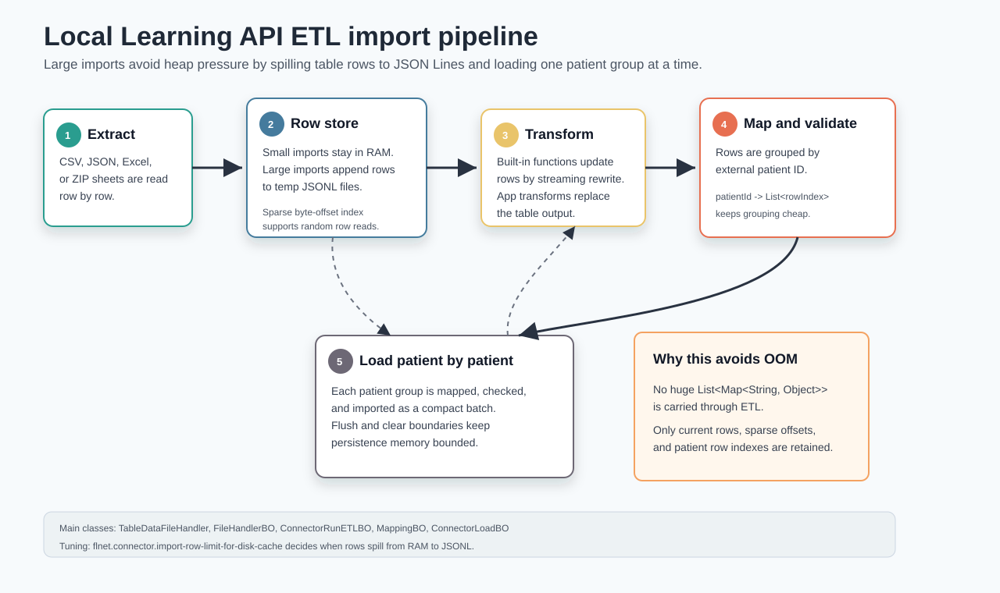

# ETL Pipeline

The Local Learning API connector import is an ETL pipeline:

- **Extract** source rows from uploaded or app-produced files.
- **Transform** rows with configured connector transformers.
- **Map** row cells to schema nodes and validate values.
- **Load** mapped values into the local patient store.

The important design goal is that a large import must not keep all rows as one huge
`List<Map<String, Object>>` for the full run. Instead, extracted rows are represented by
`TableDataFileHandler`, which can keep small imports in memory and spill large imports to a temporary JSON Lines file.
The disk file stores each row as a compact JSON array in table column order.



## Main Components

| Component | Responsibility |
| --- | --- |
| `ConnectorRunETLBO` | Orchestrates the import run and advances extract, transform, map, and load progress. |
| `ConnectorExtractBO` | Resolves the configured input source and returns a `TableDataFileHandler`. |
| `FileHandlerBO` | Reads CSV, JSON, Excel, ZIP, and merged sheets into table rows. |
| `TableDataFileHandler` | Stores table rows in memory or as compact temporary JSONL arrays with streaming and indexed access. |
| `ConnectorTransformerBO` | Applies built-in or app-based row transformations. |
| `MappingBO` | Converts source row cells into `MappingRowResultDTO` objects and validates them. |
| `ConnectorLoadBO` | Groups mapped rows by patient and delegates to the configured import mode. |
| `ConnectorLoadModeBO` subclasses | Persist data in default, comprehensive, or delete mode. |

## Data Shape Through The Pipeline

The source table is represented as:

```text
columns: List<String>
rows:    Map<String, Object> per source row
```

Each row map uses the source column name as the key and the cell value as the value:

```text
{
  "patient_id": "P-001",
  "visit": "baseline",
  "glucose": "5.6"
}
```

After mapping, the row becomes a `MappingRowResultDTO`:

```text
externalPatientId: "P-001"
validationResult: List<ConnectorValidationResultDTO>
entries:          List<PatientDataEntryDTO>
```

After loading, the mapped data becomes database entities:

```text
PatientEntity              -> patient_meta
PatientDataEntryEntity     -> patient_data
MetaPatientDataEntryEntity -> patient data-entry metadata
```

## Step 1: Start The Run

`ConnectorRunETLBO.processRun` is the entry point for a connector run.

It does the following setup:

1. creates a run message: `Starting import`;
2. sets the audit context with keycloak user, connector ID, and run ID;
3. marks the run as `RUNNING`;
4. sends progress for the `EXTRACTING` step.

All later stages update the same `ConnectorRunDTO` counters so the frontend can display run status, expected rows,
expected patients, transformed rows, loaded patients, failed entries, and final state.

## Step 2: Extract Input Data

Extraction is handled by `ConnectorExtractBO.loadConnectorData`.

There are two supported input families:

| Input configuration | Handler |
| --- | --- |
| `FileUploadSettingsDTO` | `ConnectorExtractBO.loadFromFile`, then `FileHandlerBO` |
| `AppBasedUploadSettingsDTO` | starts an app extractor and waits for uploaded tabular output |

For file uploads, `ConnectorExtractBO` loads the stored file through `ConnectorFilesBO`, then calls
`FileHandlerBO.getFirstTableData`.

For app-based extractors, the extractor app is started through `ConnectorRunExecutionRunBO`. The app uploads an output
file, and `ConnectorRunExecutionOutputAwaiter` returns the resulting `TableDataFileHandler`.

At the end of extraction, `ConnectorRunETLBO` has one table object:

```text
TableDataFileHandler tableData
```

If the table is empty, the run is marked as an error.

## Step 3: Read CSV, JSON, Excel, Or ZIP Files

`FileHandlerBO.getByFile` chooses a reader based on `FileUploadSettingsDTO.fileType`.

### CSV

CSV files are read with Apache Commons CSV.

`readCsvTable` determines the column names first:

- if `hasHeader` is true, the first record becomes the column list;
- otherwise columns are named by index: `0`, `1`, `2`, and so on.

Each source record is converted into a `LinkedHashMap<String, Object>` so column order remains stable.

Rows are appended one at a time:

```text
TableDataFileHandler.appendRow(row)
```

After each append, `FileHandlerBO.spillRowsIfNeeded` checks whether the table should move from memory to disk.

### JSON

JSON input is expected to be an array of objects.

The reader uses a Jackson `JsonParser` and reads one object at a time. It does not first deserialize the complete JSON
array into a Java list.

For each object:

1. parse a `LinkedHashMap<String, Object>`;
2. append it to `TableDataFileHandler`;
3. check whether the row threshold requires spilling to disk.

### Excel

Excel input is read with Apache POI.

`readExcel` can either:

- read only the first sheet; or
- read all sheets when `firstSheetOnly` is false or a sheet merge configuration is present.

`readSheet` uses the first row as headers when `hasHeader` is true. Otherwise it creates numeric column names.

Blank cells are represented as the empty string `""`. This is deliberate: downstream code treats an empty string as a
real source value, while a literal `null` is used as a structural placeholder during sheet merging.

### ZIP With Multiple CSV Files

ZIP input is handled by `readCsvZip`.

The ZIP reader iterates over entries and accepts common tabular extensions such as `.csv`, `.tsv`, `.txt`, `.psv`,
`.dat`, `.tab`, and `.dsv`.

Each matching entry is parsed as a separate table. The entry file name without extension becomes the sheet name in the
result map.

## Step 4: Merge Multiple Sheets Or Files

Merging is handled in `FileHandlerBO.mergeSheets`.

Merging only happens when `SheetMergeResultDTO` contains a non-empty `sheetUidMapping`.

The merge config tells the importer which column identifies the same patient or logical record in each sheet:

```text
sheetUidMapping:
  Demographics -> patient_id
  Labs         -> lab_patient_id
commonUidColumnName:
  patient_uid
```

The merge process has four phases.

### Normalize Sheet Names

Sheet names are normalized by lowercasing and removing spaces and underscores. This lets configuration survive small
differences like `Labs`, `labs`, or `Lab s`.

### Resolve UID Columns

For every sheet, the importer resolves the configured UID column. If a configured column is sheet-prefixed with
`Sheet::Column`, the importer strips the prefix for the matching sheet.

Rows without a UID value are skipped because they cannot be joined to the common merged identifier.

### Rename Duplicate Non-UID Columns

If two sheets have the same non-UID column name, that column is renamed in the merged table:

```text
Demographics::status
Labs::status
```

This prevents accidental overwrites when multiple source sheets share generic names.

### Append Merged Rows

The merged table contains one common UID column plus all non-UID columns from all merged sheets.

Each source row becomes one merged row:

- the common UID column receives the resolved UID value;
- columns owned by the current source sheet receive their real values;
- columns from other sheets are filled with `null`.

Those `null` values are structural placeholders. `MappingBO` intentionally skips cells whose value is literally `null`,
so columns from other sheets are not validated or persisted for the current source row.

For preview only, `collapseSheets` can collapse rows with the same UID into one row by taking the first non-null value
per column. This makes previews easier to read. The production import keeps rows separate so grouped data remains
faithful to the source.

## Step 5: Store Rows With TableDataFileHandler

`TableDataFileHandler` is the central table abstraction.

It stores metadata and rows:

```text
columns:         List<String>
columnProfiles:  List<ColumnProfile>
rowCount:        long
rows:            List<Map<String, Object>> only for in-memory tables
rowDataFile:     Path to temporary JSONL file for disk-backed tables
sparseOffsets:   List<Long> byte offsets for every Nth row
```

### In-Memory Mode

Small tables use the `rows` field directly. This keeps previews and small imports simple and fast.

### Disk-Backed Mode

When the row count exceeds `flnet.connector.import-row-limit-for-disk-cache`, `spillRowsToTempFile` creates a temporary
JSONL file and appends the existing in-memory rows to it.

After spilling:

- `rows` is cleared and set to `null`;
- `rowDataFile` points to the JSONL file;
- `rowCount` tracks the number of rows;
- `sparseOffsets` stores byte offsets for selected row numbers.

Each disk-backed row is stored as one JSON array on one line.

The column names are stored once in `columns`, so the JSONL file does not
repeat keys for every row. Values are written in the same order as `columns`.
For example, if the table metadata is:

```text
columns = ["patient_id", "visit", "glucose"]
```

then the disk file stores rows like this:

```json
["P-001","baseline","5.6"]
["P-002","baseline","7.1"]
```

This is JSON Lines, not one large JSON array. JSONL is important because the importer can append rows step by step and
stream them later without parsing the whole file.

When a caller reads a row, `TableDataFileHandler` reconstructs the usual
`Map<String, Object>` shape by combining `columns[i]` with `rowValues[i]`.
The rest of the ETL pipeline therefore still works with maps:

```text
["P-001","baseline","5.6"]
        +
["patient_id", "visit", "glucose"]
        =
{"patient_id":"P-001","visit":"baseline","glucose":"5.6"}
```

This keeps the existing importer API stable while reducing disk usage compared
with object-shaped JSONL such as
`{"patient_id":"P-001","visit":"baseline","glucose":"5.6"}`.

If a column is added after rows have already been spilled, the existing JSONL
lines are not rewritten immediately. When those older rows are read back, the
missing trailing value is reconstructed as `null` for the new column.

The parser still accepts object-shaped JSONL rows for compatibility with older
temporary files, but new writes use array-shaped rows.

### Sparse Byte-Offset Index

The table does not store one byte offset per row. That would be another large memory structure for very large imports.

Instead, `sparseOffsets` stores the byte offset of every `DEFAULT_SPARSE_INDEX_INTERVAL` row. The default interval is
`10_000`.

For example:

```text
sparseOffsets[0] -> byte offset of row 0
sparseOffsets[1] -> byte offset of row 10,000
sparseOffsets[2] -> byte offset of row 20,000
```

When `getRow(23_500)` is called, the table seeks to row `20_000` and scans forward until row `23_500`. This trades a
small amount of sequential file scanning for much lower memory usage.

### Streaming Reads

`streamRows` opens a `BufferedReader`, reads the JSONL file line by line,
parses each value array on demand, and reconstructs a row map from the stored
column order.

Callers should use try-with-resources:

```java
try (var stream = tableData.streamRows()) {
    stream.forEach(row -> /* process row */);
}
```

### Safe Updates

Disk-backed rows cannot be safely edited in place because the JSON representation can change length.

`updateRows` and `updateRowsWithIndex` therefore:

1. open the old JSONL file for reading;
2. create a new temporary JSONL file;
3. stream each old row;
4. apply the updater function;
5. write the changed row as a column-ordered JSON array to the new file;
6. replace the old file with the new file;
7. rebuild row count and sparse offsets.

Only the current row is in memory during this rewrite.

### Cleanup

Temporary row files are deleted by `TableDataFileHandler.close` when the table owns the file. `ConnectorRunETLBO` closes
the table in its `finally` block.

## Step 6: Transform Rows

Transformation is handled by `ConnectorTransformerBO.applyTransformations`.

There are two transformer types.

### Built-In Transformers

Built-in transformers are executed in process through `FunctionRunnerBO`.

For small in-memory tables, the transformer receives the normal row list.

For disk-backed tables, `ConnectorTransformerBO` calls `tableData.updateRows`. Each row is passed through the function
runner as a one-row list, then the result is written into the replacement JSONL file. This avoids giving the transformer
the full import-sized row list.

This is the critical memory difference from the old implementation.

### App-Based Transformers

App-based transformers are executed through the connector execution subsystem.

The app is started with `ConnectorRunExecutionRunBO`, and the importer waits for uploaded tabular output through
`ConnectorRunExecutionOutputAwaiter`.

When the app returns output, that output becomes the new `TableDataFileHandler` for the remaining pipeline stages.

## Step 7: Count And Group Patients

The external patient ID column is resolved from connector schema mapping.

The config value `flnet.connector.external-id-column` is not the source column name itself. It is the mapping label that
marks which connector mapping represents the external patient ID.

`ConnectorRunETLBO.getExternalIdColumn` finds the source column whose mapping equals that label.

For disk-backed imports, ETL then builds this index:

```text
Map<String, List<Integer>> rowIndexesByPatient
```

Example:

```text
P-001 -> [0, 4, 9]
P-002 -> [1, 2]
P-003 -> [3]
```

Only row indexes are stored, not full row maps or mapped DTOs.

Rows without an external patient ID receive synthetic keys such as `__missing_patient_row__123`. They are still mapped,
so missing-ID logs are created, but they are not counted as importable patients.

## Step 8: Map And Validate Rows

Mapping is handled by `MappingBO.applyMapping`.

The mapper first builds lookup maps:

- source column name -> `ConnectorMappingDTO`;
- schema node ID -> `ConnectorMappingDTO`;
- schema node ID -> `DataTypeNodeDTO` for validation.

For each row:

1. iterate over each cell;
2. skip cells whose value is literal `null`;
3. find the connector mapping for the source column;
4. if the mapping is the external patient ID mapping, set `externalPatientId`;
5. otherwise create a `PatientDataEntryDTO`;
6. copy visit ID and visit timestamp from configured row columns;
7. validate the value through `ConnectorValidationBO`;
8. write validation errors to patient logs.

Literal `null` is skipped because merged sheets use `null` as a structural placeholder for columns from other sheets.
Empty strings are not skipped automatically. They represent real empty source cells and are validated according to the
target data type and nullability settings.

For disk-backed imports, mapping is performed patient by patient:

1. get the row indexes for one patient;
2. read those rows from `TableDataFileHandler`;
3. call `MappingBO.applyMapping` for only that patient group;
4. pass the mapped patient group to loading.

This preserves patient-level checks without materializing all `MappingRowResultDTO` objects for the whole import.

## Step 9: Load Into The Patient Store

Loading is handled by `ConnectorLoadBO`.

The old in-memory path still accepts `List<MappingRowResultDTO>` for small imports. The disk-backed path uses
`loadPatientMappedRows`, which accepts an `Iterable<List<MappingRowResultDTO>>`. Each list represents one patient group.

For each patient group:

1. skip groups without an external patient ID;
2. detect validation errors;
3. if validation failed, update failed patient and failed data-entry counters;
4. otherwise convert the group to `ConnectorLoadPatient`;
5. delegate to the selected import mode.

`ConnectorLoadPatient` contains:

```text
externalPatientId
rows: List<ConnectorLoadRow>
```

Each `ConnectorLoadRow` contains the mapped `PatientDataEntryDTO` objects from one source row.

## Step 10: Persist Database Entities

Persistence happens in `ConnectorLoadModeBO` and its subclasses.

### Load Context

Before importing a batch, `prepareLoadContext` loads shared data:

- the target `CohortEntity`;
- the schema nodes referenced by the batch.

This avoids resolving schema nodes one by one for every data entry.

### Convert DTOs To Entities

`createNewMetaEntity` creates a temporary `PatientEntity` for the imported patient payload.

For each mapped row:

1. create a unique row group ID;
2. iterate over `PatientDataEntryDTO` values;
3. resolve the target schema node;
4. map value fields through `PatientMapper`;
5. set visit ID, visit timestamp, and visit timestamp format;
6. attach dynamic metadata entries if present;
7. check that all entries in the same imported row belong to the same parent schema group;
8. set `importSchemaGroupId` to keep row-level grouped values together.

The parent schema group check is why the loader still needs all mapped rows for one patient group. It ensures that one
source row does not accidentally mix attributes from incompatible schema groups.

### Database Tables

Imported patient data is stored mainly in these tables:

| Entity | Table | Purpose |
| --- | --- | --- |
| `PatientEntity` | `patient_meta` | One patient per external patient ID and cohort. |
| `PatientDataEntryEntity` | `patient_data` | One typed value for a schema node, visit, timestamp, and import group. |
| `MetaPatientDataEntryEntity` | metadata table for data entries | Additional metadata values attached to one patient data entry. |

`patient_meta` has a unique constraint over `external_patient_id` and `cohort_id`.

`patient_data` has a uniqueness constraint over:

```text
patient_id
schema_node_id
import_schema_group_id
visit_id
visit_timestamp
```

This prevents duplicate entries for the same patient, schema node, visit, timestamp, and imported row group.

### Import Modes

Default mode creates a patient when it does not exist. If it already exists, it appends new data entries and increments
the patient data-entry version.

Comprehensive mode treats the incoming payload as the connector's source-of-truth snapshot. It updates or creates all
incoming patients, tracks the imported external IDs, then reconciles existing patients that were not included in the
run.

Delete mode resolves each incoming external patient ID and deletes matching patient data. Missing patients are counted
as unchanged rather than failed.

### Batch Boundaries

`ConnectorLoadModeBO.importPatients` imports patients in batches controlled by:

```properties
flnet.connector.import-flush-clear-batch-size
```

Each batch runs in a new transaction through `QuarkusTransaction.requiringNew`. After the batch, the persistence context
is flushed and cleared so Hibernate does not retain all imported entities for the full run.

## Raw File Storage Versus Imported Patient Data

There are two different storage concerns.

### Uploaded Connector Files

Uploaded connector files are represented by `ConnectorFilesEntity` and stored in the `connector_files` table. The entity
extends the shared file entity base class, which stores the actual file via the platform file storage mechanism. In this
codebase, cleanup uses PostgreSQL large object deletion for the stored file object.

`connector_files.upload_info` is a JSONB column containing `ConnectorFileUploadInfoDTO` values. This stores preview and
file-structure metadata such as sheet name, columns, renamed columns, deleted-column flags, and column profiles.

The raw uploaded file is not the same thing as imported patient data. It is an input artifact that may be deleted after
a successful run if the connector file settings allow cleanup and no other connector still references the file.

### Temporary ETL Row Cache

The JSONL file created by `TableDataFileHandler` is not persisted as business data. It is a temporary runtime cache for
the current ETL run.

It exists to keep source rows out of heap memory while the run is active. It is deleted when the table handler is
closed.

### Imported Patient Store

The final business data is persisted in patient tables such as `patient_meta` and `patient_data`. Those tables are what
queries, statistics, learning exports, and patient APIs use after the connector run finishes.

## Progress And Error Handling

`ConnectorRunETLBO` updates progress at major stage boundaries:

- `EXTRACTING`;
- `TRANSFORMING`;
- `MAPPING`;
- `LOADING`;
- `FINISHED`.

Mapping errors and validation errors are written through patient logs. Load statistics are accumulated in the
`ConnectorRunDTO`:

- received patients;
- processed patients;
- failed patients;
- new, updated, deleted, and unchanged patients;
- new and failed data entries.

Statistics are published periodically using `flnet.connector.import-progress-publish-batch-size`.

## Memory-Safety Rules For Contributors

When extending this pipeline, follow these rules:

- Do not call `materializeRows` for production-sized imports.
- Do not add a full-run `List<Map<String, Object>>` after extraction.
- Do not add a full-run `List<MappingRowResultDTO>` for disk-backed runs.
- Prefer `streamRows` for linear scans.
- Prefer `readRows` or `getRow` only when indexed access is needed.
- Use `updateRows` for transformations that modify many rows.
- Keep patient-level behavior by grouping disk-backed rows with `patientId -> List<rowIndex>`.
- Close `TableDataFileHandler` after the run so temporary JSONL files are deleted.

## Minimal Mental Model

For a small import, the pipeline behaves like a traditional in-memory ETL:

```text
file -> List<Map<String,Object>> -> transformed rows -> mapped rows -> patient store
```

For a large import, the pipeline behaves like this:

```text
file -> JSONL row cache -> streaming transformations -> patient row-index map
     -> map one patient group -> load one patient group -> next patient group
```

That second path is what prevents Java heap pressure during huge connector imports.
