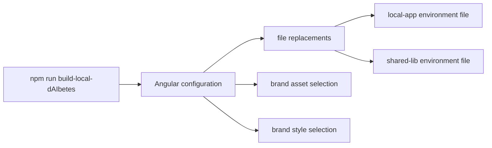

The build matrix looks noisy at first, but the underlying pattern is simple: app, brand, and target each control a different part of the output.

## The naming pattern

Scripts in `package.json` follow this shape:

```text
build-<app>-<brand>[-staging]
start-<app>-<brand>
```

Examples:

- `npm run build-local-dAIbetes`
- `npm run build-global-microbAIome-staging`
- `npm run start-global-fl-net`

## What the frontend build changes

The Angular workspace uses named configurations. Those configurations do more than swap one `environment.ts` file.

They can switch:

- app environment files
- the shared-lib environment file
- brand assets
- brand styles



## Why contributors should care

If you hardcode a URL, image path, or style choice in the wrong place, you can break another brand or target without noticing it in your local setup.

Good default behavior:

- keep runtime values in environment files
- keep brand visuals in brand folders
- keep shared behavior brand-agnostic unless there is a real reason not to

## Safe workflow for config-related changes

1. Find the script that matches your app and brand.
2. Check which environment and asset replacements that build uses.
3. Make the smallest config change possible.
4. Run the exact build or start command that should exercise the change.

If you skip step 2, you are usually testing the wrong thing.
