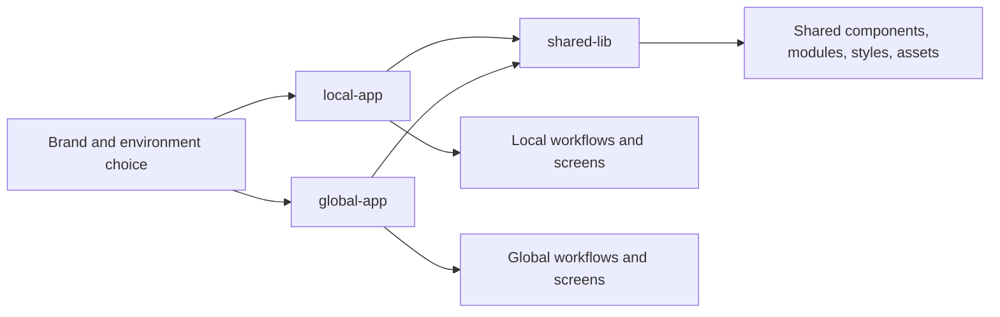

This section is for contributors working on the Angular frontend workspace behind %%DEPLOYED_PRODUCT_NAME%%.

Most frontend changes come down to four questions:

- which app owns the feature: `local-app` or `global-app`
- whether the change belongs in `shared-lib` instead of an app folder
- which brand and environment configuration your change must respect
- which checks prove the change is safe before review

## Start here

| If you need to... | Read this page |
| --- | --- |
| boot the right frontend variant locally | [Local setup](local-setup.md) |
| understand the workspace layout | [Workspace map](workspace-map.md) |
| decide which folder should own the change | [Where to change what](where-to-change-what.md) |
| avoid wiring mistakes around builds and brands | [Builds and environments](builds-and-environments.md) |
| follow implementation and UI guardrails | [Implementation guidelines](implementation-guidelines.md) |
| jump straight to a feature area | [Systems overview](systems/overview.md) |

## Mental model

The rule that matters most is simple: both apps depend on the same shared library, so a change in `shared-lib` can help both apps or break both apps.

## Operating assumptions

Read this section as engineering guidance, not as product documentation. The pages here focus on:

- which folder owns what
- which scripts actually start the app you need
- which environment files get swapped during builds
- which checks are worth running before you hand off a change

When in doubt, start with the narrowest change that fixes the problem, then widen the scope only if both apps or multiple brands genuinely need the same solution.
