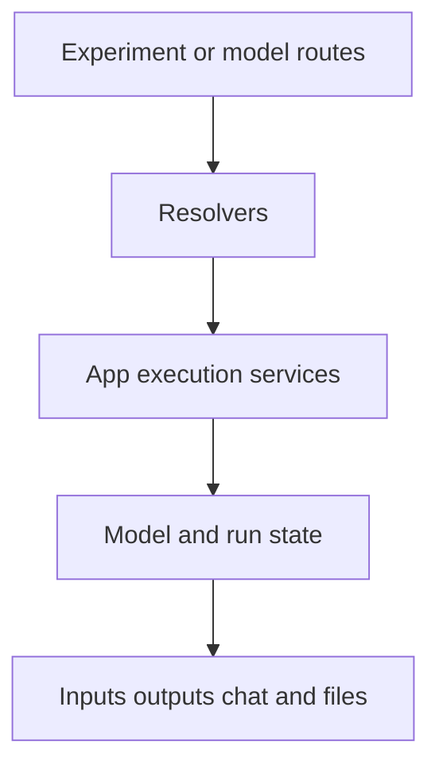

This is one of the heavier shared systems in the repo. It covers model workflows, predictions, execution inputs and outputs, file handling during runs, and chat around a run.

## Where it lives

- shared system root: `projects/shared-lib/src/lib/modules/app-execution`
- global route entry: `projects/global-app/src/app/app.routes.ts` under `/experiment`
- model-related pages: `projects/global-app/src/app/modules/model-store`

## What belongs to this system

- model workflow DTOs
- prediction DTOs
- model and workflow resolvers
- execution services
- data-analysis store state
- execution input and output components
- workflow run chat and file management

## System boundary

Start here when the problem appears after a workflow or model is already selected and the user is running it, supplying inputs, inspecting outputs, or interacting with run chat.

Do not start here for workflow authoring, store browsing, or standalone file browser work. Those belong to neighboring systems.

## System shape

## Key folders

| Folder | Why you care |
| --- | --- |
| `dto` | defines the objects moving between frontend and backend |
| `components` | owns the execution UI, dialogs, result views, and chat views |
| `service` | owns API calls, resolvers, file management, and LLM-related helpers |
| `store/data-analysis` | owns workflow run state, files, uploads, and chat state |
| `store/model` | owns model list and detail state |

## What to edit for common tasks

| Task | Start here |
| --- | --- |
| change model workflow overview or detail UI | `projects/shared-lib/src/lib/modules/app-execution/components` |
| change run inputs, file uploads, or result output | the matching component in `components` plus `store/data-analysis` |
| change resolver behavior for `/experiment` or `/model` | `projects/shared-lib/src/lib/modules/app-execution/service/*resolver*.ts` |
| change model workflow chat behavior | `model-workflow-chat.service.ts` and chat-related components |

## Adjacent systems

- workflow definition and validation work usually starts in [Workflow system](workflow-system.md)
- experiment pages that launch runs often start in [Experiments system](experiments-system.md)
- standalone platform file browsing belongs to [Store and files system](store-and-files-system.md)

## What usually trips people up

- This system is shared, but some route shells live in `global-app`.
- Files here are not the same thing as the standalone `/files` browser.
- There is LLM-related behavior in here too. Check `data-analysis-llm.service.ts` before adding a parallel helper in some random component.
