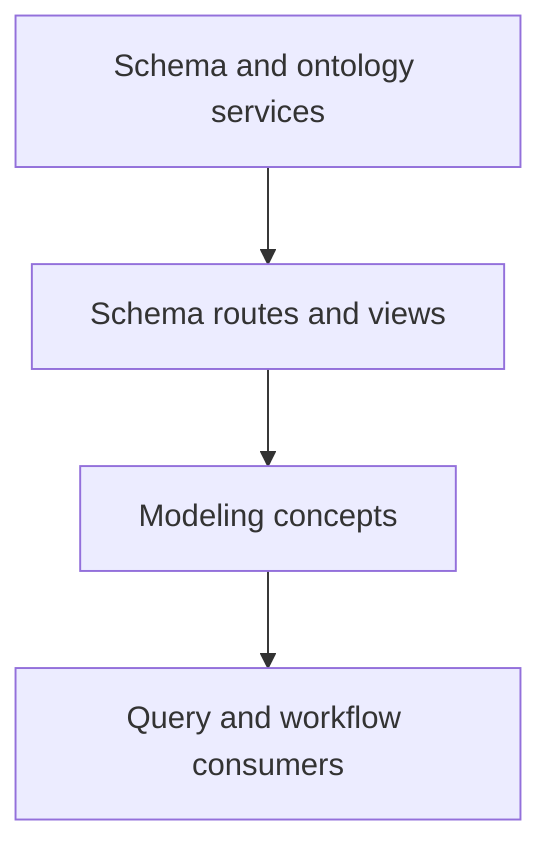

The data modeling system is the schema and ontology side of the global frontend.

## Where it lives

- route entry: `projects/global-app/src/app/modules/schema`
- shared DTO support: `projects/shared-lib/src/lib/modules/data-modeler`

## What belongs here

- schemas
- datatypes
- ontologies
- UMLS-related views
- schema and ontology services

## System boundary

Start here when the change affects schema meaning, ontology structure, datatypes, or the domain concepts that other systems consume.

Do not start here for query presentation or workflow UI unless the root cause is actually a modeling concept.

## Why contributors should care

This system is upstream of other systems. Query and workflow features depend on clean schema concepts, so changes here often leak into other parts of the app.

## What to edit for common tasks

| Task | Start here |
| --- | --- |
| change schema screens or route structure | `projects/global-app/src/app/modules/schema` |
| change datatype, ontology, or UMLS API calls | `projects/global-app/src/app/modules/schema/services` |
| change shared export DTO shape | `projects/shared-lib/src/lib/modules/data-modeler/dto` |

## Adjacent systems

- query behavior built on schema concepts often needs verification in [Query system](query-system.md)
- workflow features that consume those concepts often need verification in [Workflow system](workflow-system.md)

## Practical rule

If your change alters meaning, naming, or structure of domain concepts, treat it as a data-modeling change first, even if the bug showed up in a query or workflow screen.
