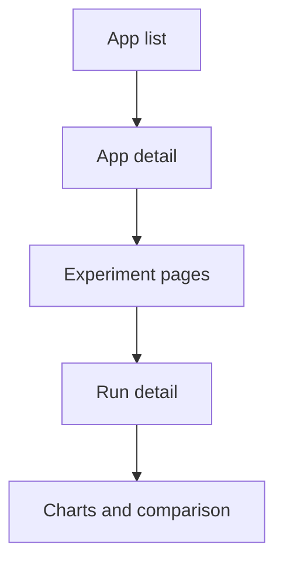

There are two experiment-shaped areas in this repo, and that matters.

- app experiments in `tool-development`
- execution and model workflow experiments in `app-execution`

If you skip that distinction, you usually open the wrong folder first.

## Main entry point

- route entry: `projects/global-app/src/app/modules/tool-development/test-app-routing.module.ts`
- shared experiment types: `projects/shared-lib/src/lib/modules/experiments`

## What this system does

For app developers, the experiment system is the place where a tool version gets test runs, run details, and result comparison views.

The codebase already shows that split:

- experiment pages and charts live in `projects/global-app/src/app/modules/tool-development/components/experiment`
- experiment data types live in `projects/shared-lib/src/lib/modules/experiments`
- run services live in `projects/global-app/src/app/modules/tool-development/service`

## System boundary

Start here when the route lives under app-owned experiment pages and the user is comparing or inspecting runs for a tool.

Do not start here if the issue is really about workflow execution, prediction outputs, or run file handling. Those changes usually belong to [Data analysis system](data-analysis-system.md).

## What to edit for common tasks

| Task | Start here |
| --- | --- |
| change experiment pages | `projects/global-app/src/app/modules/tool-development/components/experiment` |
| change run fetching or resolving | `projects/global-app/src/app/modules/tool-development/service/experiment-resolver.service.ts` |
| change run execution calls | `projects/global-app/src/app/modules/tool-development/service/experiment-run.service.ts` |
| change shared experiment DTOs | `projects/shared-lib/src/lib/modules/experiments/dto` |

## Adjacent systems

- if the page sits under an app detail route, also inspect [Tool development system](tool-development-system.md)
- if the issue concerns execution runtime behavior after the experiment starts, continue into [Data analysis system](data-analysis-system.md)

## Practical rule

If the page sits under `/app/:app-id/experiment/:experimentId`, it belongs to tool development first.

If it talks about model workflows, predictions, or uploaded files, jump to the data-analysis system next.
