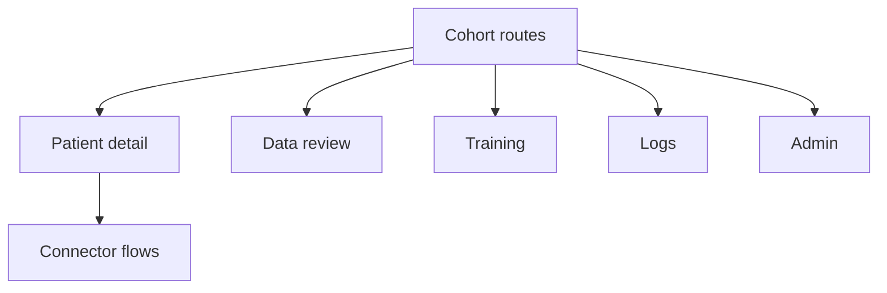

This is a grouped system page for the local frontend side of the workspace.

These modules are separate in code, but they work together in practice:

- `cohort`
- `connector`
- `data-review`
- `training`
- `logs`
- `patient`
- `admin`

## Why they belong together

They form the local operations flow:

- build or inspect a cohort
- ingest or map data through connectors
- review permissions and training-related data
- run or inspect trainings
- inspect logs and patient-level history

## System boundary

Start here when the issue is anchored in the local app and the route is part of cohort, patient, connector, training, logs, or admin flows.

Do not start here for reusable query widgets or shared workflow execution logic unless the local route is only the consuming shell.

## Route shape

The diagram is simplified, but it matches how contributors usually move through the code. Cohort and patient views are often the anchor, and connector or query-related work branches from there.

## Where to start for common tasks

| Task | Start here |
| --- | --- |
| change cohort overview or patient drilldown | `projects/local-app/src/app/modules/cohort` |
| change patient detail widgets or logs | `projects/local-app/src/app/modules/patient` |
| change connector setup, mapping, preview, or runs | `projects/local-app/src/app/modules/connector` |
| change review grids or review state | `projects/local-app/src/app/modules/data-review` |
| change training overview or detail pages | `projects/local-app/src/app/modules/training` |
| change operational logs | `projects/local-app/src/app/modules/logs` |
| change admin dashboards | `projects/local-app/src/app/modules/admin` |

## Adjacent systems

- reusable query cards and log dialogs often continue into [Query system](query-system.md)
- training or execution-related UI can overlap with [Workflow system](workflow-system.md)

## What usually trips people up

- Some local systems are nested. `connector` sits under a cohort route.
- Query UI in local flows is not owned by `logs` or `patient`; it comes from `modules/query`.
- Training screens reuse query and workflow-related pieces, so local changes can still touch shared systems.
