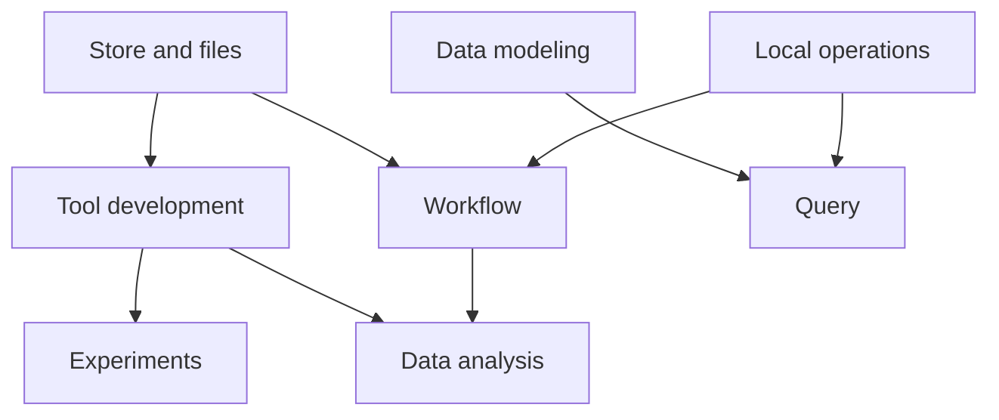

Use this section when you already know the feature area you need to change, but not yet the exact file or module.

The frontend is easier to navigate by system than by folder. The main systems are:

- workflow
- experiments
- data analysis and model execution
- query and find-data
- store and files
- tool development
- data modeling
- local operations

These are not all isolated. Some of them sit on top of shared modules, and some of them only exist in one app.

## Start here

| If the change is about... | Start here |
| --- | --- |
| flow editing, workflow detail, or workflow validation | [Workflow system](workflow-system.md) |
| app-owned experiment pages and run comparison | [Experiments system](experiments-system.md) |
| model execution, outputs, uploads, or run chat | [Data analysis system](data-analysis-system.md) |
| query composition or query UI reused in local views | [Query system](query-system.md) |
| browsing store content or platform files | [Store and files system](store-and-files-system.md) |
| app authoring, config, validation, or test app setup | [Tool development system](tool-development-system.md) |
| schema, ontology, datatype, or UMLS work | [Data modeling system](data-modeling-system.md) |
| cohort, patient, connector, training, logs, or admin | [Local operations system](local-operations-system.md) |

If you are still figuring out app ownership rather than feature ownership, go back to [Workspace map](../workspace-map.md) or [Where to change what](../where-to-change-what.md).

## Fast rule

If a feature smells cross-cutting, check `projects/shared-lib/src/lib/modules` first.

That is where most of the reusable system code already lives:

- `workflow`
- `app-execution`
- `experiments`
- `store`
- `files`
- `data-modeler`

These pages are intentionally practical. They are meant to tell contributors where to start, what the system owns, and which neighboring system they should inspect next.
