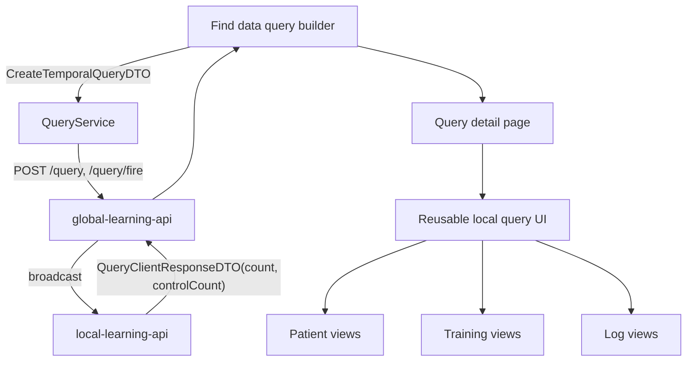

The query system is split across both apps.

- In `global-app`, it shows up as the `find-data` area with a query builder.
- In `local-app`, it shows up as reusable query detail cards and query log dialogs used inside patient, training, and log views.

## Where it lives

- global query flow: `projects/global-app/src/app/modules/find-data`
- DTOs (source of truth): `projects/global-app/src/app/modules/find-data/dto/query.ts`
- API service: `projects/global-app/src/app/modules/find-data/services/query.service.ts`
- DTO converter (legacy items → temporal group): `projects/global-app/src/app/modules/find-data/services/query-dto-converter.ts`
- local reusable query UI: `projects/local-app/src/app/modules/query`
- local query log DTO mirror: `projects/local-app/src/app/modules/logs/dto/query.ts`

## The temporal query model

The backend accepts a single shape — `CreateTemporalQueryDTO`:

```ts
interface CreateTemporalQueryDTO {
  name: string;
  description: string;
  groupId?: string;
  query: QueryGroup;          // case cohort, required
  controlQuery?: QueryGroup;  // control cohort, optional
}

interface QueryGroup {
  connectingOperator: 'AND' | 'OR';
  temporalRelations: TemporalRelation[];
  conditions: QueryCondition[];        // ITEM or nested GROUP
}
```

A `QueryCondition` is either:
- an `ITEM` carrying a `QueryItemCondition` with `ontologyId`, `operator`, `value`, `timeFilter`, optional `atLeast`/`atMost`, and optional `label`; or
- a `GROUP` that recurses with its own `connectingOperator`/`conditions`/`temporalRelations`.

`TemporalRelation` links two sibling conditions by index:

```ts
interface TemporalRelation {
  sourceConditionIdx: number;
  targetConditionIdx: number;
  relationship: 'SAME' | 'BEFORE' | 'AFTER';
  atLeast?: number;
  atMost?: number;
}
```

For full semantics see `projects/global-app/src/app/modules/find-data/dto/temporal_query_dto.md`.

## API surface (global-learning-api)

All temporal endpoints live under `/query` and are consumed by `QueryService`:

| Method | Path                              | Request body              | Notes                                                |
| ------ | --------------------------------- | ------------------------- | ---------------------------------------------------- |
| GET    | `/query`                          | —                         | List latest version per groupId.                    |
| GET    | `/query/sse`                      | —                         | Server-sent stream of query updates.                 |
| GET    | `/query/clients`                  | —                         | List connected federated clients.                    |
| GET    | `/query/{id}`                     | —                         | Single query (returns `QueryDetailDTO`).             |
| POST   | `/query`                          | `CreateTemporalQueryDTO`  | Create a new query (201 on success).                 |
| POST   | `/query/fire`                     | `CreateTemporalQueryDTO`  | Create + broadcast in one step.                      |
| POST   | `/query/{id}/fire`                | `{}`                      | Re-broadcast an existing query (creates rerun copy). |
| POST   | `/query/{id}/fire-data-statistics`| `{}`                      | Request fresh statistics for an existing query.      |
| DELETE | `/query/{id}`                     | —                         | Delete a query the caller owns and hasn't fired.     |

**There is no PUT update path anymore.** When the user edits a query, the service creates a new version under the same `groupId`. `getAllQueries()` always returns only the most recent version per group, so the editing experience still feels like an update.

The response is a `QueryDTO` that includes both counts:

```ts
interface QueryDTO {
  ...
  result?: number;        // case cohort patient count
  resultControl?: number; // control cohort patient count; only present when controlQuery was set
  temporalQuery: QueryGroup;
  temporalControlQuery?: QueryGroup;
}
```

## DTO conversion layer

The query builder UI still keeps an internal `QueryItemDTO[]` representation. `query-dto-converter.ts` wraps that into a `QueryGroup` at submit time:

```ts
const dto: CreateTemporalQueryDTO = buildTemporalCreateDto({
  name,
  description,
  legacyItems: this.queryList,
  groupId: this.data.queryData?.groupId,
});
this.queryService.createQuery(dto).subscribe(/* … */);
```

When you change the builder to emit a `QueryGroup` directly, pass it as `caseQuery` (and optionally `controlQuery`) on `buildTemporalCreateDto` and stop using `legacyItems`. The converter is the only place that needs to go away when the migration completes.

## System boundary

Start here when the change is about building queries, showing query details, or reusing query UI inside local workflows.

Do not start here for schema semantics or cohort ownership. Those often belong to [Data modeling system](data-modeling-system.md) or [Local operations system](local-operations-system.md).

## System shape



## What this means for contributors

This is not a single route-owned feature. Part of it is a top-level page, and part of it is embedded UI reused inside other systems.

That has two consequences:

- route work starts in `find-data`
- query presentation work often starts in `local-app/modules/query`

## What to edit for common tasks

| Task | Start here |
| --- | --- |
| change the query builder flow | `projects/global-app/src/app/modules/find-data/components` |
| add a new endpoint or rename one | `query.service.ts`, then mirror in [`backend/global-learning-api`](../../backend/global-learning-api/query-creation.md) |
| add a new operator, aggregation, or temporal relation to the DTO | `dto/query.ts` + `dto/temporal_query_dto.md`, then update [`backend/local-learning-api`](../../backend/local-learning-api/query-translation-and-privacy.md) |
| change query cards used in local screens | `projects/local-app/src/app/modules/query/components` |
| change how query logs are shown in patient or log views | the consuming component in `patient` or `logs`, plus the shared query component if needed |

## Adjacent systems

- backend handling and persistence: [Global learning API · query creation](../../backend/global-learning-api/query-creation.md)
- SQL translation and privacy rounding: [Local learning API · query translation & privacy](../../backend/local-learning-api/query-translation-and-privacy.md)
- schema or datatype changes that affect query behavior often require [Data modeling system](data-modeling-system.md)
- local query consumers in patient, training, or logs often require checks in [Local operations system](local-operations-system.md)

## Practical rule

If you are changing query composition, start global.

If you are changing query display inside local workflows, start local.

If a field on the DTO changes, update **all three** of: frontend `query.ts`, backend DTO classes, and `temporal_query_dto.md`.
