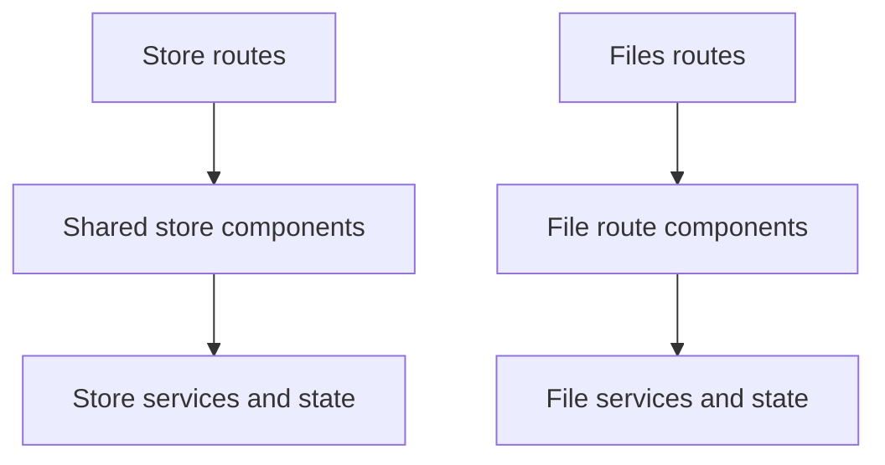

These are two separate systems in code, but contributors usually touch them together because both deal with browsing, selecting, and resolving platform assets.

## Where they live

- store route shell: `projects/global-app/src/app/modules/store`
- shared store implementation: `projects/shared-lib/src/lib/modules/store`
- files route shell: `projects/global-app/src/app/modules/files`
- shared file state: `projects/shared-lib/src/lib/modules/files`

## Store system

The store system covers:

- store list and detail pages
- model and app detail pages
- graph views
- audit views
- store state, effects, selectors, and resolver logic

## Files system

The files system covers:

- file list and file detail routes
- file selectors and dialogs
- shared file DTOs and file state

## System boundary

Start here when the issue is about browsing platform assets, inspecting store entries, selecting files, or wiring file-detail views.

Do not start here for run-scoped uploads or execution outputs attached to an experiment or model run. That usually belongs to [Data analysis system](data-analysis-system.md).

## What to edit for common tasks

| Task | Start here |
| --- | --- |
| change store list, detail, rating, graph, or filters | `projects/shared-lib/src/lib/modules/store/components` |
| change store API or state behavior | `projects/shared-lib/src/lib/modules/store/store` |
| change store route wiring or audit views | `projects/global-app/src/app/modules/store` |
| change file list or detail route UI | `projects/global-app/src/app/modules/files/components` |
| change shared file fetch state | `projects/shared-lib/src/lib/modules/files/store` |

## Adjacent systems

- experiment and model run file handling often belongs to [Data analysis system](data-analysis-system.md)
- store entries that reference app definitions can overlap with [Tool development system](tool-development-system.md)

## Practical rule

If the issue is about browsing platform content, start with `store`.

If the issue is about inspecting or selecting uploaded files, start with `files`.
