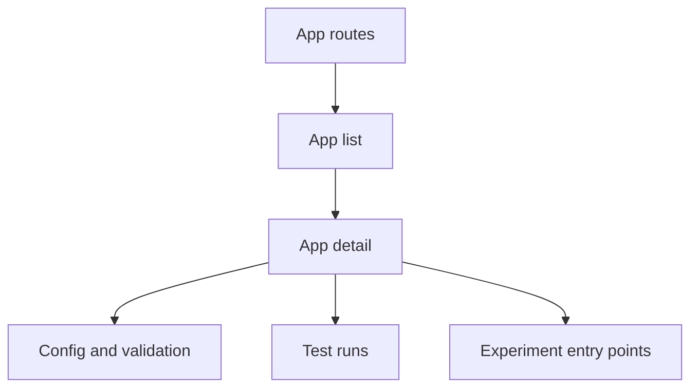

The tool development system is the app-builder side of the frontend. It is where contributors manage app definitions, configuration, startup behavior, test runs, and experiment views for a tool.

## Where it lives

- route entry: `projects/global-app/src/app/modules/tool-development/test-app-routing.module.ts`
- main implementation: `projects/global-app/src/app/modules/tool-development`

## What belongs here

- app list and app detail
- app config editors
- client config views
- startup and validation helpers
- app run and test views
- experiment views attached to an app

## System boundary

Start here when the change is about tool authoring, app metadata, client config, validation, or app-owned experiment entry points.

Do not start here for the shared workflow editor or execution runtime internals. Those usually belong to [Workflow system](workflow-system.md) or [Data analysis system](data-analysis-system.md).

## Route shape

## What to edit for common tasks

| Task | Start here |
| --- | --- |
| change app list or app detail screens | `projects/global-app/src/app/modules/tool-development/components` |
| change config form behavior | `components/app-detail-config` |
| change startup or validation handling | `helper`, `dto`, and validation services in the same module |
| change backend calls or route resolving | `projects/global-app/src/app/modules/tool-development/service` |

## Adjacent systems

- app experiment pages usually continue into [Experiments system](experiments-system.md)
- config changes that affect runtime execution often require checks in [Data analysis system](data-analysis-system.md)

## What usually trips people up

- This system owns the tool authoring flow, not the shared execution runtime.
- Experiment pages under `/app/:app-id/experiment/...` still belong here first.
- A config change often has a second impact on the data-analysis system, because execution UI reads the resulting tool definition later.
