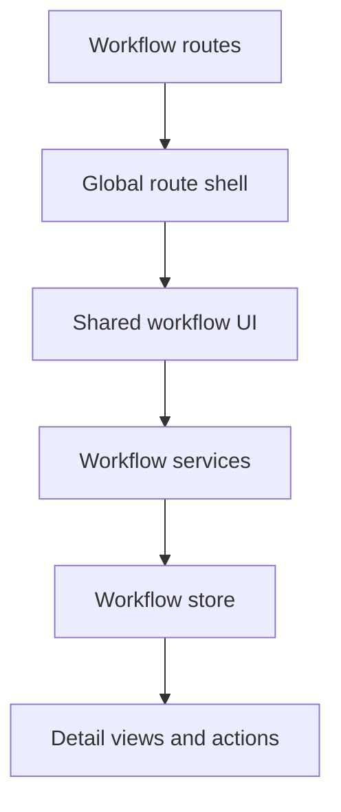

The workflow system is the reusable flow editor and workflow detail stack used from the global app and referenced by execution features.

## Where it lives

- route entry: `projects/global-app/src/app/modules/workflow`
- shared implementation: `projects/shared-lib/src/lib/modules/workflow`

## What is in the system

- workflow DTOs and models
- workflow services and validation
- workflow store, actions, reducers, effects, and selectors
- workflow chat support
- shared workflow UI components

## System boundary

Start here when the change is about defining, editing, validating, or displaying workflows themselves.

Do not start here if the issue is mainly about workflow run execution, uploads, outputs, or prediction results. That work usually belongs to the [data analysis system](data-analysis-system.md).

## How requests move through it

## What to edit for common tasks

| Task | Start here |
| --- | --- |
| change workflow list or detail UI | `projects/shared-lib/src/lib/modules/workflow/components` |
| change workflow fetch, save, or update logic | `projects/shared-lib/src/lib/modules/workflow/service/workflow.service.ts` |
| change workflow validation rules | `projects/shared-lib/src/lib/modules/workflow/service/workflow-validation.service.ts` |
| change workflow state handling | `projects/shared-lib/src/lib/modules/workflow/store` |
| change route-level behavior | `projects/global-app/src/app/modules/workflow/workflow-routing.module.ts` |

## Adjacent systems

- changes to execution details, run outputs, or file handling usually continue into [Data analysis system](data-analysis-system.md)
- changes to schema-dependent workflow behavior may require checks in [Data modeling system](data-modeling-system.md)

## What usually trips people up

- The route is in `global-app`, but most of the real system code is in `shared-lib`.
- Workflow chat is part of this system too, not a separate one-off feature.
- If a change affects workflow execution details, check the data-analysis system as well. Those two systems meet often.
