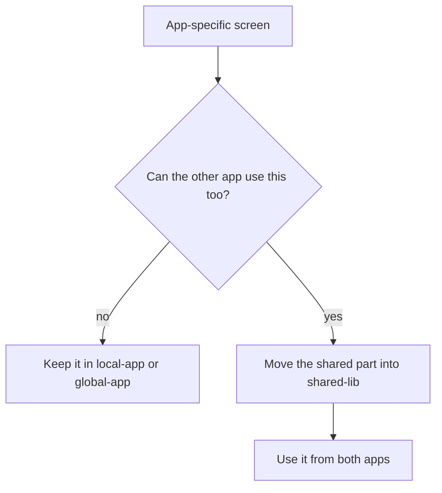

The repo is an Angular workspace with two applications and one shared library.

## Main folders

| Path | What belongs there | Why it exists |
| --- | --- | --- |
| `projects/local-app` | views and flows that only make sense in the local frontend | keeps local behavior out of the global UI |
| `projects/global-app` | views and flows for the global frontend | keeps platform-wide behavior separate from local workflows |
| `projects/shared-lib` | reusable UI, modules, services, assets, and styles | avoids copying code between both apps |
| `cypress` | end-to-end tests for both apps | catches startup and integration issues |

## What is inside the apps

Both apps are organized around feature folders under `src/app/modules`.

Examples from the current codebase:

- `global-app` has modules like `project`, `pipeline`, `workflow`, `schema`, and `tool-development`
- `local-app` has modules like `patient`, `training`, `data-review`, `connector`, and `cohort`

That split is the first routing hint for new work. If your change only matters to one app, keep it there first.

## What is inside the shared library

The shared library is more than a component bucket. It already contains:

- reusable components in `projects/shared-lib/src/lib/components`
- reusable feature modules in `projects/shared-lib/src/lib/modules`
- shared services, directives, interceptors, pipes, models, and utils
- shared styles and per-brand themes in `projects/shared-lib/src/lib/styles`
- images and translations in `projects/shared-lib/src/assets`

## Mental model

If you start in an app folder and notice you are duplicating markup, styles, or service code, that is usually the moment to stop and extract the common part into `shared-lib`.

If you already know the task but not the folder, continue with [Where to change what](where-to-change-what.md). If you know the feature area but not the path, jump to [Systems overview](systems/overview.md).
