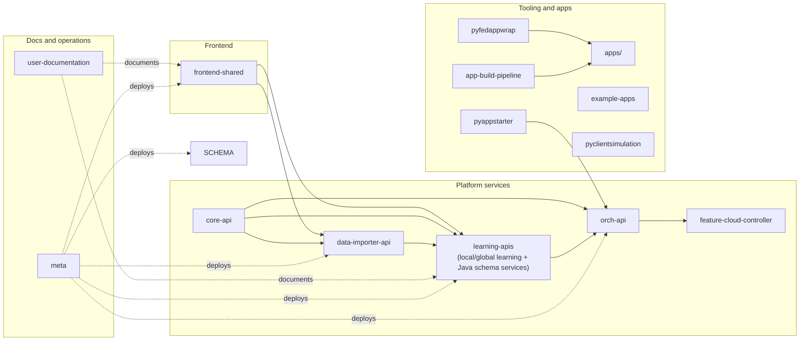

# Repository map

This workspace is **not a single monorepo**.
Use this page when you want to answer one practical question quickly:

- where should a code change go?
- which repository owns which part of the platform?
- which folders are active code versus examples or legacy material?

If you want the product-level architecture first, start with [Understanding the Platform architecture](../intro/architecture/network-architecture.md). If you already know you are touching the Angular UI, also see [Frontend workspace map](frontend/workspace-map.md).

## Mental model

The workspace is easiest to understand as four layers:

1. **Docs and operations**
2. **Frontend**
3. **Platform services**
4. **Tooling and example apps**

This diagram is intentionally simplified. It is meant as a repo ownership map, not a full runtime diagram.

## How to read this workspace

- A top-level folder with its own `.git` directory is an **independent repository** with its own history and CI.
- `apps/` is a **shared collection of tool/app folders**, not a single Git repo in this checkout.
- `deprecated/` is a **reference area for older services** and should not be your default target for new work.
- Most active repos point to the same GitLab namespace: `cosybio/federated-learning/federated_db`.

## Core product repositories

| Folder | What it owns | When you usually change it | Link |
| --- | --- | --- | --- |
| `user-documentation` | Docusaurus site for product, deployment, user, and contributor docs | Writing or restructuring docs | [user-documentation](https://gitlab.cosy.bio/cosybio/federated-learning/federated_db/user-documentation) |
| `frontend-shared` | Angular workspace for the local and global frontends plus the shared UI library and brand themes | UI flows, components, routes, frontend integrations, brand variants such as dAIbetes and PosyMed | [frontend-shared](https://gitlab.cosy.bio/cosybio/federated-learning/federated_db/frontend-shared) |
| `core-api` | Python DTOs, serializers, and helpers used on the Python service side | In practice this is mainly relevant for `data-importer-api`; the Java services use their own Maven-based shared modules | [core-api](https://gitlab.cosy.bio/cosybio/federated-learning/federated_db/core-api) |
| `learning-apis` | Parent repo for the active Java backend modules, including the local/global learning APIs and the Java schema services | Federated learning flows, query handling, workflow execution state, local/global backend behavior, and the active datamodeler implementation | [global-learning-apis](https://gitlab.cosy.bio/cosybio/federated-learning/federated_db/global-learning-apis) |
| `data-importer-api` | Connector and ETL backend for ingesting site data, applying transformers, and previewing import results | Local ingestion, connector runs, data mapping, transformation previews | [data-importer-api](https://gitlab.cosy.bio/cosybio/federated-learning/federated_db/data-importer-api) |
| `orch-api` | Orchestration backend for controlled tool execution and run lifecycle management | Starting runs, tracking execution, runtime coordination | [orch-api](https://gitlab.cosy.bio/cosybio/federated-learning/federated_db/orch-api) |
| `feature-cloud-controller` | Go-based controller and relay pieces used by the federated execution stack | Controller behavior, relay process, lower-level execution coordination | [feature-cloud-controller](https://gitlab.cosy.bio/cosybio/federated-learning/federated_db/feature-cloud-controller) |
| `meta` | Deployment definitions, infra templates, C4/Structurizr docs, Keycloak exports, helper scripts | Environment setup, deployment changes, operational wiring, internal architecture assets | [meta](https://gitlab.cosy.bio/cosybio/federated-learning/federated_db/meta) |

## Tooling and app-development repositories

| Folder | What it owns | Notes | Link |
| --- | --- | --- | --- |
| `apps/` | Example/import/transformer apps and data assets used by the platform | This folder is a workspace collection, not a standalone repo in this checkout | None in this checkout |
| `pyappstarter` | Python helper that starts containerized apps and streams run updates over WebSockets | Useful for local app execution and transformer-style workflows | [pyappstarter](https://gitlab.cosy.bio/cosybio/federated-learning/federated_db/pyappstarter) |
| `pyfedappwrap` | Python wrapper for local FEDDB app development | Lightweight support package for app authoring and local workflows | [pyfedappwrap](https://gitlab.cosy.bio/cosybio/federated-learning/federated_db/pyfedappwrap) |
| `app-build-pipeline` | Remote build-and-publish pipeline client for app images | Clones repos, injects files, builds images, runs pytest, scans images, pushes artifacts | [app-build-pipeline](https://gitlab.cosy.bio/cosybio/federated-learning/federated_db/app-build-pipeline) |
| `pyclientsimulation` | Python simulator for local-learning websocket clients | Handy for testing the global-learning flow without full local servers | [pyclientsimulation](https://gitlab.cosy.bio/cosybio/federated-learning/federated_db/pyclientsimulation) |
| `example-apps` | Example project space, currently including a digital-twin-oriented example | Good starting point when you need reference app material | [example-apps](https://gitlab.cosy.bio/cosybio/federated-learning/federated_db/example-apps) |

## Shared folders that are not top-level repos

### `apps/`

This folder currently holds small platform tools and sample material such as:

- SQL extraction
- train/test splitting
- row combination and splitting
- date normalization
- imported diabetes example data

Treat `apps/` as a toolbox area. If you are changing a reusable platform service, this is usually **not** the right place. If you are changing a concrete tool's behavior, it often is.

### `deprecated/`

This folder keeps older services such as `harmonized-api`, `meta-api`, `query-controller`, and other archived components. Use it mainly for historical reference or migration context.

## Alternative or legacy implementations worth noticing

- `py-datamodeler-api` is deprecated. Current schema and datamodel work runs on the Java side.
- `learning-apis` is the active home for the Java services, including the current datamodeler implementation used now.
- `datamodeler-api` exists separately in this workspace as a Java/Quarkus service checkout, but this local folder does not currently have a Git remote configured.
- `feature-cloud-controller/README_relay.md` is focused on relay certificate operations, so the code tree itself is more informative than the README for understanding that repo.

## Fast path: where should I change what?

- **Documentation**: `user-documentation`
- **Angular UI or shared frontend components**: `frontend-shared`
- **Python-side DTOs for the importer stack**: `core-api`
- **Schema, ontology, or metadata modeling in the current stack**: `learning-apis`
- **Legacy Python schema service work only**: `py-datamodeler-api`
- **Local ingestion, connectors, or transformation preview flow**: `data-importer-api`
- **Federated learning or local/global backend behavior**: `learning-apis`
- **Run orchestration and execution lifecycle**: `orch-api`
- **Controller or relay internals**: `feature-cloud-controller`
- **Deployment, docker-compose, Keycloak, or environment glue**: `meta`
- **Tool/app authoring support**: `pyappstarter`, `pyfedappwrap`, `app-build-pipeline`

## Source of truth for this page

This overview was assembled from the local checkout structure, each repo's configured Git remote, and the README files currently present in this workspace. If a repo's role changes, update this page together with the relevant README so the map stays trustworthy.
