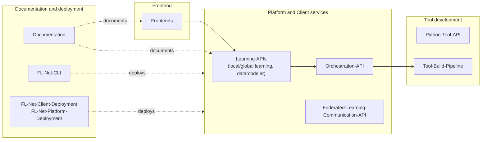

# Repository map

FL-Net is **not a single monorepo**. All repositories live in the [FedLearnNet GitHub organization](https://github.com/FedLearnNet).
Use this page to answer one practical question quickly:

- which repository owns the part of FL-Net you want to change?

If you want the product-level architecture first, start with [Understanding the network architecture](../intro/architecture/network-architecture.md). If you already know you are touching the Angular UI, also see the [Frontend workspace map](frontend/workspace-map.md).

## Mental model

The repositories are easiest to understand as four layers:

1. **Documentation and deployment**
2. **Frontend**
3. **Platform and Client services**
4. **Tool development**

```mermaid
flowchart LR
  subgraph DocsDeploy["Documentation and deployment"]
    DOCS["Documentation"]
    CLI["FL-Net-CLI"]
    DEPLOY["FL-Net-Client-Deployment\nFL-Net-Platform-Deployment"]
  end

  subgraph Frontend["Frontend"]
    FE["Frontends"]
  end

  subgraph Services["Platform and Client services"]
    LEARN["Learning-APIs\n(local/global learning, datamodeler)"]
    ORCH["Orchestration-API"]
    COMM["Federated-Learning-Communication-API"]
  end

  subgraph Tooling["Tool development"]
    PYAPI["Python-Tool-API"]
    PIPE["Tool-Build-Pipeline"]
  end

  FE --> LEARN
  LEARN --> ORCH
  ORCH --> PIPE
  DOCS -.documents.-> FE
  DOCS -.documents.-> LEARN
  CLI -.deploys.-> Services
  DEPLOY -.deploys.-> Services
```

This diagram is intentionally simplified. It is meant as a repository ownership map, not a full runtime diagram.

## Core product repositories

| Repository | What it owns | When you usually change it |
| --- | --- | --- |
| [Documentation](https://github.com/FedLearnNet/Documentation) | Docusaurus site for product, deployment, user, and contributor docs | Writing or restructuring docs, see [Documentation workflow](documentation-workflow.md) |
| [Frontends](https://github.com/FedLearnNet/Frontends) | Angular workspace with the local (Client) and global (Platform) frontends, the shared UI library, and brand themes | UI flows, components, routes, frontend integrations, brand variants, see [Frontend](frontend/overview.md) |
| [Learning-APIs](https://github.com/FedLearnNet/Learning-APIs) | Multi-module Quarkus project: `core-learning-api` (shared logic and DTOs), `global-learning-api` (Platform), `local-learning-api` (Client, including data import and the patient store), `datamodeler-api` (data models, schemas, and ontologies) | Federated learning flows, queries, workflows, data import, schema and ontology handling |
| [Orchestration-API](https://github.com/FedLearnNet/Orchestration-API) | Runs Tools as Docker containers: pulls images, creates an isolated network and volume per run, starts Tool builds, and tracks the run lifecycle | Starting runs, container isolation, run lifecycle |
| [Federated-Learning-Communication-API](https://github.com/FedLearnNet/Federated-Learning-Communication-API) | Go services for federated communication: one controller per Client and one relay server per network | Controller and relay behavior, encryption, SMPC and DP message flows |

## Tool development repositories

| Repository | What it owns | Notes |
| --- | --- | --- |
| [Python-Tool-API](https://github.com/FedLearnNet/Python-Tool-API) | Python SDK and runtime for FL-Net Tools, published as the `FL-Net-Python-Tool-API` package | Imported as `pyfedappwrap` |
| [Tool-Build-Pipeline](https://github.com/FedLearnNet/Tool-Build-Pipeline) | Containerized pipeline that builds, tests, scans, and publishes Tool images | Normally started by the Orchestration API when a Tool is published |

## Deployment repositories

| Repository | What it owns |
| --- | --- |
| [FL-Net-CLI](https://github.com/FedLearnNet/FL-Net-CLI) | The `flnet` command line for setting up and operating Clients and Platforms and for scaffolding new Tools |
| [FL-Net-Client-Deployment](https://github.com/FedLearnNet/FL-Net-Client-Deployment) | Docker Compose and helper scripts to deploy a Client, including the Client Keycloak realm |
| [FL-Net-Platform-Deployment](https://github.com/FedLearnNet/FL-Net-Platform-Deployment) | Docker Compose and helper scripts to deploy a Platform, including the Platform Keycloak realm |
| [PoSyMed-Deployment](https://github.com/FedLearnNet/PoSyMed-Deployment) | Deployment of the PoSyMed brand |

See the [Deployment section](../deployment/overview.md) for how these are used.

## Fast path: where should I change what?

- **Documentation**: `Documentation`
- **Angular UI or shared frontend components**: `Frontends`
- **Platform backend behavior (projects, queries, workflows, federated runs)**: `global-learning-api` in `Learning-APIs`
- **Client backend behavior (data import, patient store, local queries, Tool runs)**: `local-learning-api` in `Learning-APIs`
- **Schema, ontology, or data model work**: `datamodeler-api` in `Learning-APIs`
- **Tool container execution and run lifecycle**: `Orchestration-API`
- **Controller or relay internals**: `Federated-Learning-Communication-API`
- **Tool authoring support**: `Python-Tool-API`, `Tool-Build-Pipeline`
- **Deployment, Docker Compose, or Keycloak realms**: `FL-Net-CLI`, `FL-Net-Client-Deployment`, `FL-Net-Platform-Deployment`

## Source of truth for this page

This overview was assembled from the repositories in the FedLearnNet GitHub organization and their README files. If a repository's role changes, update this page together with the relevant README so the map stays trustworthy.
