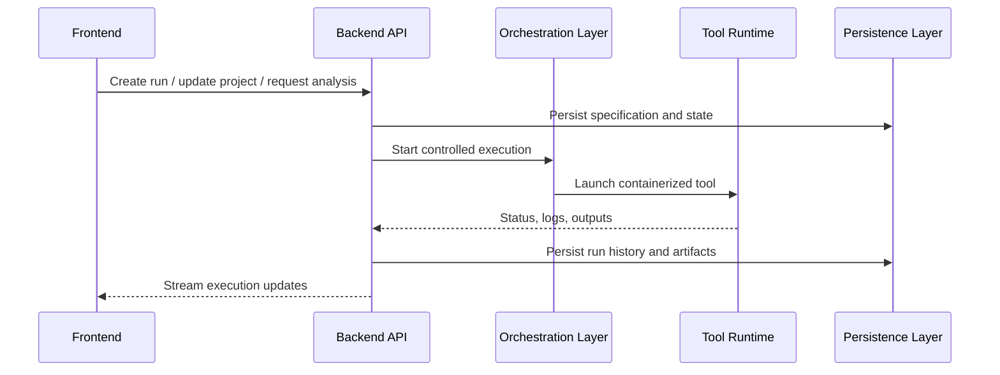

# Contribution guide overview

This section is for developers and operators who want to extend or maintain %%DEPLOYED_PRODUCT_NAME%% as a platform, not just use it as an application.

The central architectural ideas, reflected in both the codebase and the paper, are:

- **formal tool descriptions**
- **controlled build and execution**
- **persistent run state and provenance**
- **clear separation between platform control logic and runtime orchestration**
- **bounded, human-supervised AI assistance**

## End-to-end platform flow

## What contributors should optimize for

When contributing, prioritize:

- reproducibility over convenience shortcuts
- explicit interfaces over implicit behavior
- typed configuration over loosely structured input
- observability over hidden execution

This is not just a product preference. It is the operating model that makes the platform scientifically usable.

## Where to go next

- [Repository map](repository-map.md)
- [Deployment overview](deployment/overview.md)
- [Security and privacy](../intro/architecture/security-model.md)
- [Authentication](auth.md)
