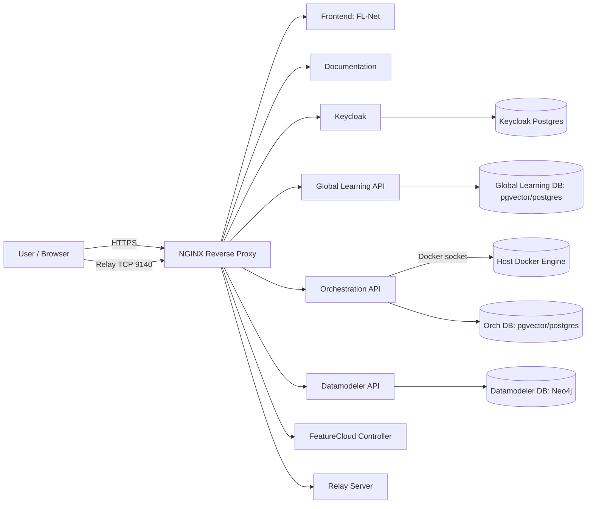
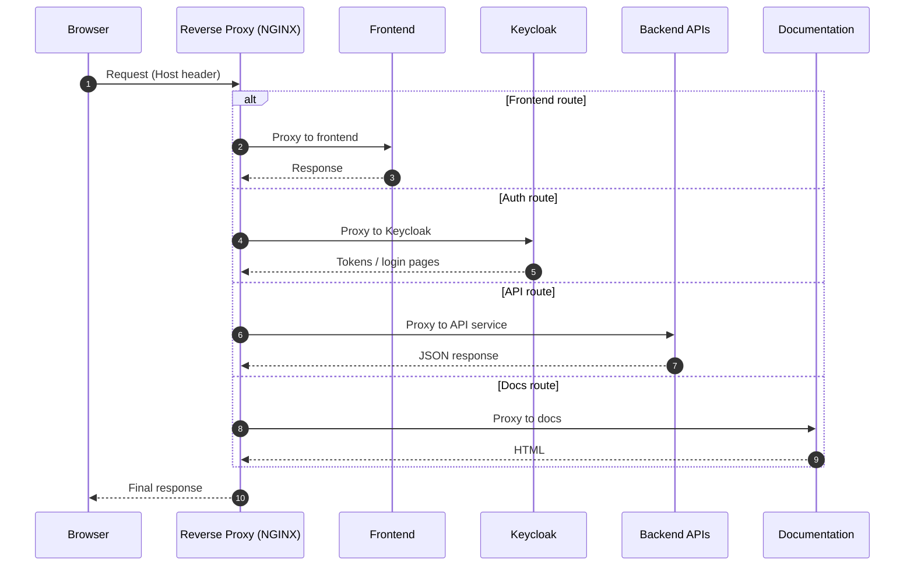
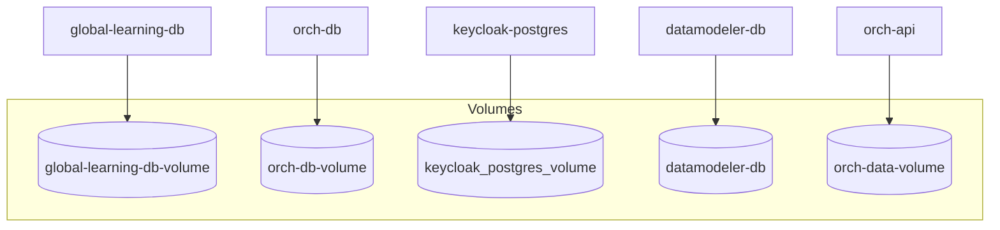

# Deploy your own Platform
## Prerequisites
- python3 (>= 3.6)
- docker
- docker compose
- A registered domain
- certbot
- at least 16 GB of RAM. 
  - On startup the authentication service Keycloak uses a few GB.
  - The ontology of the Platform consists of millions of nodes which depending on usage can be in RAM.
- a server/machine that is at best running 24/7 and exposed to the internet on two ports. 
The network is star shaped with the FLNet Platform instance as the central coordination hub. 
Without your FLNet Platform instance your whole FLNet is not available!


### Special prerequisites to take during development
[comment]: <> (TODO: We need to clean up the secrets and make the images publically available plus publish the deployment repo to github!)
As the docker registry is not yet public, the images for the FLNet Platform as well as
tool images used by the FLNet Platform are currently behind an auth check.

Therefore please contact a FLNet developer to provide you with credentials:
- A username
- A Gitlab Personal Access Token (PAT)
You will be provided with credentials that can pull images from the FLNet registry. 
Given this PAT, please do the following:
```bash
docker login gitlab.cosy.bio:5050
```
As username use the username, as password the PAT given.

## How to deploy
### 0. Prepare
#### Get the deployment folder
First make sure the [prerequisites](#prerequisites) are all met!
Then, clone the repository containing the FLNet Platform setup:
```bash
git clone https://github.com/FedLearnNet/FL-Net-Platform-Deployment.git
```
And cd into the cloned folder
```bash
cd FL-Net-Platform-Deployment/
```

#### Generate the SSL certificates
Generate the SSL certificates to use with the FLNet Platform and setup the deploy hook that
restarts the FLNet Platform after SSL cert renewal (Replace yourdomain.com!):
```bash
sudo certbot certonly --standalone \
  -d <yourdomain.com> \
  --deploy-hook "docker exec fl-net-platform-reverse-proxy-encrypted-1 nginx -s reload && docker restart fl-net-platform-relay-server-1"
```

Alternatively, you can use your own reverse proxy and deploy the FLNet Platform to `127.0.0.1`.
Please prepare this already before continuing.
For setting up your own reverse proxy, please note the following:
1. The FLNet Platform uses websockets and Server Sent Events (SSE) on multiple endpoints. 
For SSE: Make sure to turn off caching and buffering or the SSE events might get stuck in your proxies cache
For Websockets: Make sure to correctly handle websocket messages, e.g. via the rewrite engine in apache.
1. The FLNet Platform additionally deploys a TCP server for the federated learning. Make sure to
correctly proxy TCP, not HTTP to this, e.g. via the stream module in nginx.
1. The HOST header is used my multiple services of the FLNet Platform for either security or
creating redirect URIs. Please make sure to preserve the original Host header.

#### Optional: Get the UMLS ontology
The FLNet Platform supports using the UMLS as an ontology to ensure a stable data standard.
1. Make sure to get a license at the [umls homepage](https://www.nlm.nih.gov/research/umls/index.html).
1. Download the [UMLS Metathesaurus Full Subset ](https://www.nlm.nih.gov/research/umls/licensedcontent/umlsknowledgesources.html)
1. Extract the following files:
- `MRCONSO.RRF` to `FL-Net-Platform-Deployment/FLNET_platform/umls`
- `MRREL.RRF` to `FL-Net-Platform-Deployment/FLNET_platform/umls`

These files are automatically provided on startup via mounting the `umls` folder and 
the UMLS is automaically imported if these files are available. 

#### Optional: Getting the sapbert model for better ontology search
We support the use of the sapbert model for embedding the ontology, making search through
the ontology more efficient.

1. You can request the files from the FLNet developer. you need the `tokenizer.json` and 
the [sapbert model](https://github.com/cambridgeltl/sapbert/tree/main) in `onnx` format.
1. Place the following files in the relevant folder:
- `sapbert.onnx` to `flnet-platform-deployment/FLNET_platform/sapbert`
- `tokenizer.json` to `flnet-platform-deployment/FLNET_platform/sapbert`

The model is automatically loaded and used to embedd all ontology nodes.

### 1. Creating the FLNet Platform folder
Simply run the initialization script and follow the command line prompts:
```bash
python3 platform_installer.py
``` 
You will need to specify:
- The IP the Platform should listen on. Choose 127.0.0.1 if you use your own reverse proxy, otherwise
use 0.0.0.0.
- The port the Platform should listen on. The port should be free. If you deploy
onto 0.0.0.0 to allow direct access from the Internet to the Platform, we recommend to use
443 as this is the standard https port. This way you can access your Platform via
`<your-domain>` instead of having to specify a port like `<your-domain:5555>`
- The IP and port of the Platforms federated learning TCP server. This server is only used for
federated learning and manages encryption on it's own, it has normal SSL encryption via self signed
certificates plus end to end encryption. It needs another port then the main platform server!
- The domain name used. 
- The ssl certificate files.

After running the installer, the `FLNET_platform` folder is ready to be used.
The install script will provide you with the next steps, but they are also listed here.

### 2. Running your created FLNet Platform 
To start the Platform, run the following:
```bash
cd FLNET_platform
docker compose up -d
```
The first start up might take upto a few minutes.

### 3. The initial setup of the FLNet Platform
#### 3.1 First login as the admin user
Now you need to update the initial admin account created for you.
The authentication service is available at `auth/`, so e.g. at `<your-domain>/auth/`
In case you missed the initial password given by the initialization script, the initial
username and the password can be found in `FLNET_platform/env/keycloak-secrets.env` as the `KC_BOOTSTRAP_ADMIN_PASSWORD`.
Use these credentials to log in.

Please immediately change the password, this can be done via the upper right corner under manage account.
If going to the account management page causes an infinite reload glitch, you need to
1. Go to the Clients page. This is found on the left site.
2. Go to the account-console client by clicking on it's client id.
3. In Web Origins, add a plus. This just allows the redirect URLS to also be origins of requests. 

#### 3.2 Managing users in KeyCloak
The FLNet Platform is initialized without any users.
You can create users manually, hook in your own authentication service (SAML or OpenID Connect) or 
allow self registration of users. 
Please refer to the KeyCloak documentation itself. 

Here we only provide information on how to add users manually:
1. On the left site go to Manage Realms and chose the FLNet-Platform realm.
2. On the left site select users and add a user. 
Make sure to tick `Email verified` or connect a SMTP server to the KeyCloak instance!
Alternatively you can deactivate that email verification is required.

[comment]: <> (TODO: We still only have dev level groups, we should have groups and add the info about them here!)

Congratulations, you're ready to go.
Share your chosen domain and TCP port with the data holders that want to join your network.
You automatically also deploy documentation, so you can refer data holders to the relevant
documentation on how to join your network:
`<your-domain>/documentation/docs/client-usage/deploy-client`

[comment]: <> (TODO: The URL of the docs is still a bit fucked up right now!)

## 4. Keeping your FLNet Platform running
### Cert renewal
The deployment does neither automatically renew the SSL certificates nor reload updated certificates.
1. Make sure you take care of certificate renewal yourself. 
2. On certificate renewal, make sure you reload the relevant services (the reverse proxy and the relay server) to use the new certificates.
```bash
cd FL-Net-Platform-Deployment/FLNET_platform
docker compose restart reverse-proxy-encrypted
docker compose restart relay-server
```
Alternatively check the exact container names.
If you use certbot, you can use the `--deploy-hook` option to automatically reload the services after cert renewal.
Make sure to test the restart commands before you setup the hook, as it's easy to make a mistake in e.g. container names.

### 4.2 Updating the FLNet Platform
The FLNet Platform is deployed via docker compose.
We currently don'y have a specific update functionality.
You may use e.g. watchtower to automatically update the images.

## What gets deployed

### High-level overview



### Services

| Service | What it does | Depends on |
|---|---|---|
| `reverse-proxy` (NGINX) | Single entrypoint; routes to frontends, APIs, Keycloak, docs; also exposes relay TCP | All upstreams |
| `keycloak` | OIDC identity provider, realm import on boot | `keycloak-postgres` |
| `keycloak-postgres` | Postgres database for Keycloak | — |
| `frontend` | Serves FL-Net  UI (routing handled by NGINX) | `keycloak` |
| `documentation` | Serves the user documentation site | — |
| `global-learning-api` | Core FL-Net backend API | `global-learning-db`, `keycloak` |
| `global-learning-db` | Postgres + pgvector backing the Global Learning API | — |
| `orch-api` | Orchestration service (runs containers); requires docker socket access | `global-learning-db`, `keycloak` |
| `orch-db` | Postgres + pgvector backing orchestration metadata | — |
| `datamodeler-api` | Graph/ontology/data-model services | `datamodeler-db`, `keycloak` |
| `datamodeler-db` | Neo4j database for datamodeling graph | — |
| `controller` | FeatureCloud controller service | — |
| `relay-server` | FeatureCloud relay; TCP/HTTP endpoints | — |

---

## Deployment layout

```text
.
├─ docker-compose.yml
├─ .env
├─ env/
│  ├─ nginx.env
│  ├─ keycloak.env
│  ├─ keycloak-postgres.env
│  ├─ global-api.env
│  ├─ global-learning-db.env
│  ├─ orch-api.env
│  ├─ orch-db.env
│  ├─ datamodeler-api.env
│  ├─ datamodeler-db.env
│  └─ controller.env
├─ keycloak-realms/
│  └─ <realm files>.json
├─ nginx_server.conf
├─ nginx.conf
├─ umls/        (mounted read-only)
└─ sapbert/     (mounted read-only)
```

---

## Routing & domains

NGINX is the **single edge** service. It routes requests to:

- **Frontends** (FL-Net)
- **Keycloak** (`/auth/...` style endpoints depending on config)
- **Documentation**
- **APIs** (Global Learning / Orchestration / Datamodeler)
- **Relay TCP port** (exposed separately on 9140 via the reverse proxy service)

### Request flow (HTTP)



---

## Configuration: where to change what

### `.env`
Holds top-level Compose variables (e.g. ports, project name, image tags).  
Examples you likely have:
- `IMAGE_TAG`
- `NGINX_PORT`
- `RELAY_TCP_PORT`
- `COMPOSE_PROJECT_NAME`

### `env/*.env`
Contains relevant secrets such as DB passwords

### `docker-compose.yml`
Wiring:
- images + tags
- environment variables of the services
- dependencies/healthchecks
- volumes + mounts
- networks
- exposed ports
- labels (watchtower)

---

## Persistent storage

The deployment uses **named volumes** for durability across restarts:

- `global-learning-db-volume` → Postgres data (Global Learning)
- `orch-db-volume` → Postgres data (Orch DB)
- `keycloak_postgres_volume` → Postgres data (Keycloak)
- `datamodeler-db` → Neo4j data
- `orch-data-volume` → orch input directory (`/mnt/input`) used by orchestration



---

## Healthchecks & startup ordering

Several services use `depends_on: condition: service_healthy` to avoid boot races:

- APIs wait for their DBs and Keycloak
- Keycloak waits for Postgres and verifies readiness via a TCP-based healthcheck
- NGINX depends on upstream services, and restarts if it comes up too early

> NGINX note: on startup it may fail if upstreams aren’t ready yet. It should recover due to `restart: always`.

---

## Updating images

This setup includes watchtower labels:

```text
com.centurylinklabs.watchtower.enable=true
```

If you run watchtower elsewhere in your environment, it can auto-update these services.

Manual update:

```sh
docker compose pull
docker compose up -d
```

---

## Troubleshooting

### Check logs

```sh
docker compose logs -f reverse-proxy
docker compose logs -f keycloak
docker compose logs -f global-learning-api orch-api datamodeler-api
```

### Check health

```sh
docker compose ps
```

### Common issues

- **Keycloak redirect URI / hostname mismatch**  
  Usually caused by changing hostnames/ports without updating all OIDC-related env vars and NGINX routing.

- **NGINX fails at startup**  
  Upstreams not ready yet. It should recover due to `restart: always`.

- **Datamodeler mounts missing** (`./umls`, `./sapbert`)  
  Ensure directories exist and contain expected artifacts. They are mounted `:ro`.

---


