# Data flow of the Client

This document describes how data flows through a Client during normal operation.

The document assumes that you have already read the [network architecture](network-architecture.md) and the [technical architecture of the Client](technical-architecture-client.md). The technical architecture explains the components shown below; this document focuses on how data moves between them.

## Overview

The Client is the boundary around the Data Holder's local data.

**Roles.** "Data Holder" is the general term for the institution operating a Client — it is not itself a login role (Group in Keycloak). The people who act on the Data Holder's behalf have specific rights, and this document names them accordingly:
- **Data Holder (Admin)** — manages the Client instance itself: users, roles, and configuration.
- **Data Holder (Data Admin)** — uploads and manages the institution's patient data.
- **Data Holder (Data Access Manager)** — reviews and approves incoming federated statistics, learning, and metrics requests by default, and manages the permissions themselves.

Please note that a user may hold more than one of these roles, with the Admin role holding all other roles' rights by default.

**Boundaries.** The Client's perimeter is crossed at exactly four points, and each data-flow section below states which one(s) apply:
- **NGINX** — the single entry point for the Data Holder, via the Instance Manager Frontend and Keycloak.
- **Local Learning API** — the outbound channel to the Platform used for federated queries, statistics, learning, and metrics requests, and their results.
- **Orch API** — Pulls required Tool images from the Platform's registry.
- **Controller** — a separate outbound channel to the Platform used only for the federated-learning training communication itself, once a run is underway.

The full definition of each boundary, including what does *not* cross a network boundary at all (such as backups), is in [Boundaries of the Client](#boundaries-of-the-client) below.

**Federated request types.** The Platform can make four kinds of request against a Client's data. Three of them — statistics, learning, and metrics — are formal **Requests** in the sense used by the [access management documentation](../../client-usage/external-access-management.md) and require manual approval by a Data Holder (Data Access Manager). The fourth, federated queries, works differently: it is always answered automatically, shaped only by the disclosure-control settings configured for that cohort — there is no manual-approval step for a query. However, the automatic answer may also be an automatic rejection depending on how the disclosure control is set up.

Deployments that explicitly enable the relevant Automatic Access permissions can approve matching statistics, learning, or metrics requests without manual review. Manual approval remains the default.

- **Federated queries** (also called a **Data Discovery Query**, or **DDQ**) — asking how much data matching certain criteria exists (e.g. how many patients over 50 years old). Always answered automatically; shaped by disclosure control.
- **Federated statistics** — requesting the distribution of specific variables across the Client's local data. A Request; subject to disclosure control and to approval.
- **Federated learning** — coordinating a training run in which one or more Tools compute a local model update from patient-level data, without the underlying records ever leaving the Client. A Request; subject to approval.
- **Federated metrics** — requesting the local metrics a completed federated learning runs model produced from this Client's own data. A Request; subject to approval.

**Main data paths**, in the order this document covers them:

1. Deployment and initial access
2. Authentication and user access
3. Cohort creation and schema subscription
4. Data ingestion (including local ETL Tool execution)
5. Federated queries
6. Federated statistics
7. Federated learning
8. Federated metrics
9. User exports
10. Backups

## Step 0: Deployment and initial access

Before any patient data can flow through the Client, the Client itself has to be deployed and given its first user.
Deployment follows a two step procedure:
1. The Data Holder (Admin) runs the deployment script to set up the FL-Net Clients configuration and generate the required secrets.
2. The Data Holder (Admin) starts the configured FL-Net Client

### Step 0.1 Configuration
An interactive python script is used to request information from the Data Holder (Admin) about how the FL-Net Client should be set up.
These configurations, including e.g. used Domain name for the Client, used port, etc. is written into an `.env` file.
Additionally, all secrets such as database passwords, but also the initial boostrap password for the Keycloak admin account are generated and written into the `.env` file with restricted permissions (`600`, only allowing the generating user to read them).
The secrets are added to the containers of the FL-Net Client as environment variables, and can be read by any user that has access to the container. Therefore, it is important to restrict access to the containers to only trusted users.

### Step 0.2 Deployment
The deployment is done by starting the configures FL-Net Client.
This requires network access to pull all required docker images.
Required domains to whitelist are documented in the [Client deployment guide](../../deployment/deploy-client.md), which generally contains more information.
The Data Holder (Admin) is advised to use the Instance Manager Frontend to:
1. Change the bootstrap password for the Keycloak admin account to a secure password
2. Create the first user(s).

Furthermore, if the federated features are enabled, the Local Learning API on startup connects to the Platform creating the previously mentioned Local Leaning API boundary.
This data flow via this connection is discussed in the further chapters of this document.
In this stage, only technical information is exchanged, e.g. ping/pong messages.

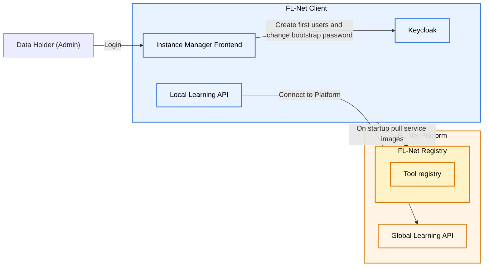

## 1. Authentication and user access

### Data Holder to FL-Net Client authentication
The Data Holder interacts with the Client using the Instance Manager Frontend via their browser, reached through the **NGINX** boundary.

Any incoming requests to the Client must be authenticated and authorized using OAuth and the dedicated FL-Net Clients Keycloak.
The Local Learning API enforces role-based access control on all requests, and the Keycloak token is used to determine the user's role. The Data Holder (Admin) can manage users and their roles through the Keycloak admin interface, which is also reached through the **NGINX** boundary. The admin interface uses it's own, seperate Keycloak realm and is only accessible to the deploying Data Holder (Admin).
This authentication holds also for all further data flows described whenever a Data Holder uses the **NGINX** boundary to access the Client.

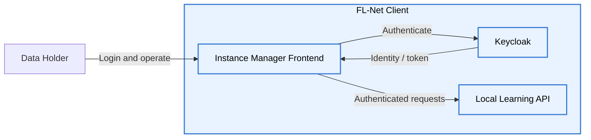

### FL-Net Client service to service authentication
Service to service communication within the Client is always authenticated and authorized.
The Local Learning API requests other services, using it's service account which uses
a dedicated Keycloak client. The client credentials are generated [at step 0.1](#step-01-configuration).
Other services do not request each other or the local learning api.

The Instance Manager Frontend and NGINX are not discussed as service to service communication, 
they merely serve to relay requests of the Data Holder.

The only containers sending requests towards the Local Learning API are started Tools.
Tools use application-layer authentication (API keys) to authenticate to both the Local Learning API and the Controller. 
See the [api key section](#details-api-keys) for more information on their size, generation, and distribution.
Other services are not reachable by the Tool due to it's network isolation.

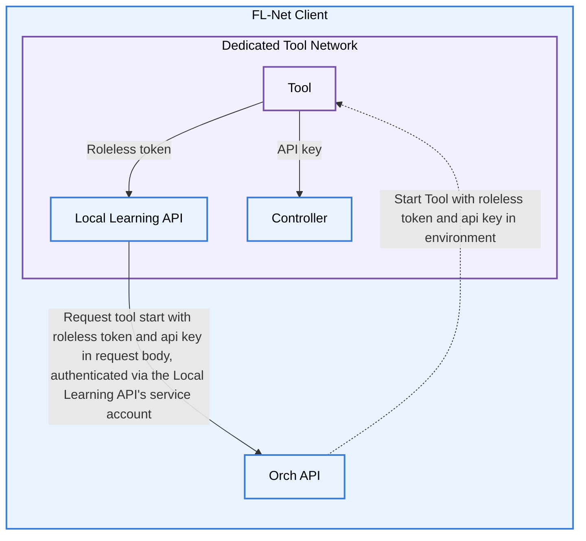
*Note: The dotted line represents the Orch API starting the Tool. Straight lines represent HTTP requests.*

### FL-Net Client to Platform authentication
The Local Learning API and Controller both connect to the Platform, but they do so in different ways. The Local Learning API uses a permanent websocket HTTPS connection to the Global Learning API, while the Controller uses a separate TCP connection to the Relay Server, only created on executing a federated learning. Both connections are encrypted using TLS.
These form the **Local Learning API** and **Controller** boundaries, respectively.
Depending on how the Client is setup in [step 0.1](#step-01-configuration), the Local Learning API connection can be an anonymous connection or a connection with a dedicated Client account on the Platform. Depending on Platform configuration, the Platform may reject unauthenticated Clients from connecting.
The Controller use mTLS and [API Key](#details-api-keys) based application layer authentication towards the Platform.

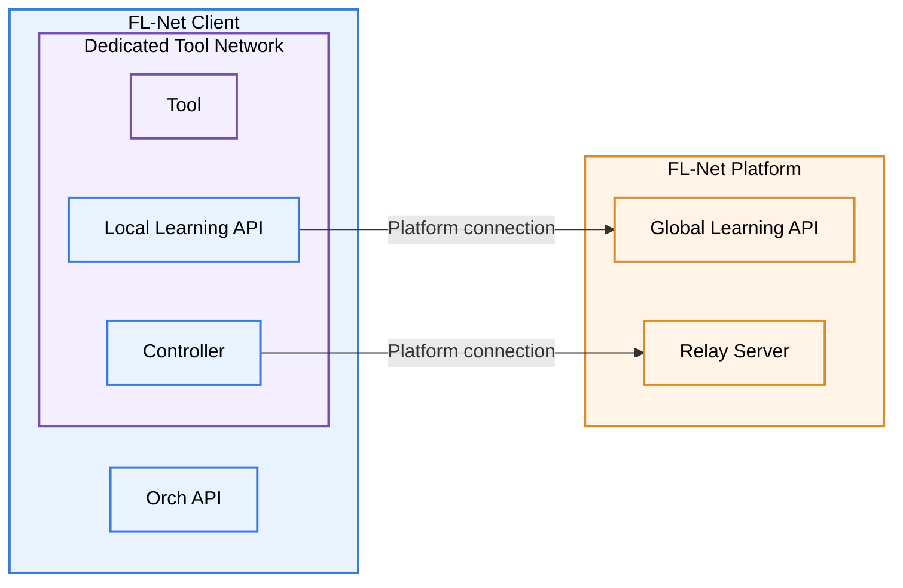
*Note: The controller is shown to be in the same network as the Tool, but this is only the case for FL-Tools, not ETL Tools discussed in this section*

### Details: API Keys
API keys are unique per FL run, tool and participating Client. 
The Local Learning API generates and holds the API Keys of the Tool:
1. The API key used between the Tool and the Controller. This is a 256 bit, hex encoded key, generated by the Local Learning API and passed to the Tool and Controller on Tool start. The SHA-256 hash of the key is stored in memory during the Tool run but not persisted. 
1. The API key used between the Tool and the Local Learning API. This is a 256 bit, base64 encoded key, generated by the Local Learning API and passed to the Tool on Tool start. The SHA-256 hash of the key is stored in memory during the Tool run but not persisted. 
The API Key used between the Controller and the Relay Server is generated by the Relay Server, and distributed to the Controller via the Local Learning API boundary. Similarly, only the SHA-256 hash of the key is stored in memory during the Tool run but not persisted. 
The Relay Server does not persist any state between FL runs.
The Global Learning API uses a randomly generated ID per FL Run and participating Client to be able to identify federated learning status updates, but restrict identfication over multiple runs via logs.

## 2. Cohort creation and schema subscription

Before data can be ingested, the Data Holder creates a cohort through the Instance Manager Frontend. To populate the cohort configuration, the Local Learning API pulls the Schemas available on the Platform as a seperate request. The Data Holder then selects a Schema in the frontend.

When the cohort is created, the Local Learning API sends a subscription request to the Platform confirming that the Client subscribes to the selected schema. If the cohort is deleted later, the Local Learning API sends the corresponding unsubscribe request. 

All mentioned requests (schema availability, subscription and unsubscription messages) are sent as an anonymous user; they do not use the identity associated with the Client's WebSocket connection to the Platform.

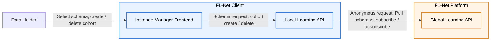

## 3. Data ingestion

Data is normally brought into the Client by a Data Holder (Data Admin).

While preparing ingestion, the Data Holder's browser loads the available Tool descriptions directly from the Platform's frontend. This is browser-to-Platform traffic and does not pass through the Client at all. The Tool descriptions are used to identify the Tools and workflows usable for the selected connector or cohort.

The Data Holder (Data Admin) uploads source files through the Instance Manager Frontend, crossing the **NGINX** boundary. The frontend sends the uploaded data and the required harmonization information to the Local Learning API.

The Local Learning API processes the imported records and persists the harmonized result in its local database. The originally uploaded source files are also persisted by the Local Learning API — but, depending on configuration, they may be automatically deleted once their data has been successfully imported, rather than retained indefinitely.

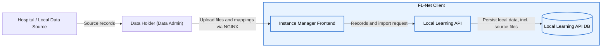

At this point, the patient data remains inside the Client environment. The browser may have loaded Tool descriptions from the Platform, but no patient data is sent in that request.

### Local ETL Tool execution

Ingestion sometimes requires more flexible processing — an ETL Tool may need to run against the data (for example, to apply an institution-specific transformation). When that happens:
1. The Data Holders (Data Admin) Browser requests the available Tools, selects the Tool or workflow to build a connector.
2. Once the Data Holder starts the connector, the Local Learning API determines what data the Tool needs and passes the workflow request to the Orch API.
3. The Orch API stages the required input in `orch-data-volume` — its own volume, which Tools never mount directly.
4. A temporary copying container transfers the staged data from `orch-data-volume` into a separate volume dedicated to that specific Tool run. This extra hop matters: it means a Tool can never reach `orch-data-volume` itself — only the one volume prepared for it — so a compromised or misbehaving Tool can't see data staged for other runs, and can't write anything back except through the same controlled copy step.
5. The Orch API pulls the required Tool's Docker image from the Platform's registry and starts the Tool container from that image, attaching the relevant volume. The Tool is started in a dedicated Docker network with no internet or host access if not otherwise requested and approved. The Local Learning API is attached to that network to allow the Tool to communicate it's states and progress and to allow the Local Learning API to rochestrate the FL run.
6. The Tool reads its input from its own volume, performs its local computation, and writes output back to that same volume.
7. At the end of the run, the copying container transfers the Tool's output back from the Tool's own volume into `orch-data-volume`, and the Orch API retrieves it from there.
8. The Orch API returns the result to the Local Learning API, which is responsible for persisting anything that needs to be kept.

The Orch API records container orchestration state (which containers ran, when, with or without errors)

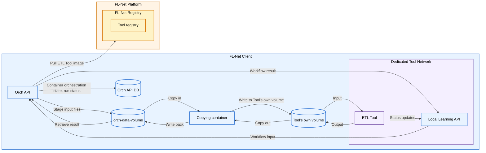

Tools run in a dedicated environment within the Client, and by default their network access is restricted to what the workflow needs. Some Tools may require broader access to the internet or the host and that access is never granted automatically: it must be **manually approved** before the Tool can use it. For instance, a Tool loading data from an online repository or from a database running on the host might need such access.

This makes the Tool an important internal boundary of its own; see [Boundaries of the Client](#boundaries-of-the-client) and the [security model](security-model.md) for details on Tool vetting, restriction, and approval.

## 4. Federated queries

The Platform can ask a Client how much data matching certain criteria exists — for example, how many patients over 50 years old. This is also called a **Data Discovery Query (DDQ)**.

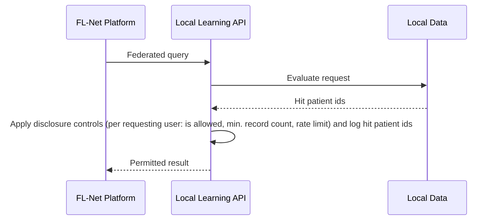
How the query is treated, from applying privacy controls to rejecting it, depends on the setup permissions, see the [access management documentation](/docs/client-usage/external-access-management.md) for details. 

## 5. Federated statistics

The Platform can request the distribution of specific variables across the Client's local data — for example, an age distribution. Unlike a federated query, this is a formal **Request**: it crosses the **Local Learning API** boundary and requires manual approval from a Data Holder (Data Access Manager) by default.

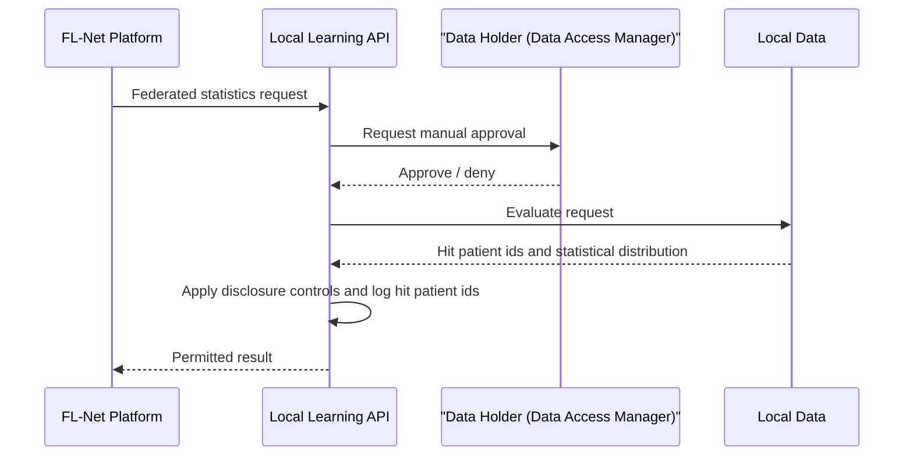

The permission system handles the approval and privacy settings, see [access management documentation](/docs/client-usage/external-access-management.md) for details.

## 6. Federated learning

A federated learning request is also a formal **Request**: it arrives at the Local Learning API and crosses the **Local Learning API** boundary first, requiring manual approval by a Data Holder (Data Access Manager) before any training data is touched. On approval, the Data Holder (Data Access Manager) can also review the Tool's documentation, source code, security scans and audit reports before approving it. Furthermore, they can manually select/deselect individual patients from the training run.

Once approved, the flow into the Tool and it's execution is the one already described under [Local ETL Tool execution](#local-etl-tool-execution).
In difference to an ETL Tool, the Controller is also attached to the Tool's network, and the Tool communicates with it to exchange model updates and other FL messages over the **federated communication channel**, connecting the participants of the FL. 
This is the second and last outbound path a Client has, and it crosses the Controller boundary rather than the Local Learning API boundary:
As FL messages are inherently more sensitive than the the other request types, messages sent over the federated learning channel are additionally to the transport encryption also machine to machine encrypted, with only the sending Clients Controller and receiving aggregators/other Clients controller able to decrypt them.
The request contains the information whether the aggregator is deployed on another participating Client or on the Platform. In case the aggregator is deployed on another Client, no information on the identify of the owner of that Client and therefore the aggregator is available.

```mermaid
flowchart LR
    subgraph CLIENT[FL-Net Client]
        ORCH[Orch API]
        DATA[("orch-data-volume")]
        COPY["Copying container"]
        TVOL[("Tool's own volume")]

        subgraph TOOLNETWORK[Dedicated Tool Network]
            LLA[Local Learning API]
            CTRL[Controller]
            TOOL[FL Tool]
        end
    end

    subgraph PLATFORM[FL-Net Platform]
        PLATFORMNODE[Platform services]
        subgraph REGISTRY[FL-Net Registry]
            REG[Tool registry]
        end
    end
    
    AGGREGATOR["Aggregator (Platform or Client)"]

    classDef client fill:#e8f3ff,stroke:#3a7bd5,stroke-width:2px,color:#000
    classDef toolnet fill:#f4efff,stroke:#7651a8,stroke-width:2px,color:#000
    classDef platform fill:#fff4e5,stroke:#d98b2b,stroke-width:2px,color:#000
    classDef registry fill:#fef3c7,stroke:#d97706,stroke-width:2px,color:#000

    class LLA,ORCH,DATA,COPY,TVOL,CTRL client
    class TOOL toolnet
    class PLATFORMNODE, platform
    class REG registry

    style CLIENT fill:#e8f3ff,stroke:#3a7bd5,stroke-width:2px,color:#000
    style TOOLNETWORK fill:#f4efff,stroke:#7651a8,stroke-width:2px,color:#000
    style PLATFORM fill:#fff4e5,stroke:#d98b2b,stroke-width:2px,color:#000
    style REGISTRY fill:#fef3c7,stroke:#d97706,stroke-width:2px,color:#000

    LLA -->|Workflow input| ORCH
    ORCH -->|Pull FL Tool image| REGISTRY
    ORCH -->|Stage patient data| DATA
    DATA -->|Copy in| COPY
    COPY -->|Write to Tool's own volume| TVOL
    TVOL -->|Input| TOOL
    TOOL -->|Local model update| CTRL
    CTRL -->|Federated communication channel, machine to machine encrypted| PLATFORMNODE
    TOOL -->|Status / progress| LLA
    TOOL -->|Local metrics / output| TVOL
    TVOL -->|Copy out| COPY
    COPY -->|Write back| DATA
    DATA -->|Retrieve result| ORCH
    ORCH -->|Local metrics, for later Federated Metrics requests| LLA
    PLATFORMNODE -->|Federated learning communication channel, machine to machine encrypted| AGGREGATOR
```

Patient-level training data therefore never leaves the Client: the Local Learning API boundary carries only the initial request and approval, and the Controller boundary carries only the resulting model update, never the source records.

The Controller/Tool also report workflow status and progress back to the Local Learning API — this status information is separate from, and does not include, the model-data exchange itself. Separately, the local metrics the Tool produces for this run are persisted through the ordinary volume path, the same as an ETL Tool's output — this is what a later [federated metrics request](#7-federated-metrics) actually retrieves.

Please note that the federated communication channel has in itself no direct limitations to its content. To ensure security, the Tools are:
- Audited and certified before they are allowed to run on the Client
- Reviewable by the Data Holder (Data Access Manager), who can inspect a Tool's documentation, source code, security scans and audit reports before approving it

The Controller itself, although in the same Docker network as any Tool, protects any FL-run-specific communication with an API key only given to the relevant Tool.
The details of this API key are found in [the authentication section before](#1-authentication-and-user-access).

## 7. Federated metrics

After a federated learning run completes, its local metrics — the metrics calculated from this Client's own data as part of that run, such as this site's contribution to accuracy or loss — can be requested separately from the run itself.

Like federated statistics and federated learning, this is a formal **Request**: it crosses the **Local Learning API** boundary and requires manual approval from a Data Holder (Data Access Manager) — see the approval flow under [Federated statistics](#5-federated-statistics).

Who can make the request depends on how the run's resulting Inference Tool was published:
- If the Inference Tool is public, any user can request this Client's local metrics for that run.
- If it isn't, only the user who originally started the federated learning run can request them.

The metrics themselves were already computed and persisted locally as part of the federated learning run (§5); this request only governs whether, and to whom, that already-computed local result may be disclosed.

## 8. User exports

A Data Holder (Data Admin) can explicitly export patient or cohort data through the Client UI. The download is served by the Local Learning API and delivered to the browser through the **NGINX** boundary, the same path used for all Data Holder access.
The data export may be done using Tools, which pass the **Orch API** boundary to pull the relevant Tool image from the Platform's registry.
The Tool execution is described under [Local ETL Tool execution](#local-etl-tool-execution) above.

At that point, the exported data leaves the Client's own storage and is no longer protected by the Client's technical controls — it is subject to the security of the user's own device from then on.

## 9. Backups

Backups are different from the flows above because they can contain the Client's persistent data in bulk, and because they don't cross any of the Client's four network boundaries at all — they're a host-level operation performed directly against the databases and the deployment directory, not something that goes through NGINX, the Local Learning API, or the Controller.

The backup process can create plaintext database dumps and copy the deployment data into the configured backup location. This means the backup location should be treated as another location containing sensitive Client data — and, in practice, as a broader one: it can also include configuration secrets from the deployment directory.

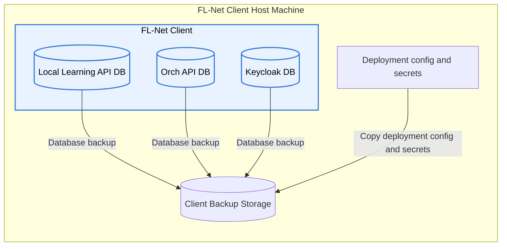

The backup process is host-side, run by IT staff directly, rather than one of the Client's normal application services. The backup process is supported via a shell script, but may be done manually as well.

## Boundaries of the Client

Reasoning about Client data flow comes down to two different kinds of boundary: four **network** boundaries, where the Client's perimeter is actually crossed by traffic to or from the outside world, and one **internal** boundary, where trust changes without any network crossing at all.

### The four network boundaries

| Boundary | Crosses to/from | Carries |
|---|---|---|
| **NGINX** | Data Holder ↔ Client | All human/browser access: login, uploads, exports, admin actions |
| **Local Learning API** | Client ↔ Platform | Schema pulls, anonymous schema subscriptions/unsubscriptions, federated queries, and federated statistics, learning, and metrics requests, plus their results |
| **Controller** | Client ↔ Platform | Federated-learning training communication only (model updates), over its own dedicated channel |
| **Orch API** | Client ↔ Platform | Pulls required Tool images from the Platform's registry |

These are deliberately separate. NGINX is the Client's only exposure and may be limited to the Data Holder's own network only; the Local Learning API and Controller are the Client's only two outbound connections to the Platform, and they're kept apart so that the request/approval/result traffic (Local Learning API) never shares a channel with raw training communication (Controller). The Data Holder's browser also connects directly to the Platform frontend to load Tool descriptions; that browser-to-Platform path is outside the Client's four network boundaries. Internally, the Client's services sit behind Docker network isolation and are not reachable from the host network except through NGINX.

### The Tool sandbox — an internal boundary

The Tool is a separate execution environment inside the Client, not a network boundary the way the four above are. This is where ETL and FL Tools — which may be third-party or workflow-specific code — process patient-level files directly. Tools are restricted to a dedicated Docker network together only with the Local Learning API and Controller. They also never mount `orch-data-volume` directly — only their own per-run volume, reached through the copying container described under [Data ingestion](#3-data-ingestion) — and they authenticate to the Local Learning API with a roleless, single-endpoint-scoped token, so network placement alone doesn't grant a Tool any broader API access.

The Tool therefore has access to sensitive data by design, but its network access is restricted by default to what it needs. A Tool that requires broader access — to the host network, the internet, or other resources — must be manually approved before that access is granted. This makes the Tool boundary the Client's main place to reason about *third-party code* risk, as distinct from the four network boundaries above, which are about *where data is allowed to physically leave*.

*Note: Any Tool requiring special network access **always** requires manual approval, bypassing any automatic approval, ETL scheduling etc.*

## Summary

The Client data flow can be reduced to one central principle:
> **Patient data is processed inside the Client, while only explicitly permitted results leave — and only through the Local Learning API or Controller boundary, never directly from a database.**

The Local Learning API is the main control point for local data, for federated queries, and for the statistics, learning, and metrics requests alongside them. It also pulls schemas and manages anonymous schema subscriptions for cohorts. The Orch API prepares data for Tool execution — always by way of a copying container into the Tool's own volume, never a direct handoff — and pulls the Tool image from the Platform registry. Tools perform the actual ETL or FL computation inside their own sandbox, and the Controller handles federated-learning communication through its own dedicated channel.

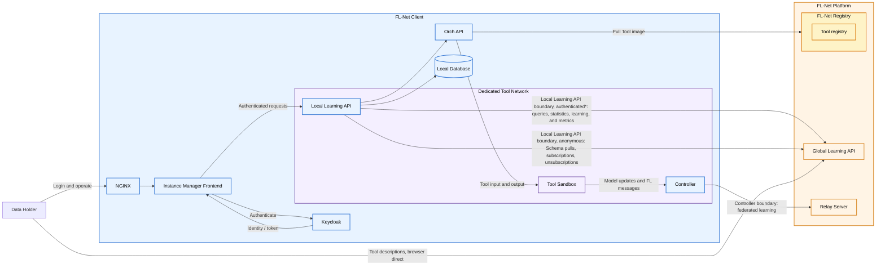
\**Only authenticated if configured on deployment, see [step 0.1](#step-01-configuration)*

For more detail about the components themselves, see the [technical architecture of the Client](technical-architecture-client.md).

For the network-level view, including the Client's connections to the Platform, see the [network architecture](network-architecture.md).

For details about the security controls and Tool restrictions, see the [security model](security-model.md).

For details on how to setup the Client's access management, see the [access management documentation](/docs/client-usage/external-access-management.md).

*Please note that automatic approval of federated learning, statistics and metrics requests is supported if the Data Holder (Data Access Manager) setup a specific permission for them. The automatic approval permission system can be turned of on deployment, see the [access management documentation](/docs/client-usage/external-access-management.md) for details.*

## Recommended next step

You now have the main Client data paths and boundaries. Continue with the [security model](security-model.md) to understand how these flows are protected and how access to sensitive Client data is controlled.
