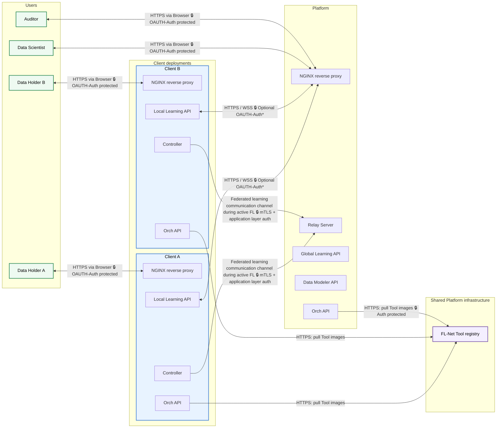

# Architecture overview

The **%%DEPLOYED_PRODUCT_NAME%% network** and **FL-Net software** follows a **federated star architecture**:

- A **Platform deployment** provides discovery, orchestration, and the interface for Data Scientists and Auditors.
- Multiple **Client deployments** are operated independently by individual data holders.

The key design choice: data holders don't have to give up local control just to join a shared network. A set of **disclosure control mechanisms** lives on the Client itself, ensuring that no non-anonymous personal data ever leaves the local environment.

## Main building blocks

### Platform

The Platform is the central, user-facing layer. It typically handles:

- Authentication of Clients, Data Scientists, and Auditors
- Schema creation and storage
- Secure data discovery across participating Clients
- Building, scanning, and storing Tools and Workflows, along with their audits
- Federated Learning (FL) project creation
- Handling FL project results, from viewing to publication

As the Platform is deployed as a multi service enseble, the following services are relevant for the network architecture:
- Global Learning API
- Data Modeler API
- Relay Server
- Orch API
- LINK_PLATFORM

More information on the Platform's internal structure and its services can be found in the [Platform technical architecture](technical-architecture-platform.md).

### Clients

Clients are self-hosted nodes operated by Data Holders. They typically handle:

- Data ingestion, where connectors map local source data to global data standards (Schemas)
- Data administration and auditing of local data changes and protected federated access
- Disclosure control lets Data Holders define how their data may be discovered and securely used

As the Client is deployed as a multi service enseble, the following services are relevant for the network architecture:
- Local Learning API
- Controller
- Orch API
- Reverse proxy (NGINX)

For a general overview, see the [Client introduction](/docs/client-usage/welcome.md). For a detailed description of the Client's services, see the [Client technical architecture](technical-architecture-client.md), which also then links to the clients data flow.

For a hands-on look at what's configurable on the Client side, see the [Client usage docs](/docs/client-usage/welcome.md).

## Connection diagram

The following describes any connections going over the internet, ignoring any connections happening on the same host. The DataHolder is assumed to be on another machine then their Client deployment.

\* The Platform operator may choose to require Clients to authenticate via OAUTH, or to allow unauthenticated access. See the [Platform technical architecture](technical-architecture-platform.md) for details.
The Microb-AI-Net and dAIbetes-Net deployments do not require OAUTH authentication for Clients, 
but federated-learning.net does.

### Client connections

#### Incoming

**Data Holder access:** `Data Holder(browser) —[HTTPS]→ Client (NGINX reverse proxy)`

The Client exposes one HTTP entry point for the Data Holder. How it's secured ultimately depends on how the local IT admin deployed the Client, but the FL-Nets deployment scripts and docs support the following options:

- **HTTPS with a CA-issued certificate supplied to the Client** (recommended). The IT admin supplies the certificate; the Client terminates TLS via NGINX. By default this:
  - Allows **TLS 1.2 and 1.3 only**
  - Enables **HSTS**, with a 1-year max-age and `includeSubDomains`
- **HTTPS with a self-signed certificate supplied to the Client.** A script for generating the self-signed certificate is provided. Unlike the CA-signed option, **HSTS should not be enabled** here — modern browsers will otherwise refuse the connection.

Alternatively, Clients can put their **own reverse proxy** in front, or connect via an **SSH tunnel**. See the [Client deployment docs](../../deployment/deploy-client.md) for details.

#### Outgoing (Client → Platform)

1. **Federated secured access:** `Client (Local Learning API) ⟷[HTTPS]⟷ Platform (NGINX reverse proxy)`
   An outgoing connection from the Client to the Platform is established over **HTTPS (port 443)**, including a **WebSocket (WSS)** connection. On the %%DEPLOYED_PRODUCT_NAME%% network, this uses the default FL-Net Platform settings: a Let's Encrypt certificate supplied to the Platform, with TLS terminated via NGINX, which:
   - Allows **TLS 1.2 and 1.3 only**
   - Enables **HSTS**, with a 1-year max-age and `includeSubDomains`

2. **Federated learning communication:** `Client (Controller) ⟷[TCP]⟷ Platform (Relay Server) ⟷[TCP]⟷ Client/Platform (Controller)`
   To relay messages during an active federated learning run, the Client and Platform open a **TCP connection (port %%DEPLOYED_PRODUCT_TCP_PORT%%)** secured with **mTLS 1.3**.

   On top of that, every message sent from a Client is individually encrypted ECIES-style over X25519. The shared secret is derived via ECDH, combining the recipient's per-run ephemeral public key with a per-message ephemeral private key generated by the sender. This extra layer does **not** apply to the initial handshake, the per-run ephemeral public key exchange, or aggregated models sent by the aggregator (deployed on either the Platform or a Client, as specified in the FL request).

3. **Tool image registry access:** `Client (Orch API) ⟷[HTTPS]⟷ FL-Net Tool registry`
   The FL-Net Tool registry is deployed on a separate server as shared Platform infrastructure for all deployed FL-Net instances. During ETL or federated-learning Tool execution, the Client's Orch API pulls the selected Tool's Docker image from this registry. This is a direct Client-to-registry connection; the image is not pulled by the Data Holder's browser, the Local Learning API, or the Platform application server.

4. **Gitlab access:** `Client (Local Learning API) ⟷[HTTPS]⟷ GitLab FL-Net Developers`
   A Data Holder may file a bug report via their Browser which is submitted via the Local Learning API to the GitLab instance run by [Cosy Bio](https://cosy.bio), the developers of FL-Net. These requests contain no Client data.
   Furthermore, any built Tool is pushed to the GitLab instance run by Cosy Bio, serving as the Tool-Store registry for the %%DEPLOYED_PRODUCT_NAME%% network.
---

#### Potential connections

Tools run as part of a federated learning run are especially sensitive, since they access non-anonymous, personal data.

At the connection level, most Tools are restricted to the dedicated Federated Learning Communication channel only. Any Tool that requests broader access — for example, to the host machine (a database loader) or to the internet (a model download) — is flagged and **always** requires manual approval.

Please refer to the [security model](security-model.md) and [data flow client](data-flow-client.md) for details on how Tools are vetted and approved, and how their access is restricted.

#### Intra Client connections
Please refer to the [Client technical architecture](technical-architecture-client.md) for details on how the Client's internal services communicate with each other.

### Platform connections

These connections are in addition to the ones described above under [Client connections](#client-connections). Data Scientist and Auditor access uses the same HTTPS settings described there. The Platform exposes one HTTP entry point shared by Data Scientists, Auditors, and Clients.

#### Incoming
Apart from the outgoing connections listed under [Client connections](#client-connections), the Data Scientist and Auditor connect to the Platform over HTTPS (port 443). The Platform terminates TLS via NGINX, which:
- Allows **TLS 1.2 and 1.3 only**
- Enables **HSTS**, with a 1-year max-age and `includeSubDomains`

#### Outgoing

1. **[UMLS](https://www.nlm.nih.gov/research/umls/index.html) access:** `Platform (Global Learning API) ⟷[HTTPS]⟷ UMLS`
   The Platform may connect to the UMLS API to retrieve UMLS concepts and their relations.

2. **Semantic Scholar / PubMed access:** `Platform (Global Learning API) ⟷[HTTPS]⟷ Semantic Scholar / PubMed`
   The Platform may connect to the Semantic Scholar and PubMed APIs as part of its research assistance features. These requests contain only text from the Data Scientist. The exact accessed domains are https://api.semanticscholar.org/ and https://eutils.ncbi.nlm.nih.gov/

3. **LLM server (UHAM) access:** `Platform (Global Learning API) ⟷[HTTPS]⟷ LLM server`
   The Platform may connect to the LLM server run by [Cosy Bio](https://cosy.bio) for the chatbot feature. These requests contain only data provided by the Data Scientist and the public Tool-Store.

4. **Docker hub/chainguard** access: `Platform (Global Learning API) ⟷[HTTPS]⟷ Docker hub / Chainguard`
   Tools are packaged docker images built on the Platform. The Platform must therefore pull the base images for Tools which may be stored in the Docker hub registry or the Chainguard registry. These requests contain no Client data.

5. **GitLab access:** `Platform (Global Learning API) ⟷[HTTPS]⟷ GitLab FL-Net Developers`
   For bug reporting, the Platform may supply the bug reports to the GitLab instance run by [Cosy Bio](https://cosy.bio), the developers of FL-Net. These requests contain no Client data.
   Furthermore, any built Tool is pushed to the GitLab instance run by Cosy Bio, serving as the Tool-Store registry of the %%DEPLOYED_PRODUCT_NAME%% network.

6. **Tool image registry access:** `Platform (Global Learning API) ⟷[HTTPS]⟷ FL-Net Tool registry`
   The FL-Net Tool registry used by the %%DEPLOYED_PRODUCT_NAME%% network is deployed on a separate server as shared Platform infrastructure. During federated-learning Tool execution, the Platform's Orch API pulls the selected Tool's Docker image from this registry. Additionally, after building a Tool, the image is pushed to this registry. This is a direct Platform-to-registry connection.

*Running a self-hosted FL-Net Platform? Contact your Platform administrator, since these defaults may have been changed. See the [Platform deployment docs](../../deployment/deploy-global.md) for more.*

#### Intra Platform connections

The Platform uses an ensemble of docker containers to run its services. These containers communicate with each other via the Docker network, which is isolated from the host network. The Platforms's internal services communicate over plain HTTP, with a deployed NGINX reverse proxy as part of the Platform handling TLS termination and routing incoming traffic from the Client, a Data Scientist or an Auditor to the appropriate service. The Platforms's internal services are not exposed to the host network, and only the NGINX reverse proxy and the Relay Server used for the Federated learning communication are exposed to the host network/the internet.

## During deployment

During deployment, the Platform and Client must be able to pull the docker image ensemble that represents a Platform/Client.
An outgoing connection will be established to
- the cosy.bio docker registry (https://gitlab.cosy.bio) to pull the Client images
- the chainguard docker registry (https://registry.chainguard.dev) to pull the base images for the Client images
- the docker hub registry to pull e.g. the database images.

After deployment, each Client must also be able to reach the shared FL-Net Tool registry so that its Orch API can pull Tool images when ETL or federated-learning workflows execute. This runtime image pull is separate from pulling the Client's own deployment images.

## Further reading

We recommend diving into whichever side is more relevant to you:

**Client**
The [Client technical architecture](technical-architecture-client.md) covers its internal structure — components, how they interact, and how it's deployed — and links on to the [Client data flow](data-flow-client.md), which details what data flows in and out. Read the technical architecture first; it provides context the data flow page assumes.

**Platform**
The [Platform technical architecture](technical-architecture-platform.md) covers its internal structure — components, how they interact, and how it's deployed.
