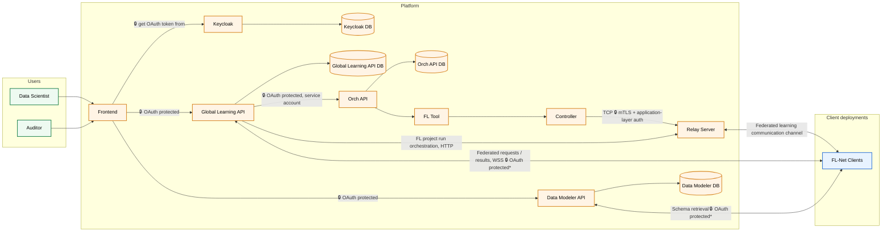

# Technical architecture of the Platform
This document describes the internal structure of the Platform, including its components,
how they interact and how it is deployed.
It is intended for readers who want to understand the technical details of the Platform, including core developers, tool developers, and IT admins considering the security of deploying the Platform.

## Overview
The Platform is an ensemble of services that run on a single host, deployed centrally to serve all participating Clients, Data Scientists, and Auditors.
These services are either provided by FL-Net or third-party software.
All required services are available as Docker images, and the provided [deployment script](/docs/deployment/deploy-global.md)
automatically configures everything for deployment via docker compose.
This documentation assumes deployment as described in the [deployment guide](/docs/deployment/deploy-global.md), using the default configuration.
Unlike the Client, a Platform deployment additionally requires a registered domain and an SSL certificate, since it must be reachable by every participating Client.

## Which services get deployed?
The Platform is a single-host deployment composed of a small set of runtime services. The services listed here are the default components that make up a standard Platform installation and reflect the architecture described in the FL-Net paper and in the network overview.

### FL-Net provided services
1. Global Learning API [Java;Quarkus]: the main platform backend service. It coordinates, orchestrates and manages the FL project run lifecycle, coordinates FL-Net Clients and handles Tool storage, including secure Tool building and certification, as well as model storage and the automatic generation of models from FL project runs. Tool certification is one of the most important trust boundaries of the Clients towards the Platform, responsibility lays on the Platform operator to ensure Tools are correctly vetted.
2. Data Modeler API [Java;Quarkus]: manages Schemas, Ontologies, DataTypes, and their associated embeddings, which are used to search through the large number of Ontology-, Schema-, and DataType-Nodes typical of biomedical ontologies.
3. Orch API [Java;Quarkus]: the orchestration service for FL workflows. It prepares the execution environment, starts Tool containers, monitors their status, and returns results to the Global Learning API. As no ETL runs on the Platform, this is used for FL project runs if the aggregator runs on the Platform and not a Client. To manage Tool containers, it runs as root with access to the host's Docker socket. See the [security model](security-model.md) for the trust implications of this.
4. Frontend [Angular]: the user-facing web interface for Data Scientists and Auditors. It provides access to the Platform UI, is used to perform DDQ, retrieve statistics, submit FL requests, manage Schemas, and manage and use models, and is also used by the Platform Admin to monitor service health.
5. Relay Server [Go]: handles communication between the local Controllers of participating Clients (and the Platform's own Controller, when the aggregator runs there) to ensure the secure exchange of model parameters and other FL messages during FL project runs. It exposes an HTTP server for FL project run management, used exclusively by the Global Learning API, alongside a TCP server with custom framing used by FL-Net Clients.
6. Controller [Go]: the Platform-side FL communication component. It handles the secure exchange of model updates and other FL messages between a locally running Tool and the Relay Server, and is deployed whenever the FL project run's aggregator is placed on the Platform rather than on a Client.
7. Documentation: a static site serving the FL-Net user documentation. It is not part of the core request/response interactions described below. You are most likely accessing this right now.

### Third-party services
1. Keycloak: the Platform's identity and access management. The Platform maintains its own Keycloak instance, separate from any Client's instance. Every FL-Net Client must additionally hold an account in the Platform's Keycloak instance, which protects the Platform against unauthorized or malicious Clients.
2. PostgreSQL database: the Platform deploys separate PostgreSQL instances for the Global Learning API (using a pgvector-enabled image to support Retrieval-Augmented Generation and LLM features), the Orch API, and Keycloak. These databases persist FL project, orchestration, and identity data.
3. Neo4j database: a dedicated Neo4j instance backs the Data Modeler API, persisting Schemas, Ontologies, DataTypes, and their embeddings.
4. NGINX reverse proxy: part of the Platform stack for TLS termination and routing incoming traffic from Data Scientists, Auditors, and Clients to the correct internal service.

This inventory serves as the deployment view of the Platform. The interaction section below explains how these services work together at runtime.

## How do the services interact?

### Overview

The Platform is the central, user-facing layer and orchestration hub. The Frontend is its single public entry point, acting as a reverse proxy that routes requests to Keycloak, the Global Learning API, and the Data Modeler API. Every other Platform service is internal and reachable only by other services — the one exception being the externally deployed Tool registry, which the Global Learning API and any Orch API (Platform or Client) reach directly to pull or push Tool images. Pushing is only done by the Global Learning API and requires authentication.

\* Whether Clients must authenticate via OAuth is set at deployment time of the Platform.

### User access (Data Scientist / Auditor)

The Data Scientist or Auditor accesses the Platform via the Frontend, authenticating through Keycloak. Once logged in, they use the Global Learning API to submit FL requests, run DDQs, retrieve statistics, manage Tools/models, and monitor service health — and the Data Modeler API directly to manage Schemas, Ontologies, and DataTypes.

The Global Learning API persists state in PostgreSQL; the Data Modeler API in Neo4j. Most endpoints on both APIs require authentication, aside from a few public ones (e.g. the Tool store). Endpoints may be restricted based on the Users role, e.g. a `Data-Scientist` role cannot submit a certification.

### Client access

Each Client keeps a permanent, authenticated WebSocket connection to the Global Learning API for federated queries, statistics/learning requests, and FL run orchestration sync. Clients also reach the Data Modeler API directly for Schema retrieval during cohort creation.

Whether Client connections require OAuth or can be unauthenticated is set at deployment time at Platform level via the deployment script. When required, the account used for the Client must have the `Site` role in KeyCloak.

### FL run orchestration

When the Platform hosts the aggregator for an FL run, the Global Learning API calls the Orch API (the same interface the Local Learning API uses on the Client). The Orch API prepares the execution context, starts the Tool container, monitors it, and returns the output to the Global Learning API — unless the model isn't meant to be shared with the Platform, in which case results are deleted along with the container volume.

The Global Learning API authenticates to the Orch API via a service account without any role assigned. The Orch API runs as root with access to the host's Docker socket.

### Federated learning communication (Relay Server)

The Global Learning API notifies the Relay Server of the FL run so it can coordinate relaying for participating Clients' Controllers. The Global Learning API handles orchestration; the Relay Server just relays FL messages between Controllers.

The Relay Server exposes two distinct endpoints with different protections:

- **HTTP orchestration endpoint** — used to start/manage FL runs. It has no auth protection of its own, but it's network-isolated and reachable only by other Platform services (specifically, only the Global Learning API calls it).
- **TCP endpoint** — used for the actual FL message relay. It's protected by mTLS and application-layer auth (API Keys), and only accepts connections from Controllers presenting a valid API key. This is publically available.

API keys are 256-bit, hex-encoded, and unique per FL run and participating Client. The Relay Server generates these keys, and the Global Learning API distributes them to the Tool and Controller. Additionally, each FL run is limited to a dedicated channel on the Relay Server, identified as a 32 bit hex encoded string.
The Relay Server does not persist any state between FL runs, so it cannot be used to track or identify participating Clients.

During FL, a Tool running on the Platform (as aggregator) talks to the Platform's Controller exactly as it would to a Client's Controller. The Controller exchanges model updates and other FL messages with the Relay Server over mTLS-secured TCP, and the Relay Server relays them to the Controllers on participating Clients. Clients only ever reach the Relay Server's TCP endpoint — never its HTTP orchestration endpoint. Tools authenticate to the Controller via API keys generated by the Relay Server, and Controllers authenticate to the Relay Server via mTLS and different API keys.

### External services

Beyond what's shown above, the Global Learning API and Data Modeler API reach a few external services:

- The Data Modeler API may query the **UMLS API** for ontology concepts.
- The Global Learning API may reach **Semantic Scholar / PubMed** for research assistance, an **LLM server** for the chatbot feature, and **Docker Hub**, **Chainguard**, and **GitLab** for Tool building, certification, and bug reporting.

See the [network architecture overview](network-architecture.md) for the full list.

### Authentication & roles summary

OAuth protection mostly requires roles:

| Connection | Required role |
|---|---|
| Client → Global Learning API | `Site` |
| Data Scientist / Auditor → Global Learning API / Data Modeler API | `Data-Scientist` or `Auditor` |
| Global Learning API → Orch API | None — isolated, called only via service account |

### What networks are the services deployed on?
All services run in the same dedicated docker network created on deployment.

However, any Tool container is started in an isolated docker network created per Tool run, attaching the
Controller and the Global Learning API to this network. After the Tool finishes execution, this network is cleaned up.

For most tools this is an internal network
with no internet access, but some specific Tools requiring internet or host access may be deployed in a network with internet access. These Platform-hosted Tools run automatically, as the Platform does not provide any Client data to them to leak. This is separate from Client-side statistics, learning, and metrics request approval, which is manual by default.

## How is data persisted?
The database services deployed use named docker volumes to persist data across restarts of the Platform:
- `global-learning-db-volume`
- `datamodeler-db`
- `keycloak_postgres_volume`
- `orch-db-volume`

An additional named volume, `orch-data-volume`, is used during FL execution, but it is not intended for persistent storage.

The Orch API writes the results from a specific FL Tool execution from the Tools volume to `orch-data-volume` via a temporary copying container.

## How are secrets handled?
When running the deployment script, secrets such as database passwords, Keycloak admin password, etc
are generated and stored in `.env` files with `600` permissions. On starting the Platform, 
these secrets are loaded into the service containers as environment variables. 
The repository specifically ignores these `.env` files, so they are not committed to the repository by accident.
The certificate and private key for TLS are provided by the deploying user and must be handled by them.

# Recommended next step

Now that you understand what the Platform is and deploys, we recommend you read the [security model](security-model.md) to understand how Tools are vetted, approved, and access-restricted during execution across the network.
