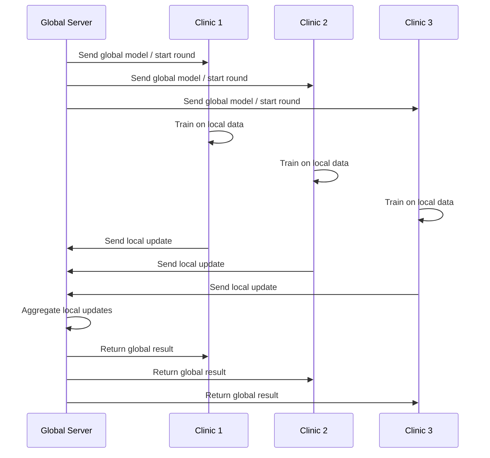
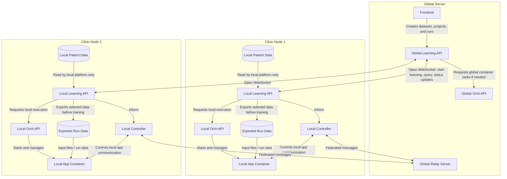

# Federated Learning: Theory & Concepts

This chapter gives you the conceptual map for the hackathon. You do **not** need to be a machine learning expert before
starting, but you should understand why federated learning exists, what problem it solves, and what it does **not** solve
by itself.

The main idea is simple:

> We want to learn from data that cannot be moved.

In healthcare, this is not an edge case. It is the normal case. Patient data is legally protected, institutionally
controlled, technically heterogeneous, and ethically sensitive. Federated learning is one way to still build useful models
across institutions without collecting all raw data in one central place.

:::tip
Federated learning is not “centralized machine learning, but with extra networking.” It is a different way of organizing
learning when data ownership, privacy, and institutional boundaries matter.
:::

---

## 1. Why This Matters: The Data Cannot Simply Leave

Classical machine learning often assumes that all data can be copied into one place:

1. Collect data from many sources.
2. Merge it into one large dataset.
3. Train a model centrally.
4. Share the trained model.

This works well technically, but it often fails legally and organizationally in medicine. A hospital cannot simply upload
patient records to an external server because the data may contain direct identifiers, indirect identifiers, rare disease
patterns, genomic information, imaging data, or combinations of features that make re-identification possible.

Even if names and addresses are removed, the data may still be sensitive. A rare diagnosis, a timestamp, a location, a
combination of age and measurements, or a unique treatment history can be enough to identify someone when combined with
external knowledge.

This is why privacy in biomedical AI is not only about deleting names. It is about controlling **what information is
exposed**, **who can compute on it**, **where computation happens**, and **what leaves the institution**.

:::tip
“Anonymous” does not automatically mean “safe.” In high-dimensional biomedical data, many columns can become identifying
when combined with external information.
:::

### Must-read papers and resources

- Narayanan, A. and Shmatikov, V. (2008). **Robust De-anonymization of Large Sparse Datasets**. IEEE Symposium on
  Security and Privacy. https://doi.org/10.1109/SP.2008.33
- Sweeney, L. (2002). **k-Anonymity: A Model for Protecting Privacy**. International Journal of Uncertainty,
  Fuzziness and Knowledge-Based Systems. https://doi.org/10.1142/S0218488502001648
- GDPR Article 25. **Data protection by design and by default**. https://gdpr-info.eu/art-25-gdpr/

---

## 2. A Short Machine Learning Refresher

Machine learning means that a computer program improves its behavior from examples instead of being fully programmed by
hand.

A useful way to compare traditional programming and machine learning is this:

| Approach | Input           | Human provides | Computer produces |
|---|-----------------|---|---|
| Traditional programming | Data            | Rules/program | Output |
| Machine learning | Data + (labels) | Learning algorithm | Model |

For example, in a binary classification task, we may want to separate patients into two groups: disease vs. no disease,
responder vs. non-responder, high risk vs. low risk. A model learns a decision function from examples. In a simple linear
model, this decision boundary may be a line or hyperplane. In a deep neural network, it may be a complex non-linear
function with many parameters.

### Training, validation, and overfitting

A model should not only memorize the training data. It should generalize to new data. That is why we split data into
training and test sets, or use cross-validation.

- **Training data** is used to update model parameters.
- **Validation data** is used to tune decisions during development.
- **Test data** is used to estimate final performance on unseen samples.

Overfitting happens when a model performs very well on training data but poorly on new data. In healthcare, this is
especially dangerous because a model may look impressive during development but fail when applied in another hospital,
patient group, device setting, or population.

:::tip
The goal is not to fit the local data perfectly. The goal is to learn a pattern that still works when the model meets new
patients, new institutions, and new measurement conditions.
:::

---

## 3. From Centralized Learning to Federated Learning

Federated learning changes the direction of movement.

In centralized learning, the data moves to the model. In federated learning, the model moves to the data.

Each clinic keeps its data locally. The global infrastructure sends a model or a training instruction to each clinic. Each
clinic trains locally and sends back only a computed result, such as model weights, gradients, statistics, or metrics. The
server aggregates these local results into a global result and sends it back.

The important part is not that “nothing is sent.” Something is sent. The important part is that **raw patient records are
not sent**. Instead, the network exchanges computed information.

This distinction matters: federated learning reduces the need for central data pooling, but model updates can still leak
information in some settings. Therefore, FL is often combined with additional privacy-enhancing techniques such as secure
aggregation, differential privacy, or encryption.

:::tip
Federated learning keeps raw data local, but it is not automatically a complete privacy guarantee. What leaves the client
still matters.
:::

### Must-read papers and resources

- Rieke, N. et al. (2020). **The future of digital health with federated learning**. npj Digital Medicine.
  https://doi.org/10.1038/s41746-020-00323-1

---

## 4. Federated Averaging: The Baseline Algorithm

The most common starting point for federated learning is **Federated Averaging**, usually called **FedAvg**.

Imagine that every clinic has a copy of the same model. In each round:

1. The global server sends the current model to all selected clients.
2. Each client trains the model locally for a few steps or epochs.
3. Each client sends the updated model parameters back.
4. The server computes a weighted average of the received parameters.
5. The averaged model becomes the new global model.

Let there be `K` clients. Client `k` has `n_k` samples, and the total number of samples is:

$$n = \sum_{k=1}^{K} n_k$$

If the global model at round `t` has parameters $\mathbf{w}^{t}$, each client locally trains and returns updated
parameters $\mathbf{w}^{t+1}_k$.

The server computes:

$$\mathbf{w}^{t+1} = \sum_{k=1}^{K} \frac{n_k}{n}\mathbf{w}^{t+1}_k$$

This means that a clinic with more samples has a stronger influence on the global model than a clinic with fewer samples.
If all clients have the same number of samples, this becomes a simple arithmetic mean:

$$\mathbf{w}^{t+1} = \frac{1}{K}\sum_{k=1}^{K}\mathbf{w}^{t+1}_k$$

FedAvg is popular because it is simple, flexible, and works with many neural network architectures. However, it also makes
assumptions that are often violated in real healthcare settings.

:::tip
FedAvg is the “hello world” of federated learning algorithms: important, widely used, and easy to understand, but not
always sufficient for heterogeneous biomedical data.
:::

### Must-read papers and resources

- McMahan, H. B. et al. (2017). **Communication-Efficient Learning of Deep Networks from Decentralized Data**. 
  https://arxiv.org/pdf/1602.05629
- Li, T. et al. (2020). **Federated Optimization in Heterogeneous Networks**.
  https://arxiv.org/pdf/1812.06127

---

## 5. The Hard Part: Federated Data Is Usually Not IID

In many introductory machine learning examples, data is assumed to be independent and identically distributed, often
abbreviated as **IID**. Federated learning in healthcare is usually the opposite.

Hospitals differ:

- They treat different patient populations.
- They use different devices and laboratory pipelines.
- They document data differently.
- They may specialize in different diseases.
- They may have different sample sizes.
- Their data may have different missingness patterns.

This is called **statistical heterogeneity** or **non-IID data**.

There is also **systems heterogeneity**. One client may have strong compute resources and a stable network connection.
Another may be slower, temporarily unavailable, or limited by local IT rules.

These differences affect training. A global model may drift toward the largest institution, converge slowly, or perform
unevenly across sites. In biomedical AI, this is not only a technical issue; it can become a fairness and validity issue.

:::tip
Federated learning is not hard because the average is hard. It is hard because the clients are different — statistically,
technically, and institutionally.
:::

### Must-read papers and resources

- Kairouz, P. et al. (2021). **Advances and Open Problems in Federated Learning**. Foundations and Trends in Machine
  Learning. https://arxiv.org/abs/1912.04977
- Li, Q. et al. (2022). **Federated Learning on Non-IID Data Silos: An Experimental Study**. IEEE Transactions on Neural
  Networks and Learning Systems. https://arxiv.org/pdf/2102.02079

---

## 6. Privacy-Enhancing Techniques: What They Add to Federated Learning

Federated learning reduces the need to move raw data, but it should be understood as one part of a larger privacy toolbox.
The main privacy-enhancing techniques you should know are:

| Technique | Main idea | Strength | Main cost |
|---|---|---|---|
| Federated learning | Keep raw data local and exchange updates | Data minimization and institutional control | Communication and update leakage risk |
| Differential privacy | Add calibrated noise to limit individual influence | Formal privacy guarantee | Lower accuracy if noise is too large |
| Secure multiparty computation | Compute aggregate values without revealing individual inputs | Strong protection during aggregation | Protocol and communication complexity |
| Homomorphic encryption | Compute on encrypted data | Very strong cryptographic protection | High computational cost and implementation complexity |

These techniques can be combined. For example, a federated system may use secure aggregation so the server only sees the
sum of updates, not each client update. It may also use differential privacy so that even the aggregate output is less
sensitive to any individual record.

### Differential privacy

Differential privacy asks a strict question:

> Would the output look almost the same if one person's data were changed or removed?

If the answer is yes, the output reveals little about any single person. This is usually achieved by adding carefully
calibrated random noise. The amount of noise depends on the sensitivity of the computation and the privacy budget,
commonly written as $\varepsilon$.

A smaller $\varepsilon$ means stronger privacy but usually more noise. A larger $\varepsilon$ means weaker privacy but
usually better accuracy.

### Secure aggregation and SMPC

Secure multiparty computation allows several parties to compute a result without revealing their private inputs. In
federated learning, the most common intuition is secure aggregation: the server learns the sum or average of updates, but
not the individual update from each client.

This is useful because individual model updates can sometimes leak information. If the server only sees the aggregate,
that attack surface is reduced.

### Homomorphic encryption

Homomorphic encryption allows computation on encrypted values. In principle, this is very powerful: a server can compute
without seeing the plaintext values. In practice, fully homomorphic encryption is often computationally expensive, and the
model or algorithm may need to be adapted to make encrypted computation feasible.

:::tip
Federated learning answers the question “Where does the data stay?” Privacy-enhancing techniques answer additional
questions such as “What can be inferred from the messages?” and “Who can see which intermediate result?”
:::

### Must-read papers and resources

- Dwork, C. and Roth, A. (2014). **The Algorithmic Foundations of Differential Privacy**. Foundations and Trends in
  Theoretical Computer Science. https://doi.org/10.1561/0400000042
- Bonawitz, K. et al. (2017). **Practical Secure Aggregation for Privacy-Preserving Machine Learning**. ACM CCS.
  https://doi.org/10.1145/3133956.3133982
- Torkzadehmahani, R. et al. (2022). **Privacy-Preserving Artificial Intelligence Techniques in Biomedicine**. Methods of
  Information in Medicine. https://doi.org/10.1055/s-0041-1740630
- Viand, A., Jattke, P. and Hithnawi, A. (2021). **SoK: Fully Homomorphic Encryption Compilers**. IEEE Symposium on
  Security and Privacy. https://doi.org/10.1109/SP40001.2021.00068

---

## 7. Federated Deep Learning

Deep learning uses neural networks with many parameters. These models can learn complex non-linear patterns, which makes
them useful for images, text, time series, omics data, and graph-structured biomedical data.

A neural network is built from layers. During training, data flows forward through the model, a loss function measures the
error, and backpropagation computes how the parameters should change. An optimizer such as SGD, RMSprop, or Adam applies
these updates.

In federated deep learning, this training loop is distributed:

1. The global server initializes or receives a model.
2. Clients train the model locally.
3. Model parameters or gradients are exchanged.
4. The server aggregates the updates.
5. The process repeats for several rounds.

This is powerful but also expensive. Deep models can have millions of parameters. Sending these parameters repeatedly can
create high communication overhead. Deep models can also overfit local client distributions if the data is strongly
non-IID.

:::tip
Federated deep learning combines the flexibility of neural networks with the constraints of distributed, privacy-aware
training. The main trade-off is between model expressiveness, communication cost, and robustness across clients.
:::

---

## 8. From Theory to Apps: What You Build in This Hackathon

In this hackathon, you will not only talk about federated learning. You will implement an app that can run inside a
federated network.

An app is a containerized unit of computation. It receives configuration and input data from the platform, performs local
work, communicates through the federated protocol if needed, and writes outputs back to the platform.

A good federated app separates three concerns:

| Concern | Question | Example |
|---|---|---|
| Local computation | What does each client compute on its own data? | Train a local model, compute statistics, evaluate metrics |
| Communication | What is exchanged between clients and aggregator? | Weights, gradients, scalar values, histograms |
| Aggregation | How are local results combined? | FedAvg, weighted mean, pooled variance, custom merge logic |

For deep learning apps, the local code often contains:

- a model class, for example a `torch.nn.Module`,
- a training loop,
- a test or validation function,
- data loading and preprocessing,
- configuration for hyperparameters,
- optional transfer learning logic,
- communication with the federated aggregator.

The most important design decision is not “Which library do I use?” It is “What information leaves the client, and how is
that information combined?”

:::tip
A federated app is not just a script in a Docker container. It is a contract: local computation, exchanged payloads,
aggregation logic, outputs, and reproducibility all have to fit together.
:::

### Must-read papers and resources

- Matschinske, J. et al. (2021). **The FeatureCloud AI Store for Federated Learning in Biomedicine and Beyond**.
  https://arxiv.org/abs/2105.05734

---

## 9. The Architecture

FL-Net maps the general federated learning idea to one global coordination layer and several local clinic nodes.
The global side manages projects, runs, cross-site coordination, and the globally available relay server. The local side
remains responsible for local data access, data export, container execution, and the locally running controller.

A central point is that the **Global Learning API** and each **Local Learning API** keep an open WebSocket connection.
Through this connection, the global side can notify local sites about new learning runs, query tasks, status updates, and
run-state changes. The global side does not directly start containers inside a clinic. Instead, container execution is
handled through orchestration APIs.

Before an app starts training, the **Local Learning API** prepares the data for the run. The app container does not query
the local database directly. It receives exported input data and run configuration from the local platform layer. This
keeps database access inside the local platform boundary and makes the app easier to reproduce and test.

| Component | Role |
|---|---|
| **Frontend** | User interface for creating datasets, projects, cohorts, and runs. |
| **Global Learning API** | Manages global project state and communicates with local sites through persistent WebSocket connections. |
| **Local Learning API** | Local backend that receives global run/query instructions, exports selected run data, exposes local state, and requests local execution. |
| **Global Orch API** | Starts and manages global containers when global-side container tasks are required. |
| **Local Orch API** | Starts and manages local containers, including the always-local controller and local app containers. |
| **Local Controller** | Always runs locally. It connects the local app container to the federated communication layer. |
| **Global Relay Server** | Runs globally and routes federated messages between local controllers during learning or query execution. |
| **App Container** | Your algorithm, packaged as a reproducible container. It receives exported input data from the local platform layer and communicates through the local controller. |
| **Exported Run Data** | The prepared input files for one run. These are created by the Local Learning API before training starts. |
| **Local Patient Data** | Data remains inside the local institution and is accessed by the Local Learning API, not directly by the app container. |

The important separation is this: the **Learning APIs coordinate the run**, while the **Orch APIs start and manage
containers**. The **Local Learning API** prepares the local data export before training starts. The app consumes this
exported run data, but it does not directly access the local database. The **local controller** is started on each client
and connects the running app to the **global relay server**, which routes federated messages between participants.

The aggregation logic is part of the federated app behavior. In practice, one participating app instance may take the
aggregating role during a run. Therefore, the diagram intentionally does not show a separate aggregator service.

:::tip
The global side coordinates the study and provides the relay. The local side controls data export, execution, and the
local controller. App containers receive prepared run data, not direct database access.
:::

---

## 10. Key Terminology

### App / Tool

An **app** or **tool** is a Docker container that implements an algorithm. It is the unit of computation in
FL-Net.

An app:

- receives configuration and input data,
- performs local computation,
- may communicate through the federated protocol,
- writes output files, models, metrics, or predictions.

### Client

A **client** is a participating local site, such as a clinic node. Each client runs the app on its own local data.
Clients do not directly inspect each other's data.

### Aggregator

An **aggregator** combines the local results from clients into one global result. In FL-Net, this aggregation
logic is implemented explicitly. Depending on the app, the aggregator may average model weights, pool statistics, merge
histograms, or apply a custom strategy.

### Communication round

A **round** is one cycle of local computation, sending local results, aggregation, and broadcasting the global result.
Many federated training workflows repeat this process several times.

### FLNet protocol

The **FLNet protocol** is the communication layer used by app containers and the aggregator. From an app developer's
perspective, this should feel like a simple communication API: send a local result and receive the global result.

### Schema

A **schema** defines the structure and semantics of data. It describes which fields exist, what their types are, and what
they mean. In biomedical settings, this may include mappings to controlled vocabularies or ontologies.

### Dataset

A **dataset** is a query configuration. It defines what part of the local data should be used for a task, for example
which schema, columns, filters, or cohort constraints apply.

### Project

A **project** connects a dataset with an app. It defines what should be computed and on which data definition it should
run.

:::tip
Most platform objects answer one of three questions: What data definition is used? What computation is performed? How is
the federated run coordinated and recorded?
:::

---

## 11. What You Should Remember Before Coding

Before you start implementing your first federated app, keep five principles in mind:

1. **Data locality is the foundation.** Raw patient data remains at the local site.
2. **Messages still matter.** Model updates, gradients, and statistics can contain information.
3. **Heterogeneity is normal.** Clients will differ in data, size, quality, and infrastructure.
4. **Aggregation is a scientific decision.** The aggregator defines what the global result means.
5. **Reproducibility is part of the app.** Configuration, inputs, outputs, and container behavior should be explicit.

If you understand these principles, the technical parts of the hackathon will make much more sense: schemas define usable
data, apps define local computation, aggregators define global combination, and the platform coordinates the run.

:::tip
Federated learning is a design discipline: every app should make clear what is computed locally, what is communicated,
how it is aggregated, and what privacy assumptions are being made.
:::