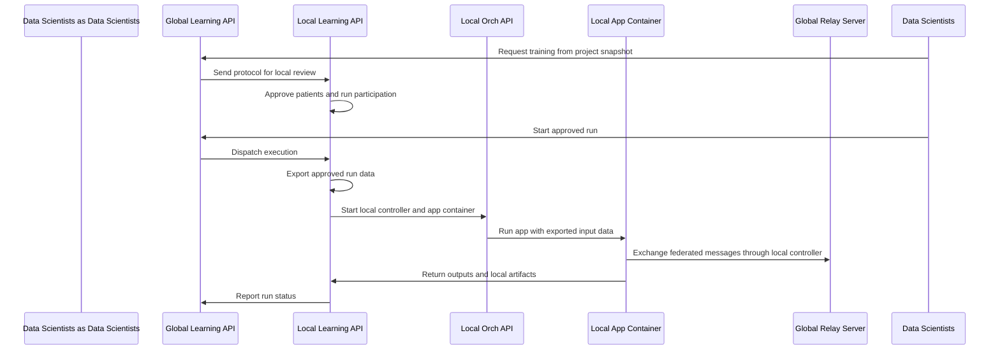

# Harmonization and Platform Features

After the environment is running and your app is published, the next question is not “How do I start training?” but:

> How does the platform know which local data should be used, how it should be interpreted, and which app should receive it?

This page explains the concepts behind the next workflow stage. It does **not** repeat every UI click. Use the linked
walkthroughs when you need the concrete step-by-step instructions with screenshots.

:::tip
This phase connects three worlds: local clinical data, the shared semantic schema, and the executable app workflow.
:::

---

## Create a Connector

A connector tells the local clinic node how local data should be imported into the platform. In this hackathon, the source
is usually a clinic-specific US-130 CSV file. In a real deployment, the source could also be another database export,
structured file, or hospital data system.

The important idea is that the connector is not just a file upload. It is the local mapping layer between raw source data
and the platform's schema-backed cohort representation.

The connector answers questions such as:

- Where is the source data?
- Which delimiter and file format does it use?
- Which missing-value symbols need to be normalized?
- Which source column maps to which schema field?
- Which transformations are needed before the data can be used?

For the US-130 dataset, missing values are often encoded as `?`. These values should be converted into proper missing
values before they enter the cohort. Typical affected columns include `race`, `weight`, `payer_code`, and
`medical_specialty`; diagnosis columns can also contain occasional `?` values.

In the hackathon DinD setup, a connector may already be registered automatically from a prepared configuration file. This
is useful because participants can focus on understanding the workflow rather than manually repeating the same import
steps. Still, you should understand what the connector does, because every later dataset export depends on this mapping.

Use the dedicated walkthrough for the exact UI flow:

- [Connector Walkthrough](../walkthroughs/wt-connector.md)

:::tip
The connector is the bridge from local raw data into a schema-backed cohort. If this mapping is wrong, every later query,
dataset, and training run will also be wrong.
:::

---

## Query Data

Before training, you need to know whether participating clinics actually contain enough matching data. The global query
workspace allows Data Scientists to ask semantic questions across clinics without directly viewing raw patient records.

A query is not plain SQL. Instead, it is built against schema concepts, for example age, diagnosis, medication, or
readmission outcome. Each local clinic evaluates the query locally and returns only a privacy-filtered result.

This matters because the query stage is a governance and feasibility step. It helps answer:

- Which clinics have relevant patients?
- Is the cohort large enough for training?
- Are some clinics missing important fields?
- Are distributions roughly comparable across sites?
- Does the planned study make sense before any app container is started?

Counts may be intentionally imprecise. A privacy threshold can suppress small groups, and returned counts may be rounded.
This prevents the query interface from becoming a patient-identification tool.

Statistics requests add another layer. Instead of only asking “How many?”, the platform can request aggregate profiles
such as age distributions, medication coverage, or readmission rates. These summaries help detect data-quality and
harmonization issues before training starts.

Use the dedicated walkthrough for the exact UI flow and privacy model:

- [Query Walkthrough](../walkthroughs/wt-query.md)

:::tip
Queries are for feasibility and governance. They help inspect the shape of the distributed cohort without exposing raw
records.
:::

---

## Create a Project

A project connects the scientific question, the data selection, and the executable workflow.

In practical terms, the project combines:

- the cohort or patient query,
- the dataset export definition,
- the app workflow,
- the app version,
- the app hyperparameters,
- the run configuration.

The workflow canvas expresses how data moves through the analysis. For the basic US-130 task, the workflow is simple: an
exported CSV input flows into the readmission prediction app. More complex workflows may include preprocessing tools,
multiple model steps, reporting tools, or chained analysis components.

The project is also the place where reproducibility becomes visible. A run should not depend on hidden local decisions.
It should be possible to look at the project and understand which data definition, app version, and hyperparameters were
used.

Use the dedicated walkthrough for the exact UI flow:

- [Project Walkthrough](../walkthroughs/wt-project.md)

:::tip
A project is the reproducible study container: it links the patient selection, exported variables, app workflow, and run
settings.
:::

---

### Create a Dataset

A query defines which patients are eligible. A dataset defines which fields are exported for those patients when a run
starts.

This distinction is important:

| Object | Main question |
|---|---|
| Query | Which patients should be included? |
| Dataset | Which variables should be exported for the app? |
| App input | How does the app receive those exported variables? |

The dataset builder is where harmonization becomes operational. You select schema-backed fields and decide how they are
exported into the training table. For the US-130 readmission app, the dataset should contain the features required by your
preprocessing code and the target column used for training.

For many tabular machine learning apps, the practical export format is a wide table: one row per encounter and one column
per feature. The exact join field and export mode must match the data model used by the cohort and the expectations of
the app.

The most common failure at this stage is a mismatch between dataset feature names and app code. If your app expects a
column called `hospital_readmission`, but the dataset exports raw `readmitted`, training will fail or silently train on
the wrong target. Keep the dataset definition, `app.yml`, and preprocessing code aligned.

Use the dedicated walkthrough for the exact UI flow:

- [Dataset Walkthrough](../walkthroughs/wt-dataset.md)

:::tip
The dataset is the contract between harmonized cohort data and the app input table. It decides what the app actually sees.
:::

---

### Start Federated Learning

Starting a federated run deliberately includes an approval step. This is not a UI inconvenience; it is part of local data
governance.

When a training request is created, the global side freezes the current project state into a protocol copy. Local clinics
can then review what is being requested: which patient group, which dataset fields, which app, which version, and which
hyperparameters. Clinics may approve, restrict, or reject participation according to their local rules.

Only after enough clinics accept does execution begin. At that point, each participating local node exports the approved
run data, starts the required containers through its local orchestration layer, and connects the app to the federated
communication path.

At a conceptual level, the flow is:

Use the dedicated walkthrough for the exact UI flow:

- [Run Walkthrough](../walkthroughs/wt-run.md)

:::tip
The approval step protects local governance. Federated execution starts only after the project snapshot has been reviewed
and accepted by participating clinics.
:::

---

### Collect Metrics and Register the Model

After training, there are two separate concerns: metrics and model artifacts.

Metrics describe what happened during the run. They can include validation accuracy, AUC, loss, training progress,
readmission rate, or other app-defined values. Depending on the privacy and governance setup, clinics may need to approve
sharing local metrics before they appear globally.

Model artifacts are the files created by the app, for example a saved `model.joblib`. These artifacts can be registered as
managed model entries so they can be versioned, validated, and later reused for prediction.

For the central baseline app from Phase B, each participating clinic may produce a local model artifact. A federated
global model requires explicit aggregation behavior. The prepared federated example sends model coefficients and sample
counts, then computes a weighted mean so larger clinics have proportionally more influence. In this architecture,
aggregation is part of the app logic and may be handled by one participating app instance during the run, rather than by a
separate global aggregator service.

Use the dedicated walkthrough for the exact UI flow:

- [Metrics & Model Walkthrough](../walkthroughs/wt-metrics.md)
- [Federated App Development Guide](../../tool-dev/create-federated-tool.md)

:::tip
Metrics explain the run. Model registration turns an output artifact into a managed, reusable model resource.
:::

---

## Run Prediction

Prediction is the application phase. Instead of training a model, you use an existing trained model to generate outputs for
new data.

Conceptually, prediction should reuse the same assumptions as training:

- the same feature meaning,
- the same preprocessing logic,
- the same feature order,
- the same model artifact,
- compatible input columns.

For the US-130 task, a prediction run usually produces a table with predicted readmission class and probability. Depending
on your app implementation, it may also produce a coefficient table, an explanation report, or a plain-text summary.

A common mistake is to treat prediction as a new analysis with different preprocessing. That breaks the model contract.
Prediction data must be transformed into the same feature space that was used during training.

Use the dedicated walkthrough for the exact UI flow:

- [Prediction Walkthrough](../walkthroughs/wt-prediction.md)

:::tip
Prediction is only valid if the input data is transformed in the same way as the training data. The model and preprocessing
state belong together.
:::
