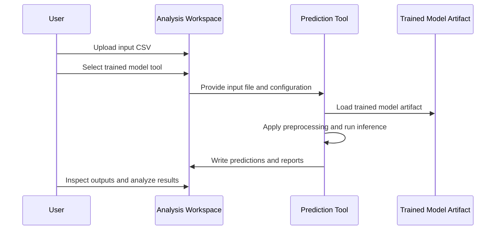

# Walkthrough: Run a Prediction

After a model has been trained and registered, you can use it to run **predictions** on new data. In the %%DEPLOYED_PRODUCT_NAME%% network, prediction is handled through the **Data Analysis** workspace on the global server frontend.

This workflow follows the PoSyMed-style execution model: you create an analysis workspace, upload or select input data,
choose an executable tool or trained model, configure its inputs and hyperparameters, run it, and review the generated
outputs.

A prediction run is different from a federated training run:

| Training                                                                        | Prediction                                                 |
|---------------------------------------------------------------------------------|------------------------------------------------------------|
| Trains a model from data across participating clinics                           | Applies an already trained model to new input data         |
| Requires project setup, dataset setup, workflow setup, and clinic participation | Requires an input file and a prediction-capable tool/model |
| Produces a trained model artifact                                               | Produces prediction outputs, reports, and explanations     |
| Usually involves federated coordination                                         | Usually runs as a direct analysis workflow                 |

For the US-130 example, the trained readmission model is used to predict whether patients are likely to be readmitted
within 30 days.

---

## Step 1 — Open the Data Analysis Workspace

In the global server frontend, open **Data Analysis** from the navigation.

The **My Data Analysis** page lists existing analysis workspaces. Each row represents one analysis experiment that can
contain input files, selected tools, outputs, and generated reports.

Click **Add Analysis** to create a new prediction analysis.

:::note
Prediction is started from **Data Analysis**, not from the federated training project page. The trained model created by
the training workflow becomes reusable as an inference-capable tool or model-backed app.
:::

:::tip[Take-home message]
Use **Data Analysis** when you want to apply a tool or trained model to concrete input data and inspect the resulting
files or reports.
:::

---

## Step 2 — Create or Open an Analysis Workspace

After creating or opening an analysis, the analysis workspace appears.

The workspace is split into two main areas:

| Area                | Purpose                                                             |
|---------------------|---------------------------------------------------------------------|
| **Data Management** | Upload, inspect, and manage input files and generated output files  |
| **Analysis Canvas** | Select a tool, configure it, run it, and review its outputs         |
| **Ask the AI**      | Optional assistant area for interpreting files or generated results |
| **PDF export**      | Allows exporting the analysis view or report where available        |

At the beginning, the workspace shows an empty state: **Start your first analysis**. Click **Run Tool** to select the
prediction tool.

:::note
The analysis workspace keeps input files, selected tools, generated outputs, and interpretation steps together in one
place.
:::

:::tip[Take-home message]
Think of an analysis workspace as a lightweight experiment folder: it contains the input data, the selected tool, the
execution results, and optional AI-assisted interpretation.
:::

---

## Step 3 — Upload and Inspect the Input Data

Upload the file you want to use for prediction. You can drag and drop the file into the upload area or click **browse**.

For the US-130 example, the uploaded input file is `clinic_128.csv`.

After uploading, open the file to inspect it.

The file preview shows the tabular data, including columns such as:

- `encounter_id`
- `patient_nbr`
- `race`
- `gender`
- `age`
- `weight`
- `admission_type_id`
- `discharge_disposition_id`
- `admission_source_id`
- `time_in_hospital`
- `payer_code`
- `medical_specialty`

Use this preview to confirm that the file has the expected structure before running the model.

Check especially:

| Check                                 | Why it matters                                                                 |
|---------------------------------------|--------------------------------------------------------------------------------|
| **Headers are correct**               | The model expects specific input columns                                       |
| **Rows are aligned**                  | Misparsed CSV files can shift values into the wrong columns                    |
| **Missing values are visible**        | Values such as `?` may need to be handled by the tool                          |
| **Target column handling is correct** | Prediction data may or may not include the label column, depending on the tool |
| **File type is correct**              | The selected prediction tool must accept the uploaded file type                |

:::note
The file is used as the input for the prediction workflow. A valid file preview does not guarantee that the model can
run, but it catches many common input problems early.
:::

:::tip[Take-home message]
Inspect the uploaded file before selecting the tool. Most prediction errors come from mismatched headers, wrong
delimiters, missing columns, or unexpected missing-value encodings.
:::

---

## Step 4 — Select the Prediction Tool

Click **Run Tool** or use the tool selector to choose the model-backed prediction tool.

Search for the US-130 model or prediction app. In the example, the selected tool is **Model for App US130-Hospital
Readmission Prediction**.

The selector may show both:

| Item                            | Meaning                                       |
|---------------------------------|-----------------------------------------------|
| **Original trainable app**      | The app used to train the model               |
| **Model-backed inference tool** | The trained model variant used for prediction |

For prediction, select the model-backed tool. It is marked as inference-oriented and represents the trained model
created from the federated training result.

:::note
The original app defines the logic and input/output contract. The trained model-backed tool adds the learned model
artifact and uses it for inference.
:::

:::tip[Take-home message]
For prediction, choose the trained model entry, not the original training-only app, unless the app explicitly supports
direct prediction without a registered model.
:::

---

## Step 5 — Assign the Input File

After selecting the tool, assign the uploaded CSV file to the required input.

The selected tool card shows the required input field, for example `data`. Choose the uploaded file, such as
`clinic_128.csv`.

A validation indicator confirms whether the input assignment is valid. In the example, the green bar and check mark
indicate that the file satisfies the input requirement.

| Element                  | Meaning                                                  |
|--------------------------|----------------------------------------------------------|
| **Input selector**       | Selects which uploaded file should be passed to the tool |
| **Check mark**           | Confirms that the required input is assigned             |
| **Green validation bar** | Indicates that the input is currently valid              |
| **Edit icon**            | Allows changing or editing the input assignment          |
| **Start button**         | Runs the configured prediction tool                      |

:::note
The tool can only start when all required inputs are assigned and valid. Optional inputs may be left empty depending on
the tool definition.
:::

:::tip[Take-home message]
A valid input assignment means the platform can pass the file to the tool. It does not mean the model result is
clinically meaningful; you still need to inspect the outputs after execution.
:::

---

## Step 6 — Review Hyperparameters

Before starting the prediction, open the **Hyperparams** panel.

The panel shows the configuration values used by the prediction tool. For the US-130 model, these may include:

| Hyperparameter  | Example value          | Meaning                                                            |
|-----------------|------------------------|--------------------------------------------------------------------|
| `max_iter`      | `1000`                 | Training-related solver limit; usually fixed for the trained model |
| `solver`        | `lbfgs`                | Optimization algorithm used during training                        |
| `class_weight`  | `balanced`             | Class weighting used during training                               |
| `random_state`  | `42`                   | Reproducibility seed                                               |
| `test_size`     | `0.2`                  | Validation split used during training or evaluation                |
| `target_column` | `hospital_readmission` | Label column expected by the tool when evaluating predictions      |
| `standardize`   | Enabled                | Whether feature standardization is applied                         |
| `C`             | `1.0`                  | Regularization strength used by the logistic regression model      |

For prediction, most of these values should usually remain unchanged because they describe the trained model
configuration or preprocessing behavior expected by the model.

:::warning
Do not change model-related hyperparameters unless you know how the prediction tool uses them. If preprocessing
parameters differ from the training setup, predictions may become invalid.
:::

:::tip[Take-home message]
Prediction should use the same preprocessing and configuration assumptions as training. Treat hyperparameters as part of
the model contract.
:::

---

## Step 7 — Start the Prediction and Review Outputs

Click the start button to run the model-backed prediction tool.

When the run finishes, generated files appear in the **Output** section of the analysis workspace.

In the example, the tool produces several outputs:

| Output                        | Description                                                    |
|-------------------------------|----------------------------------------------------------------|
| `predictions_*.csv`           | Per-patient prediction results                                 |
| `coefficients_*.csv`          | Model coefficient table, useful for inspecting feature weights |
| `prediction_explanation.html` | Interactive or formatted HTML explanation report               |
| `report`                      | Plain-text summary of the prediction run                       |

The embedded report preview shows a model report for hospital readmission prediction. It includes summary information
such as number of prediction samples, number of features, predicted readmission rate, and validation-related sections
where available.

Use **Open** to view the output file in detail. Use **Analyze** to ask the integrated AI assistant to inspect or
summarize the result.

:::note
The concrete output names depend on the tool definition. The US-130 model produces both machine-readable outputs, such
as CSV files, and human-readable outputs, such as HTML or text reports.
:::

:::tip[Take-home message]
Prediction is not complete when the tool finishes. Always inspect the output files to confirm that the number of
samples, columns, and predicted rates are plausible.
:::

---

## Step 8 — Analyze the Result with the AI Assistant

For human-readable outputs such as reports or explanations, click **Analyze**.

The analysis view shows the selected result on the left and the AI-generated interpretation on the right. This can help
summarize reports, identify visible patterns, or explain what a result file contains.

Use AI-assisted analysis for:

| Use case                  | Example                                              |
|---------------------------|------------------------------------------------------|
| **Summarization**         | Summarize the generated prediction report            |
| **Sanity checking**       | Check whether the report appears complete            |
| **Result interpretation** | Explain what the metrics or tables indicate          |
| **Documentation support** | Generate a short textual description for a report    |
| **Follow-up planning**    | Identify which output files should be inspected next |

:::warning
AI-assisted interpretation is a support feature, not a substitute for scientific or clinical validation. Always verify
important conclusions against the actual output files and the underlying analysis design.
:::

:::note
Some files may not be directly interpretable by the analysis assistant if their content is unavailable, embedded, or not
extractable. In that case, inspect the file manually or use a different output format.
:::

:::tip[Take-home message]
Use the AI assistant to accelerate review, but rely on the generated files and domain expertise for final
interpretation.
:::

---

## How Prediction Works Internally

At runtime, the platform executes the model-backed tool with the selected input data.

The simplified process is:

The key idea is that the trained model is reused as an executable prediction tool. The user supplies new data, the
platform validates required inputs, and the tool writes structured outputs back into the analysis workspace.

---

## Troubleshooting

| Problem                                      | Likely cause                                                  | Fix                                                                |
|----------------------------------------------|---------------------------------------------------------------|--------------------------------------------------------------------|
| Tool cannot start                            | Required input file is missing                                | Assign the uploaded CSV to the required `data` input               |
| Input validation fails                       | File type or schema does not match the tool input contract    | Check the file format, delimiter, and required columns             |
| Prediction fails during execution            | Model expects columns that are missing from the uploaded file | Compare the input CSV headers with the training dataset/export     |
| Predictions look implausible                 | Preprocessing or hyperparameters differ from training setup   | Check the model configuration and input encoding                   |
| No output files are produced                 | Tool execution failed or output contract was not fulfilled    | Check tool logs and expected output definitions                    |
| AI analysis says file content is unavailable | The file is not readable or extractable for the assistant     | Open the file directly or export it in a text, HTML, or CSV format |

---

## Summary

In this walkthrough, you used a trained model to run a prediction analysis.

The workflow was:

1. Open **Data Analysis** on the global server.
2. Create or open an analysis workspace.
3. Upload and inspect the input CSV file.
4. Select the trained model-backed prediction tool.
5. Assign the input file to the required tool input.
6. Review hyperparameters and model configuration.
7. Start the prediction run.
8. Inspect generated outputs.
9. Optionally analyze reports with the AI assistant.

The central idea is that trained models become reusable analysis tools. They can be selected in the same execution
environment as other PoSyMed-style tools, receive validated inputs, and return structured prediction artifacts for
review.