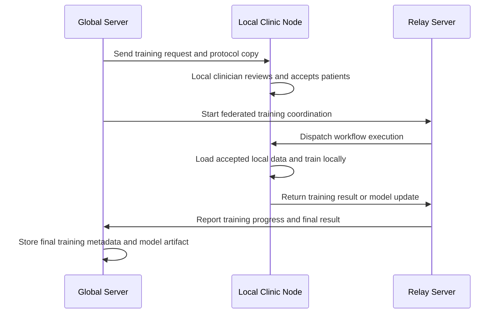

# Walkthrough: Start a Federated Run and Monitor It

A **federated training run** is one executable study instance of a configured training project. It freezes the current project state, sends the relevant protocol information to participating clinic nodes, waits for local participation approval, and then starts the federated execution.

In the %%DEPLOYED_PRODUCT_NAME%% network, a run is not started directly after the project is created. First, the project must be prepared with:

1. a linked query,
2. a configured dataset,
3. a workflow with at least one trainable app,
4. participating clinic nodes with eligible patients,
5. local clinic approval for patient participation.

The important distinction is:

| Concept | Meaning |
|---|---|
| **Project** | Editable workspace for configuring query, dataset, and workflow |
| **Training request** | Frozen version of the current project protocol sent to clinics |
| **Accepted patients** | Patients approved locally by clinic users for participation |
| **Run** | Actual federated execution after enough participation has been accepted |

A training request creates a copy of the current experimental protocol. After this copy is created, the version used for the request is no longer edited implicitly by later project changes.

---

## Step 1 — Open the Run Step of the Project

Open your project on the **global server frontend** and go to **4. Run**.

The run page contains the federated training area. If no training request exists yet, the table is empty and you can create one by clicking **Request Training**.

The page distinguishes between different execution modes, such as **Federated Training** and **Centralized Training**. For FL-Net, use **Federated Training** when the model should be trained across participating clinic nodes without centrally collecting raw patient data.

:::note
The run step is only meaningful after the previous project steps are configured. The project should already have a query, dataset, and workflow before requesting federated training.
:::

:::tip[Take-home message]
Use **Request Training** to ask participating clinics to review and accept the training protocol. This is not yet the actual model training start.
:::

---

## Step 2 — Create a Federated Training Request

Click **Request Training**. The **Create New Federated Training** dialog opens.

Fill in the training metadata:

| Field | Description |
|---|---|
| **Name of the Training** | A clear name for this training request |
| **Description of the Training** | A short explanation of the training goal and context |
| **The result model needs to be public** | If enabled, the resulting model may be accessible beyond the current user |
| **I accept the process** | Confirms that the current protocol copy may be shared with relevant hospitals |

The dialog explains that a copy of the current experimental protocol will be saved and sent to all relevant hospitals. This includes the query information and the configured training setup.

Participating hospitals then review the request locally. They can approve participation and may exclude individual patients according to local governance, consent, data quality, or institutional policy.

:::warning
Create the training request only after the project configuration is ready. The request is based on a saved copy of the current protocol. Later project edits may require a new training request.
:::

:::note
Patients must be accepted for training by local clinicians or authorized local users before the federated execution can start. The global server coordinates the process, but local clinics decide which patients may participate.
:::

:::tip[Take-home message]
A federated training request is an approval and coordination step. It gives clinics the chance to review the project before any local training is started.
:::

---

## Step 3 — Review Accepted Clinics and Patients

After the training request is created, open the training detail page.

The training detail page shows:

| Area | Meaning |
|---|---|
| **Details** | Start time, finish time, duration, and execution state |
| **Meta-Data** | Acceptance count, required/public model settings, and relay server information |
| **Participants** | Clinics that received or accepted the training request |
| **Project status** | Current status of this training request |
| **Start** | Starts the federated training after acceptance is sufficient |

The **Acceptance Count** shows how many patients have been accepted for the training request. The **Participants** section shows which clinic nodes are involved and their current project status.

In the example, `1600` patients have been accepted, and one clinic participant is listed.

:::note
The accepted patient count can differ from the original query result. Local clinics may exclude patients before accepting the request.
:::

:::tip[Take-home message]
Before starting, verify that the accepted patient count and participating clinics match your expectations. Training quality depends on the approved local cohort, not only on the original query result.
:::

---

## Step 4 — Start the Federated Training

When the participating clinics have accepted the request and the patient count is sufficient, click **Start**.

Starting the training launches the federated execution. The global server coordinates the run through the configured relay server and project workflow. Local clinic nodes execute their part of the workflow on local data and submit only the configured training outputs, such as model updates or model artifacts.

At a high level, the process is:

:::note
Raw patient data remains inside the local clinic node. The federated run uses the accepted local data to compute training results according to the configured workflow.
:::

:::warning
Do not start the training if the accepted patient count is unexpectedly low or if required clinic nodes have not accepted participation. Starting too early may produce incomplete or biased results.
:::

:::tip[Take-home message]
Only click **Start** after local acceptance is complete and the project metadata, dataset, and workflow have been reviewed.
:::

---

## What Happens After Start

After the run starts, the status and timing fields update. Depending on the workflow and deployment setup, you may see progress information, logs, local participant status, generated artifacts, and final model information.

Common outcomes are:

| Status | Meaning |
|---|---|
| **Ready** | Training request is prepared and can be started |
| **Running** | Federated execution is currently active |
| **Finished** | Training completed successfully |
| **Failed** | One or more execution steps failed |
| **Cancelled** | Training was stopped manually |

If the run fails, check the logs and participant status. Common causes include an offline clinic node, invalid dataset export, missing target column, incompatible workflow input, or a tool execution error.

---

## Summary

In this walkthrough, you started a federated training process from a configured project.

The workflow was:

1. Open the project Run step.
2. Click **Request Training**.
3. Create a frozen training request from the current project protocol.
4. Wait for local clinics to review and accept participating patients.
5. Review the accepted patient count and participating clinics.
6. Click **Start** to launch the federated execution.

The central idea is that federated training is a governed process. The global server prepares and coordinates the request, but participating clinics retain local control over patient acceptance and data execution.